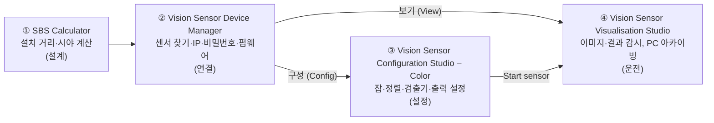

# 🎯 Festo SBS 컬러 비전 센서 실습 튜토리얼 — SBSI-F-R3C-F12-W

실제 장비 **Festo SBS Color Standard (8058732)** 로 이 품번이 지원하는 기능을 **모두 직접 조작하고 수치로 검증**하는 실습 리포지토리.
화면 따라 하기가 아니라 **3D 프린터 출력물(OK/NG 시료)** 로 실험하고, 결과를 표와 수치로 남긴다.

> [!IMPORTANT]
> **이 장비는 Standard(기본형)다.** 검출기는 **Contrast**, **Color area** 2종, 정렬은 **Contour detection**뿐이다.
> 패턴 매칭·캘리퍼·BLOB·캘리브레이션은 쓸 수 없다. → [기능 매트릭스](docs/reports/feature-matrix.md)
>
> **PLC 통신은 다루지 않는다.** 출력은 디지털 I/O(표시등·램프)로 확인한다. → [상충 보고서 A-07](docs/reports/conflict-report.md#a-07)

---

## 1. 대상 장비

| 항목 | 값 |
|---|---|
| 형식 / 품번 | SBSI-F-R3C-F12-W / 8058732 — Color, **Standard**, 12 mm, 백색 LED (매뉴얼 p.403) |
| 해상도 / 속도 | 736 × 480 (WVGA), 40 fps (데이터시트) |
| 펌웨어 | 1.23.2.2 |
| 센서 이름 / IP | MASTER / 192.168.3.40 /24, GW 192.168.3.1, DHCP 비활성화 |
| PC IP | 192.168.3.10 /24 |
| 잡 / 검출기 | 최대 8잡 / 잡당 32개 ⚠️ (데이터시트는 2) |
| 사용 I/O | 입력 03·10, 출력 12·09, 전환 07·08, 고정 출력 Ready 04·Valid 11 |
| 단종 | 2024년 공급 종료 품번 (데이터시트) → 백업 필수 |

➡️ 전체 사양·핀 배치·실습 결선: [**센서 사양과 케이블링**](docs/hardware/sensor-spec-and-cabling.md)

## 2. 학습자 전제

- PLC 기초, 컴퓨터 비전 개념(OpenCV, PyTorch, CNN/RNN)을 안다 → **개념 설명은 최소화**하고 장비 조작과 검증에 집중한다.
- SBS 프로그램은 처음 쓴다 → 모든 메뉴 위치를 **번호 박스가 표시된 스크린샷**으로 보여 준다.
- Configuration Studio의 **Help 탭 영문은 레슨마다 한국어 번역**으로 함께 싣는다. → [Help 번역 색인](docs/help-ko/README.md)

---

## 3. 소프트웨어 4종 — 역할과 사용 순서



| # | 소프트웨어 | 언제 쓰나 | 이 품번 메모 | 출처 |
|---|---|---|---|---|
| ① | SBS Calculator v3.0.10 | 설치 전: 작업 거리 ↔ 시야(FOV) ↔ mm/px | ⚠️ 기기 목록에 R3C(736×480)가 없다 → 계산식 + 실측으로 대체 | (SBS Calculator 리소스), [A-02](docs/reports/conflict-report.md#a-02) |
| ② | Vision Sensor Device Manager | 매번 시작점. 센서 검색, IP 변경, 설정/보기 프로그램 실행 | 이 PC에서는 **한국어 UI** | (매뉴얼 p.39–40, p.54–66) |
| ③ | Vision Sensor Configuration Studio – Color | 검사 설정 6단계: Job → Alignment → Detector → Output → Result → Start sensor | 영문 UI | (매뉴얼 p.41, p.47) |
| ④ | Vision Sensor Visualisation Studio | 운전 중 감시, 이미지 저장, 잡 선택·업로드 | 설정 기능은 제한적 | (매뉴얼 p.39, p.42–43, p.277–286) |

### 3.1 Device Manager 화면 지도


| # | 화면 표기 (매뉴얼 영문명) | 하는 일 | 출처 |
|---|---|---|---|
| 1 | 🔑 열쇠 아이콘 (Password button) | 로그인·비밀번호 관리 | (매뉴얼 p.44–45) |
| 2 | `활성화된 센서들` (Active sensors) | 네트워크에서 찾은 센서 목록. 첫 칸 LED: 녹색 = Run, 노랑 = Config, 빨강 = 오류/시작 중 | (매뉴얼 p.40), Help 패널 문구 |
| 3 | `시뮬레이션 모드의 센서` (Sensors for simulation mode) | 장비 없이 오프라인 설정 | (매뉴얼 p.40) |
| 4 | `활성화된 센서 추가` › `추가` (Add sensors via IP address) | 검색이 안 될 때 IP로 직접 추가 | (매뉴얼 p.40) |
| 5 | `즐겨찾기` (Favorites) | 자주 쓰는 센서 저장 | (매뉴얼 p.41) |
| 6 | `탐색` (Find) / `구성` (Config) / `보기` (View) / `설정` (Settings) | 다시 검색 / Configuration Studio 실행 / Visualisation Studio 실행 / IP 등 네트워크 설정 | (매뉴얼 p.40–41) |
| 7 | 도움말 패널 (Context help) | 선택한 기능의 설명 (영문) | (매뉴얼 p.41) |
| 8 | 상태표시줄 `IP 주소 (PC)` | 이 PC의 IP. 어댑터가 여러 개면 경고 표시 | (매뉴얼 p.36) |

### 3.2 Configuration Studio 화면 지도


| # | 화면 표기 | 하는 일 | 출처 |
|---|---|---|---|
| 1 | `File` `View` `Options` `Help` | 메뉴 (잡/잡셋 저장·불러오기는 File) | (매뉴얼 p.41, p.262) |
| 2 | 툴바 | 자주 쓰는 명령 아이콘 ⚠️ 아이콘별 이름은 툴팁 캡처 후 확정 | (매뉴얼 p.41) |
| 3 | **Setup**: `Job` `Alignment` `Detector` `Output` `Result` `Start sensor` | 설정 6단계. 위에서 아래 순서로 진행 | (매뉴얼 p.47) |
| 4 | **Trigger/Image update**: `Trigger` `Single` `Continuous` | 연속 촬영 ↔ 1장 촬영, 화면 트리거 | (매뉴얼 p.42, p.259) |
| 5 | **Connection mode**: `Online` `Offline` | 센서 연결 ↔ 시뮬레이션 | (매뉴얼 p.42, p.260) |
| 6 | 이미지 창 | 영상 + 검색/파라미터 영역(ROI) 그래픽 | (매뉴얼 p.41) |
| 7 | 확대(`−` `Fit` `+`), 필름스트립 이동 | 확대, 저장된 이미지 넘기기 | (매뉴얼 p.41, p.261) |
| 8 | `Help` `Result` `Statistics` 탭, `Home` `Prev` `Next` `Print` | 상황별 도움말(영문) / 검출 결과 / 통계 | (매뉴얼 p.42) |
| 9 | 잡 목록 + `New` `Load` `Save` `Delete` `Delete all` | 잡 만들기·관리 | (스크린샷), (Help: scjobedit) |
| 10 | 설정 탭 (Setup 단계에 따라 바뀜) | 예: Job → `Image acquisition` `White balance` `Pre-processing` `Cycle time` | (스크린샷) |
| 11 | 상태표시줄 | Mode, Name, Active job, Cycle time, Flash 사용량, 커서 X/Y/밝기, DOUT 표시 | (매뉴얼 p.42) |

> 각 Setup 단계의 상세 화면은 해당 모듈에서 다룬다: [`images/annotated/`](images/annotated/)

---

## 4. 커리큘럼 — 현장 문제 해결 순서

**잘 보이게 → 위치 찾기 → 판별 → 출력 → (PC 연동) → 운영**

| 모듈 | 현장 질문 | 다루는 기능 | 실물 실험 (예) | 정량 기준 (예) | 상태 |
|---|---|---|---|---|---|
| [00 장비와 도구 지도](docs/00_device-map.md) | 무엇을, 얼마나 떨어져서 볼까? | 품번 해독, 기능 매트릭스, SW 4종, FOV 계산 | 계산한 거리에서 자를 찍어 실제 FOV 측정 | 계산 FOV ↔ 실측 오차 기록 | ⏳ |
| [01 연결과 첫 이미지](docs/01_connection-first-image.md) | 센서와 말이 통하나? | 결선, PC IP, 검색·IP 변경, Online/Offline, 초점 | 초점 나사로 거리별 초점 맞추기 | 검색 성공, 준비 시간(s) 측정 | ⏳ |
| [02 좋은 이미지 만들기](docs/02_image-quality.md) | 검출기가 판단할 만큼 잘 보이나? | 해상도, 셔터, 게인, Dynamic, 내장 조명·쿼드런트, 외부 조명 출력, 화이트 밸런스, 전처리 | 같은 시료 조건 A/B 촬영 | OK/NG 콘트라스트 차 기록 | ⏳ |
| [03 어디에 있나](docs/03_alignment-contour.md) | 부품이 움직여도 따라가나? | Contour detection 정렬, 검색/파라미터 영역 | 시료 ±X mm 이동·±θ 회전 | 허용 편차 안 추종 10/10 | ⏳ |
| [04 무엇을 판별하나](docs/04_inspection-detectors.md) | 있나? 색이 맞나? 크기가 맞나? | 04-1 Contrast · 04-2 Color area(RGB/HSV/LAB) · 04-3 크기 Go/No-Go(대체 기법) | 캡 유/무, 색 다른 시료, 크기 다른 시료 | OK 10/10, NG 10/10, 마진 ≥ 15 % | ⏳ |
| [05 판정과 출력](docs/05_judgement-and-output.md) | 결과를 기계에 어떻게 알리나? | 논리 조합, I/O mapping, H/W·S/W 트리거, Timing, Cycle time, Result, Start sensor | 트리거 → 판정 → 램프까지 시간 측정 | 지연 시간(ms), 오판 0 | ⏳ |
| [06 PC 데이터 연동 (선택)](docs/06_pc-data-link.md) | 결과값을 PC에 기록할 수 있나? | Ethernet TCP/IP 텔레그램(2005/2006) → Python 수신 | 판정 결과를 CSV로 저장 | 트리거 수 = 수신 레코드 수 | ⏳ **결정 필요** |
| [07 운영과 유지보수](docs/07_operation-maintenance.md) | 품종을 바꾸고, 기록을 남기고, 복구할 수 있나? | 잡 관리·전환, 잡셋 백업/복원, 이미지 레코더, FTP/SMB 아카이빙(NG만), Visualisation Studio, WebViewer, 비밀번호, 펌웨어 업데이트 절차 | NG 이미지만 PC 공유 폴더에 저장 | 저장 장수 = NG 수 | ⏳ |
| [08 최종 프로젝트](docs/08_capstone.md) | 실제 검사 공정을 혼자 만들 수 있나? | 위치 추적 + 조명/전처리 + 복수 검출기 + 판정 + I/O + NG 이미지 저장 | 결함 4종 이상 시료 | 정확도, 사이클 타임, 위치 허용 범위 | ⏳ |

> [!NOTE]
> Module 06은 원래 PLC 연동이었다. 사용자 규칙 9로 PLC를 빼고 PC 연동(선택)으로 바꿨다. 외부 통신 전체를 빼려면 [A-07](docs/reports/conflict-report.md#a-07)의 안 2로 바꾼다.

## 5. 모든 레슨의 형식

| 블록 | 내용 |
|---|---|
| 🎯 목표 | 끝나면 할 수 있는 것 (동사, 1–3개) |
| 🏭 왜 필요한가 | 이 기능이 없을 때 현장에서 생기는 문제 1개 |
| 📋 선행 조건 / 준비물 | 이전 레슨, 시료, 결선 상태 |
| ⚙️ 메뉴 경로 | `소프트웨어 › 메뉴 › …` + **번호 박스 스크린샷** + (출처) 또는 ⚠️ [실기 확인 필요] |
| 📖 Help 번역 | 해당 화면 Help 탭 영문의 한국어 번역 |
| 📝 단계별 조작 | 번호 순서. 파라미터 표: \| 파라미터 \| 시작값 \| 의미 \| 올리면 \| 내리면 \| |
| 🧪 실험 | 변수 하나만 바꿔 결과를 기록 (양식 제공) |
| 🔍 검증 | 정량 합격 기준 (예: OK 10/10, NG 10/10, 마진 = \|합격 기준값 − 실측값\| ≥ 15 %) |
| 💥 고장 주입 | 일부러 틀리게 설정하고 증상 관찰 |
| ⚠️ 함정과 해결 | 증상 → 원인 → 조치 |
| ✅ 체크리스트 | |
| 📁 포트폴리오 기록 | 남길 스크린샷·수치·한 줄 요약 |

## 6. 출처 표기

| 표기 | 문서 |
|---|---|
| (매뉴얼 p.xx) | SBS Vision Sensor Manual V1.23.2 (8097682 2018-07c) — 펌웨어와 같은 버전 |
| (데이터시트) | colour sensor SBSI-F-R3C-F12-W, 8058732 |
| (설치설명서) | SBS Mounting Instruction V1.23.2 (8090327) |
| (Help: 토픽파일) | Configuration Studio Help 원본 `SBS_ContextHelp_en_V1_22_14.chm` |
| (설정파일) | 설치 SW `SBSConfig/1.23.2.2/Data/*.xml` |
| (스크린샷 파일명) | `images/raw/` 직접 캡처 |
| ⚠️ [실기 확인 필요] | 자료로 확정 못 함 → [장비 앞에서 확인할 목록](docs/appendix/verify-on-device.md) |

원본 PDF·CHM은 PC의 `C:\Program Files (x86)\Festo\SBS Vision Sensor\Documentation\`, `…\Help\`에 있다. **저작권 때문에 이 저장소에는 넣지 않는다.**

## 7. 저장소 구조

```text
festo-sbs-r3c-tutorial/
├── README.md                         ✅ 이 파일
├── .gitignore                        ✅ 매뉴얼·Help 원본 제외
├── docs/
│   ├── 00_device-map.md              ⏳ 장비와 도구 지도
│   ├── 01_connection-first-image.md  ⏳ 연결과 첫 이미지
│   ├── 02_image-quality.md           ⏳ 좋은 이미지 만들기
│   ├── 03_alignment-contour.md       ⏳ 위치 추적
│   ├── 04_inspection-detectors.md    ⏳ 04-1 Contrast / 04-2 Color area / 04-3 크기 Go/No-Go
│   ├── 05_judgement-and-output.md    ⏳ 판정과 출력
│   ├── 06_pc-data-link.md            ⏳ PC 데이터 연동 (선택)
│   ├── 07_operation-maintenance.md   ⏳ 운영과 유지보수
│   ├── 08_capstone.md                ⏳ 최종 프로젝트
│   ├── hardware/
│   │   └── sensor-spec-and-cabling.md ✅ 사양·핀 배치·실습 결선·네트워크
│   ├── reports/
│   │   ├── feature-matrix.md         ✅ 기능 매트릭스 + 1차 커버리지
│   │   └── conflict-report.md        ✅ 상충 보고서
│   ├── help-ko/
│   │   └── README.md                 ✅ Help 토픽 → 레슨 번역 색인
│   └── appendix/
│       ├── verify-on-device.md       ✅ 장비 앞에서 확인할 목록 (V-01~V-14)
│       ├── advanced-only.md          ✅ 상위 모델 전용 기능
│       ├── glossary.md               ⏳ 용어집
│       └── troubleshooting.md        ⏳ 문제 해결
├── images/
│   ├── raw/                          ✅ 원본 캡처 8장 (수정 금지)
│   ├── annotated/                    ✅ 번호 박스 주석본 9장
│   └── CAPTURE-LIST.md               ✅ 더 찍어야 할 화면 목록
├── templates/
│   └── experiment-log.md             ⏳ 실험 기록 양식
├── tools/
│   ├── annotate.py                   ✅ 스크린샷 번호 박스 도구
│   └── annotations.json              ✅ 박스 좌표
└── backups/                          잡셋 백업 파일 보관
```

### 스크린샷 주석 만들기

```bash
pip install pillow
python tools/annotate.py tools/annotations.json
```

새 캡처를 `images/raw/`에 넣고 `annotations.json`에 박스 좌표 `[왼쪽, 위, 오른쪽, 아래]`를 추가하면 `images/annotated/`에 새 파일이 생긴다. 원본은 건드리지 않는다.

## 8. 시작 전 체크

- [ ] [상충 보고서](docs/reports/conflict-report.md)의 **결정 필요** 2건(A-07 Module 06 범위, A-09 공개 여부) 결정
- [ ] [사양서 4.1](docs/hardware/sensor-spec-and-cabling.md) 핀 표와 실습실 케이블 대조 (V-06)
- [ ] OK/NG 시료 준비: 캡 유/무, 색 2종 이상, 크기 2종 이상 (3D 프린터 출력물)
- [ ] 현재 잡셋 백업: Configuration Studio `File › Save job set (Backup) ...` → `backups/`

## 9. 저작권

Festo 매뉴얼·Help의 저작권은 Festo SE & Co. KG에 있다(매뉴얼 p.2). 이 저장소의 Help 번역은 학습용이다. 공개 전 [A-09](docs/reports/conflict-report.md#a-09)를 확인한다.
스크린샷은 작성자가 직접 찍은 소프트웨어 화면이다.
