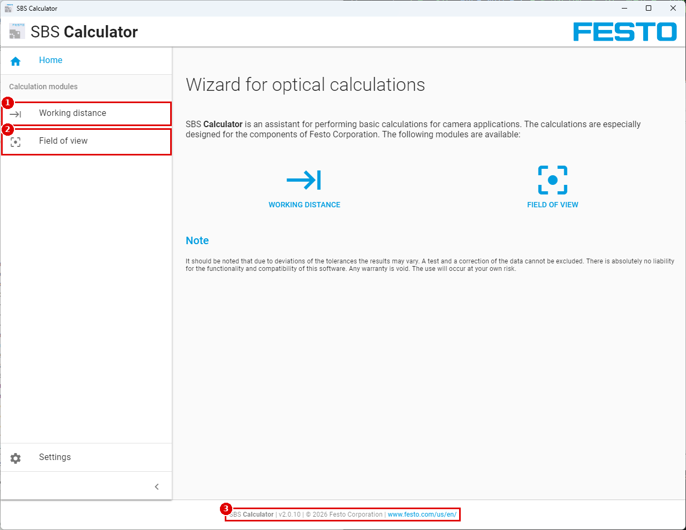
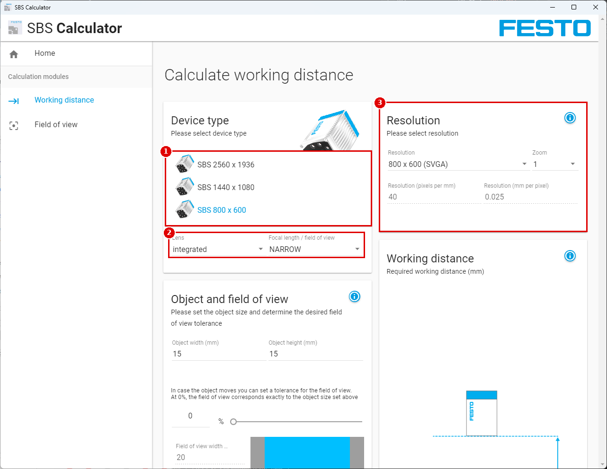
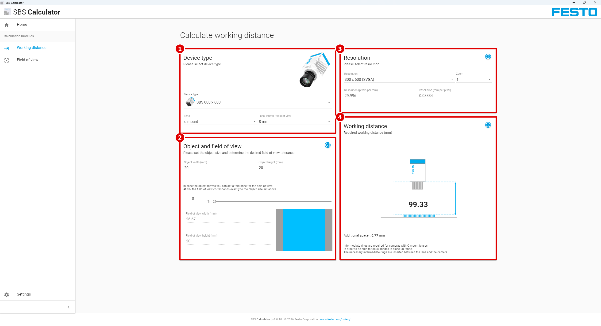

# Module 00 — 장비와 도구 지도

> 📝 **v2 (2026-10-02)**: SBS Calculator 화면 3장 추가, 기기 목록 확인(V-10 ✅), 버전 표기 v2.0.10으로 정정. 1차 판: [`00_device-map.md`](00_device-map.md)

> 현장 질문: **"무엇을, 얼마나 떨어져서, 어떤 도구로 볼까?"**

## 🎯 목표
1. 품번 `SBSI-F-R3C-F12-W`를 해독하고 이 장비로 **할 수 있는 검사와 없는 검사**를 구분한다.
2. SBS 소프트웨어 4종의 역할과 **사용 순서**를 설명한다.
3. 시료 크기로부터 **필요한 시야(FOV)·설치 거리·mm/px**를 계산하고, Module 01 이후 실측으로 검증한다.

## 🏭 왜 필요한가
설치 거리를 감으로 정하면, 결함이 2~3픽셀밖에 안 되는 거리에 센서를 고정해 놓고 나중에야 "검출이 안 된다"는 걸 알게 된다. 브래킷을 다시 만드는 비용이 생긴다.

## 📋 선행 조건 / 준비물
- [센서 사양과 케이블링](hardware/sensor-spec-and-cabling.md) 1~2절 읽기
- 시료(3D 프린터 출력물) OK 1개, 각 결함 NG 1개씩
- 버니어 캘리퍼스, 자(또는 1 mm 모눈종이 출력물)

---

## 0.1 품번과 기능 범위

| 형식명 자리 | 이 장비 | 결론 |
|---|---|---|
| `F` | Color | 컬러 검출기(Color area) 사용 가능 |
| `AF` 없음 | **Standard** | 정렬은 Contour만, 검출기는 Contrast·Color area만 (매뉴얼 p.19) |
| `R3` `C` | 736×480 컬러 | WVGA/VGA/QVGA |
| `F12` | 12 mm 렌즈 | 최소 작업 거리 30 mm, 최소 시야 8×6 mm (매뉴얼 p.403) |
| `W` | 백색 LED | 색 판별에 유리 |

➡️ 전체 표: [기능 매트릭스 v2](reports/feature-matrix_v2.md), 쓸 수 없는 기능: [상위 모델 전용](appendix/advanced-only.md)

### 검사 질문 → 이 장비의 답

| 검사 질문 | 이 장비에서 | 레슨 |
|---|---|---|
| 부품이 움직여도 따라가나? | Alignment › Contour detection | 03 |
| 있나/없나? | Contrast | 04-1 |
| 색이 맞나? | Color area | 04-2 |
| 크기가 맞나? | Color area의 면적·Object size로 **Go/No-Go만** (치수 값 출력 불가) | 04-3 |
| 몇 개인가? 치수 몇 mm인가? 글자·코드? | ❌ 상위 모델 필요 | 부록 |

## 0.2 소프트웨어 4종


| 순서 | 소프트웨어 | 언제 | 설치 위치(이 PC) |
|---|---|---|---|
| ① | **SBS Calculator** v2.0.10 (화면 하단 표기) | 설치 전 설계 | `C:\Program Files (x86)\Festo\SBS Calculator\SBS Calculator.exe` |
| ② | **Vision Sensor Device Manager** | 매번 시작점 | `C:\Program Files (x86)\Festo\SBS Vision Sensor\SBSFind\` (바로가기 `Vision_Sensor_Device_Manager.lnk`) |
| ③ | **Vision Sensor Configuration Studio – Color** | 검사 설정 | Device Manager에서 센서 선택 › `구성 (Config)` 버튼으로 실행 (실행 파일 `SBSConfig\1.23.2.2\SBS_Config.exe`) |
| ④ | **Vision Sensor Visualisation Studio** | 운전 감시·기록 | Device Manager에서 센서 선택 › `보기 (View)` 버튼으로 실행 |

> [!NOTE]
> 매뉴얼은 "바탕화면 아이콘 SBS vision sensor로 시작"이라고 쓴다(매뉴얼 p.44). 이 PC의 바탕화면 아이콘 이름은 ⚠️ [실기 확인 필요] — 바탕화면/시작 메뉴에서 이름을 확인하고 [V-21](appendix/verify-on-device_v3.md)에 적는다.
> Configuration Studio와 Visualisation Studio는 **센서 버전에 맞는 실행 파일을 Device Manager가 골라 실행**하므로, 직접 exe를 열지 말고 항상 Device Manager에서 연다.

<details>
<summary>📖 Help 번역 — SBS 운영·설정 소프트웨어 개요 (Help: overview)</summary>

**SBS 소프트웨어의 구조**
SBS 소프트웨어는 다음 세 모듈로 구성된다.

- **Vision Sensor Device Manager**
  센서 또는 센서 시뮬레이션 모델을 선택해 "Vision Sensor Configuration Studio"로 설정하거나 "Vision Sensor Visualisation Studio"로 표시(감시)하기 위한 모듈이다. IP 주소, 펌웨어 업데이트 같은 시스템 설정과 비밀번호·사용자 권한도 여기서 바꿀 수 있다.
- **Vision Sensor Configuration Studio**
  센서를 설정하고 검사 작업(잡, job)을 구성하는 종합 기능을 담고 있다. 비밀번호 보호가 켜져 있으면 설정에 사용자 그룹 Administrator 권한이 필요하다.
- **Vision Sensor Visualisation Studio**
  이미지와 결과를 표시한다. 센서를 감시·점검하는 데 쓴다. 또한 폭넓은 아카이빙(기록 보관) 기능이 있다. Vision Sensor Configuration Studio에 비해 설정 기능은 제한적이다. 비밀번호 보호가 켜져 있으면 사용자 그룹 "Administrator" 또는 "Worker" 권한이 필요하다.

최신 버전은 www.festo.com 의 SBS Software에서 무료로 내려받을 수 있다.
</details>

<details>
<summary>📖 Help 번역 — Vision Sensor Device Manager (Help: sf)</summary>

- **A) Active sensors (활성화된 센서들)** — PC에서 제어할 수 있는, 네트워크상의 모든 SBS 비전 센서를 표시한다.
- **B) Sensors for simulation mode (시뮬레이션 모드의 센서)** — 오프라인 시뮬레이션에 쓸 수 있는 모든 SBS 비전 센서를 표시한다.
- **C) Add sensors via IP address (IP 주소로 센서 추가)** — 소프트웨어 시작 후나 "Find" 버튼을 누른 뒤에도 보이지 않는 센서라도, 네트워크에 있고(예: 게이트웨이 너머) IP 주소를 알고 있으면 IP 주소로 직접 추가할 수 있다. "Add" 버튼을 누르면 그 센서를 찾아 Active sensors 목록에 추가하므로 편집할 수 있다.
- **D) Functions (기능)**
  - Find: 네트워크에서 제품을 찾는 검색을 다시 실행한다.
  - Config: 연결된 센서나 센서 시뮬레이션을 설정한다 = Vision Sensor Configuration Studio
  - View: 연결된 센서의 이미지나 결과 데이터를 표시한다 = Vision Sensor Visualisation Studio
  - Settings: 센서 IP 주소 등 네트워크 설정을 편집한다.
- **E) Context** — 상황별 도움말
- **F) Favorites (즐겨찾기)** — SBS 비전 센서를 즐겨찾기로 저장할 수 있다. 즐겨찾기는 빠른 접근과 센서 관리에 쓴다.
</details>

<details>
<summary>📖 Help 번역 — Vision Sensor Configuration Studio (Help: sc)</summary>

화면 영역은 다음과 같다.
- **A) 메뉴와 툴바**
- **B) Setup** — Vision Sensor Configuration Studio 전체 기능 장 참조
- **C) Image (이미지)** — 그래픽으로 조절할 수 있는 작업·검색 영역과 확대 기능, 필름스트립 탐색이 있는 이미지 출력
- **D) Help, Result, Statistics**
  - Help: 현재 주제에 대한 상황별 도움말
  - Result: 선택한 파라미터에 대한 검출기 결과
  - Statistics: 판정과 실행 시간에 대한 통계 표시
- **E) Image acquisition mode (영상 취득 모드)** — 연속(free run)과, 트리거 입력(센서 또는 화면 버튼)을 받는 단일 이미지 모드 사이를 전환
- **F) Connection mode (연결 모드)** — 온라인과 오프라인 모드 전환(센서 있음 또는 센서 없이 시뮬레이션)
- **G) Job selection (잡 선택)** — Setup 탐색에서 선택한 동작에 따라 바뀌는 내용. 관련 파라미터를 설정한다.
- **H) Status bar (상태표시줄)** — Mode / SBS 이름 / 활성 잡 등 여러 상태 정보. Run 모드에서는 사이클 타임 / 커서 x·y 위치와 픽셀 밝기 / 개별 I/O 켜짐·꺼짐 표시("Output/Digital output"에서 설정한 대로).
</details>

<details>
<summary>📖 Help 번역 — Vision Sensor Visualisation Studio (Help: sv)</summary>

- **A) Image display (이미지 표시)**
- **B) Context** — 상황별 도움말
- **C) Commandos (명령)** — 이미지 표시·전송·아카이빙 명령
- **D) Job and result display (잡과 결과 표시)** — 이 탭들에서 (통계) 결과를 표시하고, 잡을 전환하고, Vision Sensor Visualisation Studio에서 센서로 잡/잡셋을 올릴 수 있다.
</details>

<details>
<summary>📖 Help 번역 — Context help (Help: help)</summary>

모든 소프트웨어 기능에는 상황별 도움말 페이지가 있으며, 기능을 선택하는 즉시 표시된다.
Help 버튼("?" 기호)을 누르거나 온라인 도움말 창을 더블클릭하면 모든 도움말 페이지를 볼 수 있다. 거기서 키워드 검색도 할 수 있다.
상황별 도움말과 달리 이 도움말 창은 크기를 키울 수 있어 긴 글을 보기 편하다.
</details>

## 0.3 시야(FOV)와 설치 거리 계산

### ⚙️ 메뉴 경로
`SBS Calculator › Field of view` (작업 거리 → 시야) / `SBS Calculator › Working distance` (시야 → 작업 거리)
(SBS Calculator 리소스 `i18n_en.json`: NAV_FIELDOFVIEW "Field of view", NAV_DISTANCE "Working distance")



| # | 화면 표기 | 하는 일 |
|---|---|---|
| 1 | `Working distance` | 물체 크기 → 필요한 작업 거리 |
| 2 | `Field of view` | 작업 거리 → 시야·분해능 |
| 3 | 하단 `SBS Calculator \| v2.0.10` | 버전 확인 |



| # | 화면 표기 | 확인 결과 |
|---|---|---|
| 1 | `Device type` 드롭다운 | **SBS 2560 x 1936 / SBS 1440 x 1080 / SBS 800 x 600 세 가지뿐** → R3C(736×480) 없음 ✅ V-10 확인 |
| 2 | `Lens` (integrated / c-mount), `Focal length / field of view` (WIDE / MEDIUM / NARROW …) | 2.x 세대 렌즈 이름 |
| 3 | `Resolution`, `Zoom`, `Resolution (pixels per mm / mm per pixel)` | 결과 분해능 |



| # | 카드 | 입력/출력 |
|---|---|---|
| 1 | Device type | 기기·렌즈·초점거리 선택 |
| 2 | Object and field of view | 물체 폭·높이(mm), 위치 여유(%) → 시야 폭·높이 |
| 3 | Resolution | 해상도·줌 → px/mm, mm/px |
| 4 | Working distance | 필요한 작업 거리(mm), C-mount면 추가 스페이서 |

> 화면 사용법은 이 계산기로 익히되, **이 장비의 값은 아래 대체 계산표**를 쓴다.

> [!WARNING]
> 설치된 SBS Calculator **v2.0.10**의 `Device type` 목록에는 **SBS 2560 x 1936 / 1440 x 1080 / 800 x 600만** 있다(SBS Calculator 리소스 `theme/settings.json`). 이 장비(736×480)는 고를 수 없다 → [상충 A-02](reports/conflict-report_v3.md#a-02). **화면으로 확인 완료**(스크린샷 calc_device-type-list).

### 📝 단계별 조작
1. SBS Calculator를 열고 `Field of view`를 누른다.
2. `Device type` 드롭다운을 펼쳐 캡처한다(`calc_fov_device-list.png`). 736×480 항목이 없으면 3번으로 간다.
3. 아래 **대체 계산표**를 쓴다. 이 표는 같은 앱 코드 안에 남아 있는 736×480·12 mm 상수로 앱과 같은 계산식을 돌린 값이다.

**대체 계산식** (SBS Calculator 리소스 `fieldOfViewController.js`, `configuration.js`의 `v10` 상수: 센서 폭 4.416 mm, 렌즈 오프셋 −15.1 mm, 화면비 1.5333)

```text
th  ≈ 작업거리(mm) + 15.1          # 렌즈 기준점 보정 (반복 보정은 0.3 mm 이하라 생략 가능)
FOV_가로(mm) = th × 4.416 / 12 − 4.416
FOV_세로(mm) = FOV_가로 / 1.5333
mm/px      = FOV_가로 / 736        (WVGA 기준)
```

| 작업 거리 (mm) | FOV 가로 × 세로 (mm) | mm/px (WVGA) | px/mm |
|---|---|---|---|
| 30 | 11.0 × 7.2 | 0.015 | 66.8 |
| 50 | 19.1 × 12.5 | 0.026 | 38.5 |
| 80 | 30.5 × 19.9 | 0.042 | 24.1 |
| 100 | 38.0 × 24.8 | 0.052 | 19.4 |
| 120 | 45.5 × 29.7 | 0.062 | 16.2 |
| 150 | 56.6 × 36.9 | 0.077 | 13.0 |
| 200 | 75.1 × 49.0 | 0.102 | 9.8 |
| 300 | 112.0 × 73.0 | 0.152 | 6.6 |

교차 확인: 매뉴얼 그래프(매뉴얼 p.398 Fig. 362)에서 680 mm일 때 가로 약 240 mm ↔ 계산 251.9 mm. 30 mm에서는 계산 11.0×7.2 mm ↔ 사양 최소 시야 8×6 mm(매뉴얼 p.403)로 차이가 있다 → **반드시 실측으로 확정**한다.

### 거꾸로 계산 (시료 → 거리)
1. 시료의 가장 긴 변 L(mm)을 캘리퍼스로 잰다.
2. 위치 편차 여유를 더한다: `필요 FOV_가로 = L + 2 × (최대 위치 편차)` (SBS Calculator의 "field of view tolerance" 개념, `TXT_TIP_FOV`)
3. 표에서 필요 FOV_가로 이상이 되는 **가장 가까운 거리**를 고른다(가까울수록 mm/px가 작아 정밀하다).
4. 가장 작은 결함 크기 ÷ mm/px = 결함 픽셀 수. **3 px 이상**을 목표로 한다.
   (경험칙. SBS Calculator도 Data Matrix에서 "최소 3 pixels/module"을 권장한다: `TXT_WARNING_PPM`)

## 🧪 실험 — 계산 FOV vs 실측 FOV

> Module 01에서 첫 이미지를 얻은 뒤 수행한다. **바꾸는 변수는 작업 거리 하나.**

1. 모눈종이(1 mm)를 시료 위치에 놓는다. Job › Image acquisition › Resolution = WVGA.
2. 렌즈 앞면~종이 거리를 자로 맞춘다(100 / 150 / 200 mm).
3. 초점을 맞추고(Module 01) 화면 가로 끝에서 끝까지 보이는 눈금 수를 센다.

| 작업 거리 (mm) | 계산 FOV 가로 (mm) | 실측 FOV 가로 (mm) | 오차 (%) | 실측 mm/px |
|---|---|---|---|---|
| 100 | 38.0 | | | |
| 150 | 56.6 | | | |
| 200 | 75.1 | | | |

`오차(%) = (실측 − 계산) / 계산 × 100`

## 🔍 검증
- 세 거리 모두 실측값이 기록되어 있다.
- 오차가 ±10 % 넘으면 "거리 측정 기준점(렌즈 앞면 vs 하우징 앞면)"을 바꿔 다시 잰다. 어느 기준이 맞았는지 기록한다.
- 최종 설치 거리와 그 거리의 실측 mm/px, 가장 작은 결함의 픽셀 수(≥ 3 px)를 결정했다.

## 💥 고장 주입
- 일부러 **30 mm 미만**으로 붙인다 → 초점이 끝까지 맞지 않는 것을 확인한다(최소 작업 거리 30 mm, 데이터시트).
- 시료를 FOV 가장자리에 두고 Module 03에서 위치 추적이 실패하는지 본다 → "위치 편차 여유"가 왜 필요한지 확인.

## ⚠️ 함정과 해결

| 증상 | 원인 | 조치 |
|---|---|---|
| Calculator에서 이 센서를 못 고름 | v2.0.10은 2.x 세대 목록만 노출 | 위 대체 계산표 + 실측 |
| 계산과 실측이 10 % 넘게 다름 | 거리 기준점이 다름, 해상도가 WVGA가 아님 | 기준점 통일, WVGA 확인 |
| 결함이 1~2 px | 너무 멂 | 거리 줄이기 → FOV 다시 확인 |

## ✅ 체크리스트
- [ ] 이 장비로 불가능한 검사 3가지를 말할 수 있다
- [ ] 4개 소프트웨어를 사용 순서대로 말할 수 있다
- [ ] 시료 치수, 필요 FOV, 선택한 설치 거리를 기록했다
- [ ] (Module 01 후) 실측 FOV·mm/px를 기록했다

## 📁 포트폴리오 기록
- 스크린샷: `calc_fov_device-list.png`, 모눈종이 촬영 이미지 1장
- 수치: 설치 거리, 실측 mm/px, 최소 결함 픽셀 수, 계산 대비 오차
- 한 줄 요약 예: "제조사 계산기가 단종 센서를 지원하지 않아 앱 내부 계산식을 역추적하고 실측으로 오차 ○ %를 확인해 설치 거리 ○ mm를 결정"

---
출처 링크: Festo 다운로드·문서 안내 <https://www.festo.com/sp> (부품번호 8058732로 검색) · 로컬 매뉴얼 `C:\Program Files (x86)\Festo\SBS Vision Sensor\Documentation\SBS_user_manual_en_V_1_23_2.pdf`
