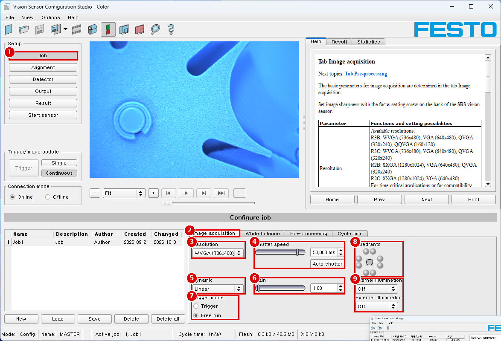
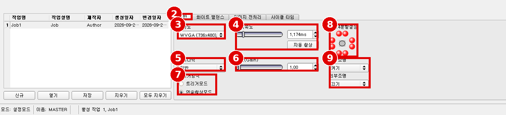
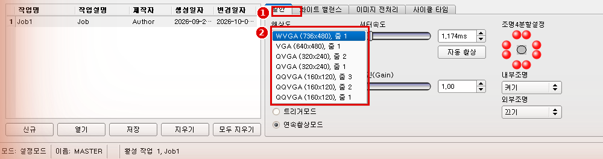
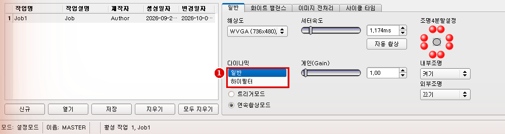
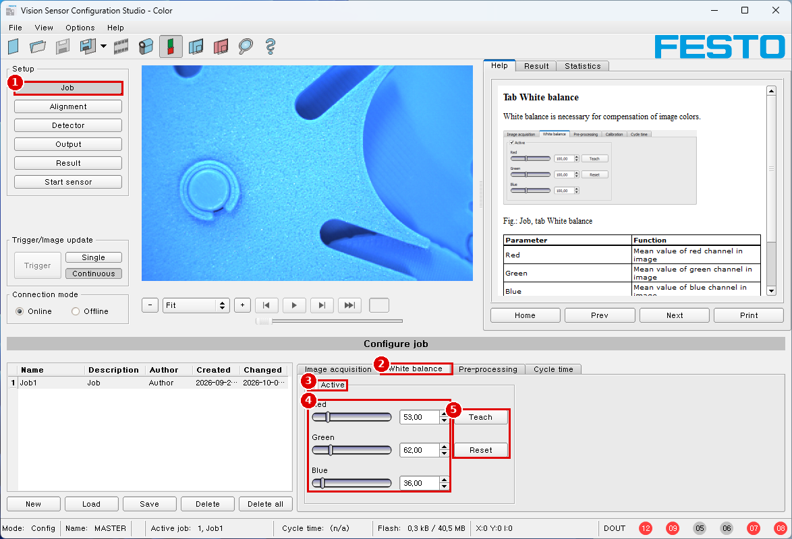
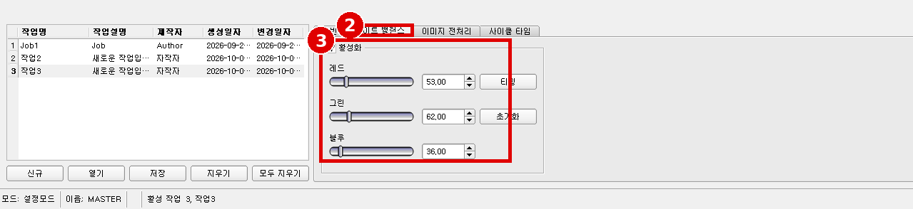
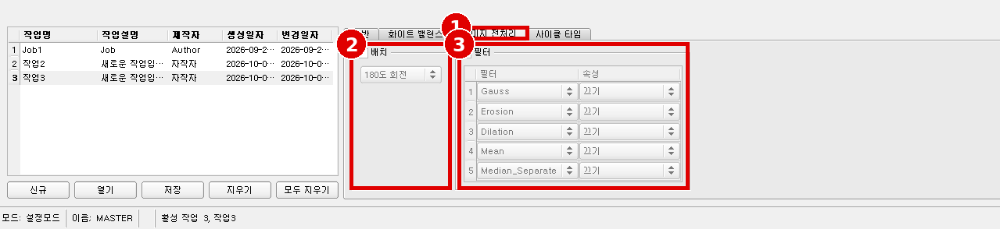
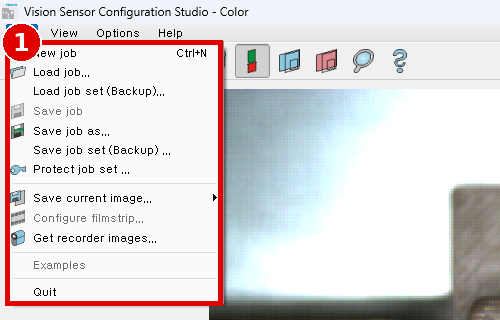
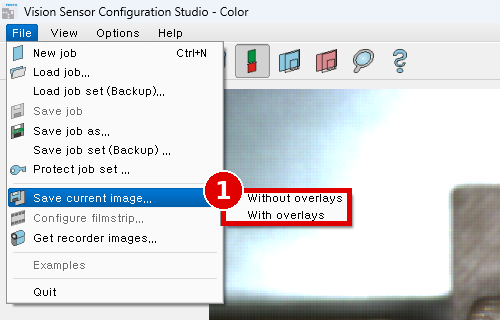

# Module 02 — 좋은 이미지 만들기

> 📝 **v3 (2026-10-02 PC 제어 캡처)**: 해상도·다이나믹 드롭다운 펼친 화면 추가 — V-02 ✅(QQVGA·줌 항목 있음, 상충 B-23), V-03 ✅(일반/하이필터). 이전 판: [`02_image-quality_v2.md`](02_image-quality_v2.md)

> 📝 **v2 (2026-10-02)**: 한국어 일반·화이트 밸런스·이미지 전처리 탭 화면, File 메뉴(필름스트립은 Offline 전용) 확인, 현재 조명 설정 갱신. 1차 판: [`02_image-quality.md`](02_image-quality.md)

> 현장 질문: **"검출기가 판단할 만큼 잘 보이나?"**
> 검출기는 이미지 품질을 넘지 못한다.

## 🎯 목표
1. 잡(Job)을 만들고 **Image acquisition / White balance / Pre-processing** 탭의 파라미터를 하나씩 바꿔 영상 변화를 **수치로** 기록한다.
2. OK·NG 시료의 차이가 가장 크게 보이는 **조명·노출 조건**을 고른다.
3. 같은 조건을 반복 시험할 수 있게 **필름스트립**을 만든다.

## 🏭 왜 필요한가
조명과 노출을 대충 두고 검출기 임계값만 만지면, 아침·저녁 실내 조명이 바뀔 때마다 판정이 흔들린다. 실제로 지금 설정(내장 조명 Off, 셔터 50 ms, 스크린샷 cs_job_image-acquisition)은 실내 조명에만 기대고 있다 → [상충 C-02](reports/conflict-report_v3.md#c-02).

## 📋 선행 조건 / 준비물
- [Module 01](01_connection-first-image.md) — 라이브 영상, 초점 고정
- 시료: OK 1개, "있나/없나" NG 1개, 색 다른 NG 1개, 광택 있는 부품 1개
- 흰 종이(화이트 밸런스용, 무늬 없는 A4), 검은 종이
- [실험 기록 양식](../templates/experiment-log.md)

> [!TIP]
> **밝기를 수치로 읽는 법**: 상태표시줄 `X: Y: I:` 는 마우스 커서 위치의 좌표와 픽셀 밝기다(Help: sc ⑪ "cursor x/y location and pixel intensity"). 밝은 곳·어두운 곳에 커서를 올려 I 값을 읽고 **ΔI = I(밝은 곳) − I(어두운 곳)** 을 콘트라스트로 기록한다. 컬러 영상에서 I가 어떤 값(회색값/채널)인지는 ⚠️ [실기 확인 필요: V-17].

---

## 2.1 잡 만들기

### ⚙️ 메뉴 경로
`Configuration Studio › Setup › Job` → 잡 목록 아래 `New` `Load` `Save` `Delete` `Delete all` (스크린샷 cs_job_image-acquisition)

### 📝 단계별 조작
1. 먼저 현재 상태를 백업한다: `File › Save job set (Backup) ...` → `backups/YYYYMMDD_before-m02.*` (Help: scjobset)
2. `New`로 잡을 하나 만든다. 이름 칸을 더블클릭해 `M02_image`로 바꾼다(Help: scjobedit).
3. 목록에서 새 잡을 선택한 상태로 아래 탭을 차례로 설정한다.

📖 Help 번역 — Setup Jobs (Help: scjob)

잡(job)은 특정 검사 작업을 수행하는 데 필요한 모든 설정과 파라미터를 담는다.

📖 Help 번역 — Creation, modification and administration of jobs (Help: scjobedit)

선택한(목록에서 표시된) 잡은 설정 창의 두 탭 모두에 파라미터를 입력해 수정할 수 있다. 목록에 잡이 없으면 먼저 새 잡을 만들어야 한다.

**새 잡 만들기:** 잡 선택 목록 아래의 "New" 버튼을 누른다. 목록에 새 잡 항목이 나타난다. 해당 줄(Name, Description, Author)을 더블클릭해 항목을 편집한다.

**그 밖의 기능**

| 기능 | 설명 |
|---|---|
| New | 새 잡을 정의 |
| Open | PC에서 잡을 불러옴 (※ 이 버전 화면 표기는 `Load`) |
| Save | 선택한 잡을 PC에 저장 |
| Delete | 선택한 잡을 목록에서 삭제 |
| Delete all | 목록의 모든 잡을 삭제 |
| Protect | 잡/잡셋을 비밀번호로 보호 (※ 이 버전 화면에는 버튼 없음 → File 메뉴, [상충 B-15](reports/conflict-report_v3.md#b-15)) |

설명한 모든 기능은 File 메뉴로도 할 수 있다.

센서의 메모리 용량이 다 차서 더 이상 잡을 센서에 올릴 수 없으면 상태표시줄의 남은 메모리 표시 색이 빨갛게 바뀐다.

## 2.2 Image acquisition 탭

### ⚙️ 메뉴 경로
`Setup › Job › Image acquisition` (스크린샷 cs_01 ②~⑨)

| 번호 | 화면 표기 | 파라미터 |
|---|---|---|
| ③ | Resolution | 해상도 |
| ④ | Shutter speed / `Auto shutter` | 노출 |
| ⑤ | Dynamic | 응답 곡선 |
| ⑥ | Gain | 게인 |
| ⑦ | Trigger mode `Trigger` / `Free run` | 트리거 |
| ⑧ | Quadrants | 조명 영역 |
| ⑨ | Internal illumination / External illumination | 조명 |

한국어 화면:

| # | 한국어 표기 | 영문 | 캡처 당시 값 (Job1) |
|---|---|---|---|
| 2 | `일반` 탭 | Image acquisition | |
| 3 | 해상도 | Resolution | WVGA (736x480), 줌 1 |
| 4 | 셔터속도 / `자동 활상` | Shutter speed / Auto shutter | **1.174 ms** |
| 5 | 다이나믹 | Dynamic | **일반** (선택지 `일반` / `하이필터` = Linear / High, V-03 ✅) |
| 6 | 게인(Gain) | Gain | 1.00 |
| 7 | 트리거방식: 트리거모드 / 연속촬상모드 | Trigger mode: Trigger / Free run | 연속촬상모드 |
| 8 | 조명4분할설정 | Quadrants | 8개 모두 켜짐 |
| 9 | 내부조명 / 외부조명 | Internal / External illumination | 켜기 / 끄기 |

### 해상도·다이나믹 선택지 (드롭다운 펼친 화면)

| # | 내용 |
|---|---|
| 1 | `일반` 탭 |
| 2 | `해상도` 목록: **WVGA (736x480) 줌 1 / VGA (640x480) 줌 1 / QVGA (320x240) 줌 2 / QVGA (320x240) 줌 1 / QQVGA (160x120) 줌 3 / QQVGA (160x120) 줌 2 / QQVGA (160x120) 줌 1** |

> [!WARNING]
> Help는 R3C 해상도를 "WVGA, VGA, QVGA" 3개로 적고 Zoom은 "R2B 전용"이라 했지만, 실제 화면(FW 1.23.2.2)에는 **QQVGA와 줌 2·3 항목이 있다** → [상충 B-23](reports/conflict-report_v4.md#b-23). V-02 ✅.
> `줌 n`이 시야를 1/n로 잘라 확대하는 것인지, 픽셀을 묶는(binning) 것인지는 화면만으로 알 수 없다 ⚠️ [실기 확인 필요: V-25] — QVGA 줌 1과 줌 2로 같은 자를 찍어 시야(mm)를 비교한다. **해상도를 바꾸면 검출기가 모두 지워지므로 실습용 새 잡에서만** 시험한다.

| # | 내용 |
|---|---|
| 1 | `다이나믹` 목록: **일반 / 하이필터** — 영문 Help의 `Linear` / `High`에 순서대로 대응 (V-03 ✅, V-24 🔶 순서 대조) |

> [!NOTE]
> 1차 스크린샷(내장 조명 Off, 셔터 50 ms) 이후 **내장 조명 On + 셔터 1.174 ms**로 바뀌었다. 새로 만든 작업2·작업3은 기본값 셔터 **0.25 ms**(설정파일 default 0.25)라 영상이 어둡다(cs_ko_job_load-dialog 배경). 실험 A의 A0 기준값으로 두 조건을 모두 기록한다.

📖 Help 번역 — Tab Image acquisition (Help: scjobgeneral)

영상 취득의 기본 파라미터는 Image acquisition 탭에서 정한다. 이미지 선명도는 SBS 비전 센서 뒷면의 초점 조절 나사로 맞춘다.

| 파라미터 | 기능과 설정 가능 범위 |
|---|---|
| Resolution | 사용 가능한 해상도: R3B: WVGA (736x480), VGA (640x480), QVGA (320x240), QQVGA (160x120) / **R3C: WVGA (736x480), VGA (640x480), QVGA (320x240)** / R2B: SXGA (1280x1024), VGA (640x480), QVGA (320x240) / R2C: SXGA (1280x1024), VGA (640x480). 처리 시간이 중요한 응용이나 호환성 때문에 낮은 해상도를 고를 수 있다. **해상도를 바꾸면 앞서 정의한 모든 검출기가 삭제된다!** |
| Zoom (R2B 전용) | Zoom 기능으로 여러 시야/이미지 영역을 고를 수 있다 (※ 이 품번 해당 없음) |
| Dynamic | 영상 취득 특성 최적화: "Linear"는 선형 응답 곡선(동적 영상 취득이 없는 SBS 제품처럼 동작), "High"는 이미지의 밝은 영역에서 계조가 더 좋다(과포화 방지). |
| Trigger mode | 트리거 모드 선택(SBS를 트리거 모드 또는 free run 모드로). 트리거 모드에서는 하드웨어 트리거(핀 03 WH)나 데이터 인터페이스 중 하나로 트리거할 수 있다. free run에서는 SBS가 계속 이미지를 찍고 평가를 처리한다. |
| Shutter speed | 이미지 밝기를 조절하는 파라미터. 이미지 밝기는 되도록 "Shutter speed"로 맞춘다. 이 방법으로 원하는 밝기를 얻을 수 없을 때만 슬라이더 "Gain"을 쓴다(Gain 기본값 = 1). 빠르게 움직이는 물체에서는 셔터 값이 크면 이미지가 번질 수 있다. Auto-Shutter 버튼으로 노출을 자동 설정할 수 있다. 최대 셔터 값은 100 ms다. **내장 조명 펄스의 최대 길이는 8 ms다.** 8 ms보다 긴 셔터 시간은 내장 조명과 외부 조명을 함께 쓸 때만 의미가 있다. |
| Gain | 이미지 밝기를 조절하는 파라미터. 먼저 셔터 속도로 밝기를 맞추고, 필요할 때만 두 번째 단계로 게인을 쓴다(Gain 기본값 = 1). |
| Quadrants (illumination) | LED를 클릭하면 조명의 개별 사분면을 끌 수 있다. 짧은 작업 거리에서 반사를 피하는 데 쓸 수 있다. |
| Internal illumination | 내장 조명 켜기/끄기 |
| External illumination | 외부 조명 선택(on / off / permanent). 외부 조명은 핀 09 RD로 스위칭된다. |

트리거 없이도 계속 갱신되는 라이브 이미지를 얻으려면 다음을 (필요하면 임시로) 설정한다.
- "Job/Image acquisition"에서 free run으로 설정
- "Trigger / collect image"에서 continuous로 설정

### 📝 파라미터 표

| 파라미터 | 시작값 | 의미 | 올리면 | 내리면 | 출처 |
|---|---|---|---|---|---|
| Resolution | WVGA (736×480) 줌 1 | 픽셀 수 (+ 줌) | (WVGA가 최대) | VGA/QVGA/QQVGA: 처리 빨라짐, mm/px 커짐, **검출기 전부 삭제** | (Help: scjobgeneral), (화면 2026-10-02) |
| Shutter speed | 1 ms (내장 조명 On) | 노출 시간, 0.017–100 ms | 밝아짐, 움직이는 시료 번짐, **8 ms 초과분은 내장 조명 효과 없음** | 어두워짐, 번짐 감소 | (Help: scjobgeneral), (설정파일) |
| Gain | 1.00 | 신호 증폭, 0.75–4 | 밝아짐 + 노이즈 증가 | 어두워짐, 노이즈 감소 | (설정파일) |
| Dynamic | 일반 (Linear) | 응답 곡선 | 하이필터 (High): 밝은 부분 포화 줄어듦 | 일반: 밝기에 선형 | (Help: scjobgeneral), (화면) |
| Internal illumination | On | 내장 백색 LED 8개 | — | Off: 주변광에만 의존 | (Help: scjobgeneral) |
| Quadrants | 전체 On | LED 사분면 | 더 켜면 균일, 반사 증가 가능 | 일부 끄면 반사·번쩍임 감소, 그림자 생김 | (Help: scjobgeneral) |
| External illumination | Off | 핀 09 RD 출력 | On: 촬영 시 출력 / Permanent: 계속 출력 | Off | (Help: scjobgeneral), (설정파일 Off/On/Permanent) |
| Trigger mode | Free run | 촬영 시작 조건 | — | Trigger: 외부/화면 트리거 때만 | (Help: scjobgeneral) |

> [!WARNING]
> **해상도를 바꾸면 그 잡의 검출기가 모두 삭제된다**(Help: scjobgeneral). 해상도는 이 모듈에서 확정하고, Module 03 이후에는 바꾸지 않는다.

## 2.3 White balance 탭

### ⚙️ 메뉴 경로
`Setup › Job › White balance` (스크린샷 cs_02)

| 번호 | 화면 표기 |
|---|---|
| ② | `White balance` 탭 |
| ③ | `Active` 체크 |
| ④ | `Red` `Green` `Blue` 슬라이더/값 (기본 53.00 / 62.00 / 36.00, 설정파일) |
| ⑤ | `Teach` / `Reset` |

| # | 한국어 표기 | 영문 |
|---|---|---|
| 1 | 작업 | Job |
| 2 | `화이트 밸런스` 탭 | White balance |
| 3 | 활성화 / 레드·그린·블루 (53.00 / 62.00 / 36.00) / 티칭 / 초기화 | Active / Red·Green·Blue / Teach / Reset |

📖 Help 번역 — Tab White balance (Help: scjobwhitebalance)

화이트 밸런스는 이미지 색을 보정하는 데 필요하다.

| 파라미터 | 기능 |
|---|---|
| Red | 이미지의 빨강 채널 평균값 |
| Green | 이미지의 초록 채널 평균값 |
| Blue | 이미지의 파랑 채널 평균값 |
| Teach | 화이트 밸런스 실행. 화이트 밸런스를 하려면 카메라 아래에 균일한 흰 영역이 있어야 한다. |
| Reset | 값 초기화 |

### 📝 단계별 조작
1. 2.2의 조명·셔터를 먼저 확정한다(화이트 밸런스는 조명 조건에 따라 달라진다).
2. 시료 자리에 흰 종이를 **화면 전체가 덮이게** 놓는다.
3. `Active` 체크 → `Teach`. 바뀐 Red/Green/Blue 값을 기록한다.
4. 흰 종이를 치우고 색 시료를 놓아 색이 자연스러워졌는지 본다.
5. `Reset`을 눌러 기본값(53/62/36)으로 돌아가는지 확인한 뒤, 다시 `Teach`로 맞춘다.

## 2.4 Pre-processing 탭

### ⚙️ 메뉴 경로
`Setup › Job › Pre-processing` (한국어: `작업 › 이미지 전처리`)

| # | 한국어 표기 | 영문 | 기본값 |
|---|---|---|---|
| 1 | `이미지 전처리` 탭 | Pre-processing | |
| 2 | 배치 (체크) + `180도 회전` | Arrangement (Rotation 180°) | 체크 해제 |
| 3 | 필터 (체크) + 1–5행 `필터` / `속성` | Filter / Property | Gauss, Erosion, Dilation, Mean, **Median_Separate**, 모두 `끄기` |

※ Help 목록의 `Median`이 화면에는 `Median_Separate`로 나온다. 같은 필터로 보고 쓰되 기록에는 화면 이름을 적는다.

📖 Help 번역 — Tab Pre-processing (Help: scjobpreprocessing)

Preprocessing 탭에서는 센서가 찍은 이미지를 분석 전에 필터링하고 재배치할 수 있다. **필터는 최대 5개, 배치 필터는 1개**까지 쓸 수 있고 선택한 순서대로 처리된다.
**모든 검출기(정렬 검출기와 일반 검출기)는 원본 이미지가 아니라 전처리된 이미지로 동작한다.**
특히 모폴로지 연산(Dilation, Erosion)은 조합하면 개선 효과가 있다. 예를 들어 Erosion과 Dilation을 차례로, 또는 반대 순서로 처리한다.

예: 밝은 배경 앞의 검은 점은 dilation과 erosion을 차례로 처리하면 없앨 수 있다.

**이미지 개선용 배치(arrangement)**

| 배치 종류 | 효과 |
|---|---|
| Rotation 180° | 이미지를 180° 회전 |
| Mirror | 세로 방향 대칭 |
| Flip | 가로 방향 대칭 |

**이미지 개선용 필터**

| 필터 종류 | 효과 |
|---|---|
| Gauss | 가우시안 필터 마스크로 이미지를 부드럽게 한다. 외란 감소, 방해되는 세부·잡티 억제, 이미지 평활화에 쓴다. |
| Erosion | 어두운 영역 확장, 어두운 영역 안의 밝은 픽셀 제거, 잡티 제거, 밝은 물체 분리. 각 회색값을 필터 마스크(예: 3x3) 안의 최소 회색값으로 바꾼다. |
| Dilation | 밝은 영역 확장, 밝은 영역 안의 어두운 픽셀 제거, 잡티 제거, 어두운 물체 분리. 각 회색값을 필터 마스크(예: 3x3) 안의 최대 회색값으로 바꾼다. |
| Median | 각 회색값을 필터 마스크(예: 3x3) 안 픽셀들의 중앙값으로 바꾼다. 대표 용도는 노이즈 감소, 특히 국소적으로 밝거나 어두운 픽셀("소금-후추" 노이즈) 제거. |
| Mean | 각 회색값을 필터 마스크(예: 3x3) 안 픽셀들의 평균 회색값으로 바꾼다. 외란 감소, 방해되는 세부·잡티 억제, 평활화에 쓴다. |
| Range | 각 회색값을 필터 마스크(예: 3x3) 안 픽셀들의 범위값(최대 − 최소 회색값)으로 바꾼다. 대표 용도는 엣지 검출·강조, 국소 콘트라스트 개선. |
| Standard deviation | 각 회색값을 필터 마스크(예: 3x3) 안 픽셀들의 표준편차로 바꾼다. 대표 용도는 표면 결함이나 엣지 강조. |
| Edge detection (Sobel) | 결과 이미지에 Sobel 알고리즘으로 검출한 엣지가 담긴다(영상처리 문헌 참조). 대표 용도는 엣지 검출·강조, 국소 콘트라스트 개선, 표면 결함 검출. |
| Multiplication | 각 픽셀의 회색값에 선택한 배수(2x, 4x, 8x, 16x)를 곱한다. 값은 255에서 잘린다. |
| Inversion | 이미지 반전 |

활성 필터의 효과는 이미지에 바로 보인다. 필터 커널을 크게 고를수록 효과가 강하다. 필터는 위에서 아래로 나열된 순서대로 적용된다.

**필터 설정하기:**
- Filter 열의 팝업 메뉴에서 원하는 순서대로 필터를 고른다.
- Property 열의 팝업 메뉴에서 필터 커널 크기를 넣는다. "Off"로 두면 그 필터는 꺼진다.

| 파라미터 | 시작값 | 올리면(커널 크게) | 내리면 / Off | 주의 |
|---|---|---|---|---|
| Median | Off | 점 노이즈 제거 ↑, 작은 결함도 같이 지워질 수 있음 | 원본 유지 | 결함 크기(px)보다 커널이 크면 결함이 사라진다 |
| Gauss / Mean | Off | 부드러워짐, 엣지 흐려짐 | 원본 유지 | Module 03 윤곽 추적 점수에 영향 |
| Erosion → Dilation | Off | 밝은 잡티 제거(열림) | 원본 | 순서를 바꾸면 반대 효과 |
| Multiplication | Off | 어두운 영상 증폭, 255에서 포화 | 원본 | 셔터로 해결되면 쓰지 않는다 |

> [!NOTE]
> FTP/SMB 아카이빙 이미지는 **전처리 전 이미지**로 저장된다(배치 설정만 반영). (Help: scjobarchive) → Module 07

## 2.5 필름스트립 — 같은 영상으로 반복 시험하기

### ⚙️ 메뉴 경로
`File › Configure filmstrip...` 또는 툴바 필름스트립 아이콘 (Help: scfilmstripedit)

> [!IMPORTANT]
> `Configure filmstrip...`은 **Online 상태에서는 회색(비활성)** 이다(스크린샷 cs_menu_file). 반드시 `Offline`으로 바꾼 뒤 연다 — Help 순서와 같다.

실험 이미지 한 장을 남길 때는 `File › Save current image... › Without overlays / With overlays`를 쓴다.

📖 Help 번역 — Creating filmstrips (Help: scfilmstripedit)

설정 모드에서는 센서 이미지가 PC의 RAM으로 계속 들어온다. Online에서 Offline 모드로 바꾸면 최대 30장의 이미지를 쓸 수 있고, 이를 필름스트립 파일로 저장할 수 있다. 센서에서 받은 이미지 대신, 또는 그에 더해, PC나 외부 저장 매체에 보관된 이미지 묶음이나 개별 이미지를 불러와 새 필름으로 합칠 수 있다.
목록에서 이미지를 선택하면 오른쪽 미리보기 창에 작게 표시된다.

**센서 이미지를 필름스트립으로 저장하기:**
1. 먼저 PC를 센서에 연결한다. free run과 collect image / continuous로 메모리를 이미지로 채운다(Mode of connection = online).
2. Mode of connection 창에서 "offline" 옵션 버튼을 고른다.
3. File 메뉴에서 configure filmstrips를 고르거나 툴바의 filmstrips 아이콘을 누른다. 센서에서 불러온 이미지가 아래 선택 목록에 나타난다.
4. 이제 이미지를 살펴보고, 순서를 바꾸거나 개별 이미지를 지우거나 추가할 수 있다. 필름스트립 하나의 최대 이미지 수는 30장이다.
5. 목록 아래의 "Save filmstrip" 버튼을 누른다. 목록의 모든 이미지가 보이는 순서대로 필름스트립 파일(확장자 .flm)로 저장되어 이후 시뮬레이션에 쓸 수 있다.

**PC의 필름스트립과 개별 이미지 불러오기:**
1. Mode of connection 창에서 "Offline" 옵션 버튼을 고른다.
2. File 메뉴에서 configure filmstrip을 고르거나 툴바의 filmstrip 아이콘을 누른다.
3. 목록에서 필름 파일을 골라 "Load filmstrip" 버튼을 누르거나, "Load image" 버튼으로 PC나 외부 저장 매체의 개별 이미지를 불러온다.
4. 불러온 이미지는 선택 목록에 추가된다.

파일 종류와 위치는 source 열에 표시된다: PC에 저장된 필름스트립(Film), PC에 저장된 개별 이미지(File), 센서 메모리의 이미지(Sensor). Online에서 Offline으로 바꾼 직후에는 모든 항목이 Sensor다.

**필름스트립 편집하기:** 출처와 관계없이 선택 목록의 개별 이미지로 새 필름을 만들 수 있다.

| 버튼 | 기능 |
|---|---|
| "˂", "˂˂", "˃", "˃˃" | 이미지 순서 바꾸기: 선택한 이미지를 한 칸 위/아래로, 또는 목록 끝으로 옮긴다 |
| Load image | 외부 저장 매체에서 이미지를 더 불러온다 |
| Delete, Delete all | 목록에서 이미지 삭제 / 모두 삭제 (저장 매체의 이미지는 지워지지 않는다) |
| Abort | 변경 없이 목록 닫기 |
| Import | 보이는 순서대로 모든 이미지를 PC의 필름 메모리로 불러온다. 이제 Offline 모드에서 표시·분석에 쓸 수 있다. |
| Load / Save film strip | 저장 매체에서 필름스트립을 불러오거나 저장 |

📖 Help 번역 — Simulation of jobs (offline mode) (Help: scfilmstrip)

저장된 필름스트립(= 이미지 묶음)을 써서 센서를 연결하지 않고도 설정을 만들고 시험할 수 있다. 시뮬레이션은 설정을 미리 준비하거나 Online에서 만든 설정을 개선할 때 유용하다.

참고: Vision Sensor Configuration Studio에는 출고 시 몇 개의 필름이 들어 있다. 그 밖의 영상 취득 방법: Image recorder.

### 📝 단계별 조작 — 기준 필름 만들기
1. 2.2~2.4 조건으로 Online, Free run, Continuous.
2. OK 시료 10장 분량(위치를 조금씩 바꿔 가며)을 찍히게 둔 뒤 `Offline`으로 바꾼다.
3. 필름스트립 창에서 OK 이미지만 남겨 `film_OK.flm`으로 저장.
4. 같은 방법으로 각 NG 유형별 `film_NG_<유형>.flm`을 만든다.
5. 이 필름들은 Module 04 검증(OK 10/10, NG 10/10)에 그대로 쓴다.

---

## 🧪 실험 A — 조건 A/B 콘트라스트 비교 (한 번에 변수 하나)

시료: "있나/없나" 대상 부위가 있는 OK 시료. 측정: 대상 부위(밝은 곳)와 배경(어두운 곳)의 I 값 → ΔI.

| # | 바꾼 변수 | 값 | I(대상) | I(배경) | ΔI | 포화(255) 여부 | 메모 |
|---|---|---|---|---|---|---|---|
| A0 | 기준: 내장 조명 Off, 셔터 50 ms (현재 값) | — | | | | | |
| A1 | Internal illumination | On (셔터 1 ms) | | | | | |
| A2 | Shutter speed | 0.25 ms | | | | | |
| A3 | Shutter speed | 2 ms | | | | | |
| A4 | Shutter speed | 8 ms | | | | | |
| A5 | Shutter speed | 16 ms | | | | | 8 ms 초과: 변화가 적어야 함(Help) |
| A6 | Gain (셔터 고정) | 2.0 | | | | | 노이즈 |
| A7 | Dynamic | High | | | | | 광택 부품에서 |
| A8 | Quadrants | 반사 나는 쪽 사분면 Off | | | | | |

**노이즈 측정 (A6, 전처리)**: 균일한 회색 영역 5점의 I 값 → 표준편차 σ 기록.

| 조건 | I₁ | I₂ | I₃ | I₄ | I₅ | σ |
|---|---|---|---|---|---|---|
| Gain 1.0 | | | | | | |
| Gain 4.0 | | | | | | |
| Gain 4.0 + Median 3x3 | | | | | | |

## 🧪 실험 B — 화이트 밸런스

| 단계 | Red | Green | Blue | 색 시료 인상 (자연스러움 1–5) |
|---|---|---|---|---|
| Reset (기본) | 53.00 | 62.00 | 36.00 | |
| Teach (내장 조명 On) | | | | |
| Teach 후 조명 Off로 변경 | (그대로) | | | → 조명 바꾸면 다시 Teach가 필요함을 확인 |

## 🧪 실험 C — 외부 조명 출력(핀 09 RD)

| External illumination | 상태표시줄 DOUT 09 | 멀티미터 핀 9–0 V (V) |
|---|---|---|
| Off | | |
| On | | |
| Permanent | | |

외부 조명 장비가 없으면 멀티미터·DOUT 표시로만 확인한다(V-14).

## 🔍 검증
- 선택한 조건에서 **ΔI(OK 대상 vs 배경) ≥ 50** 이고 포화(255) 픽셀이 검사 부위에 없다. (50은 이 튜토리얼의 출발 기준. Module 04 마진 결과로 조정)
- 같은 조건에서 10번 재촬영(Single) 시 I(대상)의 변동 폭 ≤ ±5
- 화이트 밸런스 Teach 값 기록 완료
- `film_OK.flm`과 NG 유형별 필름 저장 완료

## 💥 고장 주입

| 해 볼 것 | 관찰 |
|---|---|
| 내장 조명 Off + 셔터 0.25 ms | 거의 검은 영상 → Auto shutter가 무엇을 고르는지 기록 |
| 셔터 50 ms로 손으로 시료를 움직임 | 번짐 |
| 화이트 밸런스 Teach를 파란 종이 위에서 실행 | 색이 틀어짐 → Reset 후 재Teach |
| 검출기를 하나 만든 뒤 Resolution을 VGA로 변경 | **검출기 삭제** 확인 (Help: scjobgeneral) → 백업에서 복원 |
| Median 9x9 | 작은 결함이 사라지는 것 확인 |

## ⚠️ 함정과 해결

| 증상 | 원인 | 조치 |
|---|---|---|
| 셔터를 올려도 밝기가 거의 안 변함 | 내장 LED 펄스 최대 8 ms (Help: scjobgeneral) | 8 ms 이하로 쓰고 부족하면 Gain/외부 조명 |
| 검출기가 사라짐 | 해상도 변경 (Help: scjobgeneral) | 해상도는 처음에 확정, 바꾸기 전 백업 |
| 아침·오후 판정이 다름 | 주변광 의존 | 내장 조명 On + 짧은 셔터로 주변광 영향 줄이기 |
| 색이 파랗게 보임 | 조명 바꾼 뒤 WB 미재설정 | 흰 종이로 Teach |
| 광택 부위가 하얗게 날아감 | 정반사 | Quadrants 일부 Off, Dynamic High, 각도 조정 |
| LED-Power가 100 % 아님 | 긴 셔터 + 짧은 최소 사이클 | Cycle time 탭 → Module 05 |

## ✅ 체크리스트
- [ ] 해상도 확정 (이후 변경 금지)
- [ ] 조명 On/Off, 셔터, 게인, Dynamic, Quadrants 실험 표 완료
- [ ] 화이트 밸런스 Teach
- [ ] 필요 시 전처리 필터 1개 이하로 결정(이유 기록)
- [ ] OK / NG 유형별 필름스트립 저장
- [ ] 백업 파일 `backups/`에 저장

## 📁 포트폴리오 기록
- 스크린샷: 조건 A0 vs 최종 조건 비교 2장, WB 전후 2장
- 수치: ΔI 개선(예: 18 → 120), 노이즈 σ, 최종 셔터/게인/조명
- 한 줄 요약 예: "주변광 의존 설정(셔터 50 ms)을 내장 조명 펄스 한계(8 ms)에 맞춰 재설계해 콘트라스트 ΔI ○ → ○, 반복 변동 ±○ 이내"

---
출처 링크: Festo 다운로드·문서 안내 <https://www.festo.com/sp> (8058732 검색) · 매뉴얼 8.1.2–8.1.4장(p.69–73), 8.12장(p.268–269)
