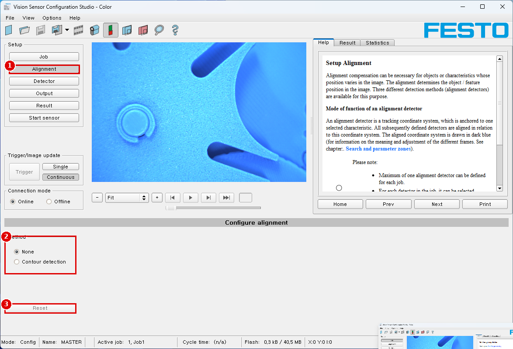

# Module 03 — 어디에 있나: 위치 추적 (Contour detection)

> 현장 질문: **"부품이 컨베이어에서 조금 밀리거나 돌아가도 검사 영역이 따라가나?"**

## 🎯 목표
1. Alignment에 **Contour detection**을 설정해 시료의 윤곽을 학습시킨다.
2. 이후 만드는 검출기의 검사 영역(ROI)이 시료를 **따라가게** 만든다.
3. 시료를 ±X mm 이동, ±θ 회전시켜 **추종 가능 범위**를 수치로 정한다.

## 🏭 왜 필요한가
위치 추적 없이 고정 ROI로 "캡 있나"를 보면, 부품이 3 mm만 밀려도 ROI가 배경을 보고 멀쩡한 부품을 NG로 버린다(과검출). 라인 정지와 재검사 비용이 생긴다.

## 📋 선행 조건 / 준비물
- [Module 02](02_image-quality.md) 완료: 해상도·조명·WB 확정, 필름스트립
- 모눈종이(1 mm) 위에 OK 시료, 각도기(또는 15° 간격 선을 그린 종이)
- 이 품번은 정렬 방식이 **Contour detection 하나뿐**이다(매뉴얼 p.19, 스크린샷 cs_alignment) → [상충 B-10](reports/conflict-report_v2.md#b-10)

---

## 3.1 검색 영역과 파라미터 영역 이해하기

📖 Help 번역 — Search and parameter zones (Help: scroi)

정렬과 검출기 설정 단계에서 검색 영역과 파라미터 영역을 정의할 수 있다. 이미지 창에서 서로 다른 색의 프레임으로 구분된다.
화면의 그림(노랑, 빨강 프레임 등)은 메뉴 항목 "View/all drawings"에서 검출기나 분류별로 켜고 끌 수 있다. "View/drawings of current detector only"를 쓰면 현재 처리 중인 검출기를 빼고 화면의 모든 그림을 끌 수 있다.

**검색 영역과 파라미터 영역의 정의**
새 검출기를 만들면 노란 프레임이 표시되는데, 이것이 검출기의 검색 영역이다. 검색 영역의 기본 모양은 사각형이다. contrast와 gray level 검출기는 원도 고를 수 있다. 정의된 특징(빨간 프레임)은 그 중심이 검색 영역(노란 프레임) 안에 있으면 찾아진다(초록 프레임).
pattern matching과 contour detection 검출기에는 검색 영역 안에 파라미터 영역도 있으며 빨강 또는 초록 프레임으로 표시된다.
- 빨간 프레임 = 학습(teach)한 특징
- 초록 프레임 = 찾은 특징

위치 제어/점검을 정의하면 파란 프레임도 나타난다(사각형, 원, 타원 중 하나).
정렬 검출기를 정의하면 그 프레임은 노란 점선으로 표시된다.
각 프레임의 왼쪽 위 모서리에 검출기 번호가 표시된다.

**검색 영역과 파라미터 영역 조정하기**
처음에 기본 크기·위치로 표시된 영역은 이미지나 검출기 목록에서 선택한 뒤 크기와 위치를 바꿀 수 있다. 프레임의 조절 손잡이 8개로 모양과 크기를 맞춘다. 프레임 안 아무 곳이나 클릭해 끌면 위치를 옮길 수 있다. 프레임 옆에서 중심을 가리키는 화살표로 프레임의 회전 위치를 바꿀 수 있다.
학습한 샘플은 화면 오른쪽 아래 General 또는 Parameters 탭에 원래 크기로 표시된다. 이미지나 검출기 목록에서 선택한 현재 활성 검출기의 프레임만 굵은 선과 조절 손잡이로 표시되고, 선택하지 않은 다른 프레임은 가는 선이나 점선(정렬 검출기)으로 표시된다.

참고:
- 최적의 검출을 위해 특징은 뚜렷해야 하고 그림자 같은 변하는 부분이 없어야 한다.
- 뚜렷한 윤곽, 엣지, 명암 차이가 유리하다.
- 평가 시간을 줄이려면 검색 영역을 불필요하게 크게 잡지 않는다.

**결과 막대(Result bar)**
검색 영역 오른쪽에 찾은 특징과 찾으려는 특징의 일치도가 고정 막대와 설정된 임계값으로 표시된다.
- 초록 막대 = 찾으려는 특징을 찾았고 설정한 최소 일치도 임계값에 도달했다.
- 빨간 막대 = 요구 일치도로 물체를 찾지 못했다. 표시할 그래픽은 View 메뉴에서 고를 수 있다.

| 프레임 색 | 의미 (Help: scroi) |
|---|---|
| 노랑 실선 | 검출기의 검색 영역 |
| 노랑 점선 | 정렬 검출기 프레임 |
| 빨강 | 학습한 특징(파라미터 영역) |
| 초록 | 찾은 특징 |
| 진한 파랑 | 정렬된 좌표계 (Help: scalignment) |
| 막대 초록/빨강 | 일치도가 임계값 이상/미만 |

## 3.2 Contour detection 설정

### ⚙️ 메뉴 경로
`Setup › Alignment › Method › Contour detection` → 아래 탭 `Color channel` `Parameters` `Optimization, contour` `Speed` `Result offset` (Help: scalignmentcontour)

| 번호 | 화면 표기 |
|---|---|
| ① | Setup `Alignment` |
| ② | Method: `None` / `Contour detection` |
| ③ | `Reset` (선택한 정렬 검출기를 공장 설정으로) |

⚠️ [스크린샷 필요: `cs_alignment_contour_colorchannel.png`, `…_parameters.png`, `…_optimization.png`, `…_speed.png`, `…_resultoffset.png`]

📖 Help 번역 — Setup Alignment (Help: scalignment)

이미지 안에서 위치가 바뀌는 물체나 특징에는 정렬 보정이 필요할 수 있다. 정렬은 이미지 안의 물체/특징 위치를 결정한다. 이를 위해 세 가지 검출 방법(정렬 검출기)이 있다. (※ 이 품번은 Contour detection 하나만 표시됨)

**정렬 검출기의 동작 방식**
정렬 검출기는 하나의 선택한 특징에 고정된 추적 좌표계다. 이후에 정의하는 모든 검출기는 이 좌표계를 기준으로 정렬된다. 정렬된 좌표계는 진한 파랑으로 그려진다(여러 프레임의 의미와 조정은 Search and parameter zones 장 참조).

참고:
- 잡 하나에 정렬 검출기는 최대 하나만 정의할 수 있다.
- 잡의 각 검출기마다 정렬을 따라갈지 말지 고를 수 있다.
- 정렬은 계산 단계가 하나 더 필요하므로 응용에서 꼭 필요할 때만 쓴다.

📖 Help 번역 — Selection and configuration of an Alignment (Help: scalignmentedit)

**정렬 검출기 고르기:**
1. Setup 버튼 "Alignment"를 누른다.
2. 설정 창 "Method"에서 검출 방법을 고른다.

| 검출 방법 | 설명, 선택 기준 |
|---|---|
| None | 정렬 끔 |
| Pattern matching | 임의의 패턴 검출. 다음 경우 우선 쓴다: 축에 평행하거나 명암이 강한 엣지가 거의 없고, 이미지에 회색 무늬 영역이 있을 때. 부품에 각도 편차/회전이 있으면 쓸 수 없다. 회전 허용은 패턴에 따라 약 +/- 5 %. (※ 이 품번 해당 없음) |
| Edge detection | 엣지 검출은 다음 경우에 쓴다: X 및/또는 Y 방향 위치 오프셋이 있을 때, 최대 각도 오프셋(학습 위치 대비 회전)이 약 ±20°(물체와 응용에 따라 다름)일 때, 축에 평행하고 명암이 강한 엣지가 있을 때. 위 조건을 만족하면 엣지 검출은 매우 빠른 정렬 방법이다. (※ 이 품번 해당 없음) |
| **Contour detection** | 임의 각도의 윤곽과 엣지 검출. 다음 경우에는 반드시 contour detection을 써야 한다: 학습 위치 대비 회전이 360°까지 생길 수 있을 때. 어떤 모양이든 명암이 좋은 엣지가 있을 때 우선 쓸 수 있다. 상대적으로 복잡한 contour detection 기능은 보통 사이클 타임이 비교적 길다. |

**정렬 검출기 설정하기:**
1. 필요하면 화면에 표시된 검색 영역과 파라미터 영역의 위치와 크기를 맞춘다.
2. Parameters 탭에서 정렬 검출기를 설정한다.

**검출기별 정렬 적용**
"Detector" Setup에 선택한 모든 검출기가 나열된다. "Alignment" 열에서 검출기마다 설정한 정렬을 따를지 고를 수 있다. 기본값은 "Active"다.

**Reset**
"Reset" 버튼으로 선택한 정렬 검출기를 공장 설정으로 되돌릴 수 있다.

📖 Help 번역 — Alignment Contour detection (Help: scalignmentcontour)

이 검출기는 엣지를 이용해 윤곽을 검출하는 데 알맞다. 검색 영역 안 물체의 윤곽을 학습해 센서에 저장한다. Run 모드에서 센서는 학습한 윤곽과 가장 잘 맞는 위치를 찾는다. 일치도가 설정한 임계값보다 높으면 결과는 양호(positive)다. contour detection은 완전한 360° 각도 검출 모드로 동작할 수 있다. 즉 물체가 어떤 각도로 돌아가 있어도 된다(각도 설정을 그에 맞게 해야 한다).

다음 주제: Tab Color channel, Tab Parameters, Tab Optimization contour, Tab Speed, Tab Result offset, Tab Gripping space (※ Gripping space 탭은 이 품번 화면에 없으면 해당 없음)

### 탭 1 — Color channel

📖 Help 번역 — Tab Color channel (Help: sccolorselectiongrey)

Color channel 탭에서 컬러 이미지(3채널)를 회색값 이미지(1채널)로 바꿀 수 있다. 흑백 SBS 비전 센서의 회색값 이미지와 달리 명암을 크게 높일 수 있다. 어떤 색을 강조할지는 검출기마다 따로 정할 수 있다. 그래서 광학 컬러 필터를 쓰는 것보다 훨씬 유연하다.
표시되는 이미지는 선택한 검출기에 따라 다르다.
- Color 검출기: 항상 컬러로 표시
- Object 검출기: 흑백 이미지. 선택한 색 모델과 색 채널에 따라 표시

Color channel 탭에서 설정할 수 있는 파라미터:

| 파라미터 | 기능 |
|---|---|
| Color model | 색 모델: RGB, HSV, LAB |
| Selection color filter | 색 공간에 따라 다음 색 필터의 전부 또는 일부를 쓸 수 있다: Color channel (기본), Color distance, Binarization. 이미지를 컬러와 흑백 사이에서 전환한다. |

**색 필터 선택**
- **Color channel (기본)** — 선택한 색 채널을 회색값 이미지로 쓴다.
- **Color distance** — 색 모델 값을 지정하거나 스포이트로 기준색을 고른다. 회색값 이미지는 각 픽셀이 이 기준색에서 얼마나 떨어져 있는지를 나타낸다. 대표 용도: OCR용 문자 분리.

| 파라미터 | 기능 |
|---|---|
| Red / Green / Blue / Lightness / A / B | 색 채널. 슬라이더나 값 입력으로 설정(기본 0) |
| Pipette button | 스포이트 버튼을 고른 뒤 이미지를 클릭하면 선택한 색 채널이 자동으로 정해진다 |
| Maximum distance | 현재 색과 학습한 색 사이의 거리. 최대 색 거리를 넘는 색은 "Inverted" 설정에 따라 검정 또는 흰색이 된다 |
| Inverted | 색 거리 이미지 반전 |

- **Binarization** — 색 범위를 고른다. 이 색 범위 안의 모든 픽셀은 흰색, 색값이 벗어난 픽셀은 검정이 된다.

| 파라미터 | 기능 |
|---|---|
| Red / Green / Blue / Hue / Saturation / Value / Lightness / A / B | 색 범위 결정. 슬라이더나 값 입력으로 설정 |
| Inverting button | 누르면 현재 설정을 반전 |
| Pipette button | 스포이트 버튼을 고른 뒤 이미지를 클릭하면 선택한 색 채널이 자동으로 정해진다 |

**활용**: 시료와 배경의 색이 다르면 그 색 차이가 가장 큰 채널(예: 빨간 시료 + 흰 배경 → RGB의 G 또는 B 채널)을 골라 윤곽의 명암을 키운다.

### 탭 2 — Parameters

📖 Help 번역 — Tab Parameters (Help: scalignmentcontourparameters)

contour detection의 가장 중요한 파라미터는 Parameters 탭에서 설정한다.
오른쪽 아래의 옅은 파랑 엣지(이미지에서 명암 변화가 큰 곳)는 파라미터 설정에 따라 찾아 표시된 것이다. 찾은 엣지/윤곽은 이 파라미터를 바꾸거나 "Edit contour" 기능으로 바꿀 수 있다. SBS 비전 센서는 이 윤곽을 검색 영역(노란 프레임) 안에서 찾는다.

| 파라미터 | 기능 |
|---|---|
| Threshold | 찾은 윤곽과 학습한 윤곽이 일치해야 하는 기준 |
| Angle range | 검색하는 각도 범위 (범위가 클수록 처리 시간이 길다) |
| Scale range | 정해진 배율 범위 안에서 확대·축소된 물체도 검출 |
| Contour | 학습한 윤곽 표시 (시야의 빨간 프레임) |
| Edit contour | 윤곽 편집으로 검색 영역의 일부를 가릴 수 있다. 검사에 상관없는 부분을 지우개처럼 지울 수 있다. 마스크는 반전할 수도 있다. |
| Lock | 윤곽 잠금/해제: 잠긴 상태에서는 학습 영역 변경 같은 (의도치 않은/실수에 의한) 변경으로부터 학습한 윤곽이 보호된다. 학습한 윤곽을 바꾸려면 잠금을 푼다. |

**추가 정보 — 실행 속도 최적화:**
- 위치 검색 영역(노란 프레임)은 필요한 만큼만 크게.
  참고: 패턴의 중심점이 검색 영역 안에 있는 한 윤곽은 찾아진다!
- 배율 검색 범위는 필요한 만큼만.
- 해상도를 VGA 대신 QVGA로 낮춘다. 주의: 전역 파라미터이므로 모든 검출기에 영향을 준다!
- "accurate – fast"를 fast로.
- "Min. contrast pattern" 값을 올린다. 관련 윤곽이 화면에 여전히 보이는지 주의한다.
- "Min. contrast image" 값을 올린다.
- 특히 정렬에서는: 명암이 더 높은 다른 기준 패턴을 써서 "Min. contrast pattern"과 "Min. contrast image"를 올릴 수 있게 한다.

**안정적인 검출:**
- 위치 검색 영역(노란 프레임)이 충분히 큰가?
- 각도 검색 범위가 충분히 큰가?
- 배율 검색 범위가 충분히 큰가?
- 모델과 이미지의 명암이 알맞게 설정되었나? (모델은 샘플에서 보이게)
- 이미지에 겹친 물체가 여러 개 있나?
- 뚜렷한 엣지가 있나? 필요하면 다시 학습한다.
- "Min. contrast pattern"이 알맞은가? 학습한 패턴에 관련 윤곽선이 다 나타나지 않으면 "Min. contrast pattern"을 내린다. 윤곽선이 너무 많이 나타나면 올린다.
- "Min. contrast image"가 현재 이미지에 알맞은가? 현재 이미지의 명암이 학습한 기준 이미지/패턴보다 높거나 낮으면 "Min. contrast image"를 그에 맞게 올리거나 내린다.
- 엉뚱한 위치에서 윤곽을 찾나? 학습한 패턴이 고유하지 않으면 새 윤곽을 학습한다.
- 결과 값이 이미지마다 크게 흔들리나? 그림자 때문에 생긴 엣지나 원하지 않는 윤곽 조각 같은 "가짜" 엣지가 학습되지 않았는지 확인한다. "Min. contrast pattern"을 올린다. "Edit contour"로 검색 영역 일부를 가릴 수 있다.

파라미터 Angle range: 각도의 회전 방향(그림 참조)

### 탭 3 — Optimization, contour

📖 Help 번역 — Tab Optimization, contour (Help: scalignmentcontouroptimization)

"Optimization, contour" 탭에서 엣지 전이와 명암에 대한 추가 설정을 할 수 있다.

| 파라미터 | 기능 |
|---|---|
| Min. contrast pattern | 학습한 모델에서 엣지로 인정되기 위한 최소 명암 |
| Min. contrast image | 현재 이미지에서 엣지로 받아들이기 위한 최소 명암 |
| Edge transition (Fix / Fix + inverted / Flexible) | 물체/윤곽과 배경 사이의 전이를 정한다. 윤곽을 학습한 배경에서만 찾을지("Fix"), 학습한 배경과 반전된 배경에서 찾을지("Fix + inverted"), 어떤 배경에서든 찾을지("Flexible") 고른다. |
| Auto | 자동 선택 |

**추가 정보 — Edge transition 예:** 회색 물체를 더 밝은 배경 앞에서 학습했다.

| Edge transition 설정 | 밝은 배경 | 어두운 배경 | 일정하지 않은 배경 |
|---|---|---|---|
| Fix | OK | not OK | not OK |
| Fix + inverted | OK | OK | not OK |
| Flexible | OK | OK | OK |

### 탭 4 — Speed

📖 Help 번역 — Tab Speed (Help: scalignmentcontourspeed)

Speed 탭의 파라미터로 센서의 실행 시간을 바꿀 수 있다. Search levels를 조정하면 검색에 쓰는 세밀함과 시간이 바뀐다. 검색을 덜 세밀하게 하면(일찍 끝내므로 빠름), 또는 더 세밀한 부분까지 고려하면(오래 찾으므로 느림) 된다.

| 파라미터 | 기능 |
|---|---|
| Angle step | 선택한 각도 범위 전체에서의 검색 민감도(도 단위 [°]) |
| Scale step | 선택한 배율 범위 전체에서의 검색 민감도 |
| Search levels (accurate - fast) | 검색 단계 수. 큰 값: 빠름 = 위험(후보를 놓칠 수 있음). 작은 값: 느림 = 덜 위험(모든 후보) |
| Accordance level (accurate - fast) | 표시된 값보다 점수가 낮은 후보는 검색 중 자동으로 버려진다. 큰 값: 일찍 버림 = 빠름 = 위험. 작은 값: 늦게 버림 = 느림 = 덜 위험. 잘못된 결과가 나오면 이 값을 내린다(더 정확하게). |
| Auto | 자동 선택 |

### 탭 5 — Result offset

📖 Help 번역 — Tab Result offset (Help: screspose)

Result offset으로 찾은 물체의 최종 위치를 바꿀 수 있다. 로봇 좌표계로 작업하면서 예를 들어 '집기 점(pick point)'을 정해야 할 때 유용하다.

| 파라미터 | 기능 |
|---|---|
| None | 관심 영역(ROI)의 (중심을) 자동으로 정한다 |
| Offset | 자유롭게 고를 수 있는 위치(그래픽 또는 값 입력). 예: 로봇 그리퍼용. X: X 방향 오프셋(ROI 중심 기준), Y: Y 방향 오프셋(ROI 중심 기준), Angle: 각도 오프셋(ROI 방향 기준) |

### 📝 파라미터 표 (시작값은 화면 기본값을 그대로 기록 — ⚠️ 범위는 자료에 없음, V-15)

| 탭 | 파라미터 | 시작값 | 의미 | 올리면 | 내리면 |
|---|---|---|---|---|---|
| Parameters | Threshold | (기본값 기록) | 윤곽 일치 기준 | 엄격 → 비슷한 물체 오인 감소, 정상품 놓칠 위험 | 관대 → 잘 찾지만 엉뚱한 곳 오인 위험 |
| Parameters | Angle range | 시료 회전 범위 + 여유 | 검색 각도 | 넓게 → 시간 ↑ | 좁게 → 범위 밖 회전 실패 |
| Parameters | Scale range | 1.0 근처 | 크기 변화 허용 | 넓게 → 시간 ↑, 크기 다른 시료도 찾음 | 좁게 → 크기 다른 시료는 못 찾음 (04-3에 활용) |
| Optimization | Min. contrast pattern | Auto | 모델 엣지 최소 명암 | 윤곽선 감소(그림자 제거) | 윤곽선 증가(잡음 엣지 포함) |
| Optimization | Min. contrast image | Auto | 현재 영상 엣지 최소 명암 | 어두운 영상에서 못 찾을 수 있음 | 잡음에 민감 |
| Optimization | Edge transition | Auto | 배경 극성 | Flexible: 배경 바뀌어도 찾음 | Fix: 학습 배경에서만 |
| Speed | Search levels | Auto | 검색 단계 | 빠르고 위험 | 느리고 안전 |
| Speed | Accordance level | Auto | 후보 조기 탈락 | 빠르고 위험 | 느리고 안전 |

### 📝 단계별 조작
1. 시료를 모눈종이 기준 위치(원점)에 놓고 `Single`로 한 장 찍는다(설정은 단일 이미지로 하는 것이 좋다: 매뉴얼 p.48).
2. `Alignment › Method = Contour detection`.
3. 노란 검색 영역을 **시료가 움직일 범위 + 여유** 만큼 키운다. 빨간 파라미터 영역은 시료의 **뚜렷한 바깥 윤곽**에 맞춘다(그림자·인쇄 글자 제외).
4. Color channel 탭: 시료-배경 대비가 가장 큰 채널을 고른다.
5. Parameters 탭: Angle range를 실험 범위(예: ±180°)로, Scale range는 좁게.
6. Optimization 탭: 윤곽선이 시료 외곽만 깨끗하게 나올 때까지 Min. contrast pattern을 조정. 그림자 윤곽이 남으면 `Edit contour`로 지운다. 확정 후 `Lock`.
7. **추종 확인용 검출기 하나 추가**: `Detector › New › Contrast`(자세한 설정은 04-1). 검출기 목록의 `Alignment` 열이 `Active`인지 확인(Help: scalignmentedit).
8. 시료를 옮기며 진한 파랑 좌표계와 Contrast 검출기 프레임이 함께 움직이는지 본다.

## 🧪 실험 — 추종 범위 측정 (한 번에 변수 하나)

**측정 항목**: 정렬 성공 여부(막대 초록/빨강), 정렬 점수 ⚠️(Result 탭에 정렬 검출기 결과가 나오는지 확인), Contrast 검출기 프레임이 같은 부위에 있는지(O/X).
각 조건 10회(시료를 놓았다 다시 놓기).

**A. 이동 (회전 0°)**

| 이동 X (mm) | 성공 / 10 | 점수 최소 | 점수 평균 | ROI 추종 O/X |
|---|---|---|---|---|
| 0 | | | | |
| +2 / −2 | | | | |
| +5 / −5 | | | | |
| +10 / −10 | | | | |
| 검색 영역 경계 밖 | | | | |

Y 방향도 같은 표로 반복.

**B. 회전 (이동 0)**

| 회전 (°) | 성공 / 10 | 점수 최소 | 점수 평균 | ROI 추종 O/X |
|---|---|---|---|---|
| 0 | | | | |
| ±15 | | | | |
| ±45 | | | | |
| ±90 | | | | |
| 180 | | | | |

**C. 속도와 정확도 (Speed 탭)** — Statistics의 실행 시간(Module 05에서 Start sensor 후 측정)

| Search levels / Accordance level | 평균 실행 시간 (ms) | B표 ±90° 성공 / 10 |
|---|---|---|
| Auto | | |
| fast 쪽 끝 | | |
| accurate 쪽 끝 | | |

## 🔍 검증
- 정한 **허용 편차(예: ±5 mm, ±180°)** 안에서 정렬 성공 **10/10**, ROI 추종 10/10
- 점수 마진: `정렬 점수 최소값 − Threshold ≥ 15 %p` ⚠️ 점수 단위는 화면에서 확인
- 허용 편차 밖(검색 영역 밖)에서는 **실패해야 정상** — 실패 시 잡 결과가 NG가 되는지 Module 05에서 확인

## 💥 고장 주입

| 해 볼 것 | 관찰할 증상 |
|---|---|
| Angle range를 ±10°로 줄이고 45° 회전 | 정렬 실패, 빨간 막대 |
| 시료 옆에 그림자를 만드는 물체를 두고 재학습 | 점수 흔들림 → Min. contrast pattern ↑ / Edit contour |
| 배경을 검은 종이로 바꿈 (Edge transition = Fix) | 실패 → Fix + inverted / Flexible로 바꿔 비교 |
| 검출기 목록 Alignment = 비활성 | 시료를 옮기면 ROI가 제자리에 남음 |
| 시료를 2개 놓음 | 엉뚱한 쪽에 정렬 |

## ⚠️ 함정과 해결

| 증상 | 원인 | 조치 |
|---|---|---|
| 점수가 이미지마다 크게 흔들림 | 그림자·반사 엣지가 학습됨 (Help) | Min. contrast pattern ↑, Edit contour |
| 엉뚱한 위치에 정렬 | 학습 윤곽이 고유하지 않음 (Help) | 더 특징적인 부위로 재학습 |
| 실행 시간이 김 | 검색 영역·각도·배율 범위가 큼 | 필요한 만큼만 (Help) |
| 해상도를 낮췄더니 검출기가 사라짐 | 해상도는 전역 파라미터 + 변경 시 검출기 삭제 | Module 02에서 확정 |
| 시료가 반쯤 화면 밖이어도 찾음 | 중심이 검색 영역 안이면 찾음 (Help) | 검색 영역을 실제 허용 범위로 |

## ✅ 체크리스트
- [ ] Contour detection 학습, 윤곽 깨끗함, Lock
- [ ] 검색 영역 = 허용 편차 + 여유
- [ ] 이동·회전 실험표 완료, 허용 편차 결정
- [ ] 검출기 Alignment 열 Active 확인
- [ ] 백업 저장

## 📁 포트폴리오 기록
- 스크린샷: 학습 윤곽(빨강), 이동/회전 상태에서 추종하는 화면 2장
- 수치: 허용 편차(±mm, ±°), 성공률, 점수 마진, 실행 시간
- 한 줄 요약 예: "윤곽 기반 정렬로 ±○ mm/±○° 위치 편차를 보정해 고정 ROI 대비 과검출 제거(추종 10/10)"

---
출처 링크: Festo 다운로드·문서 안내 <https://www.festo.com/sp> (8058732 검색) · 매뉴얼 8.2장(p.97–122), 8.15장(p.271–272)
