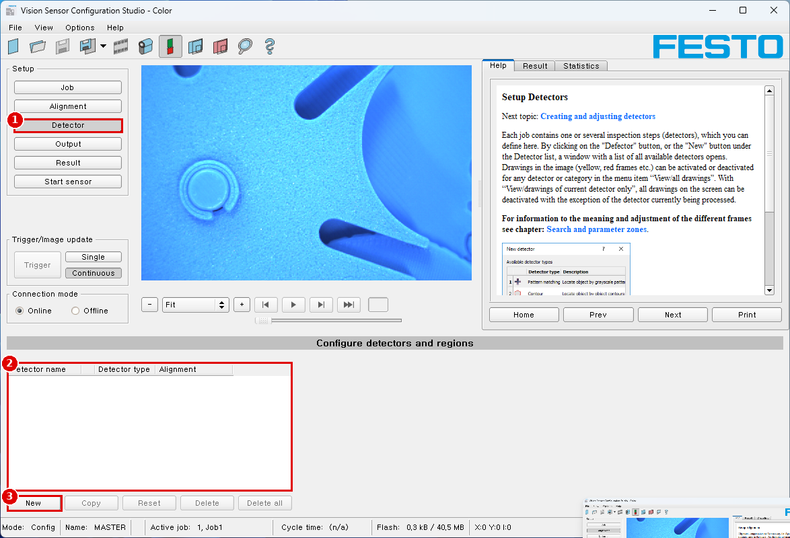
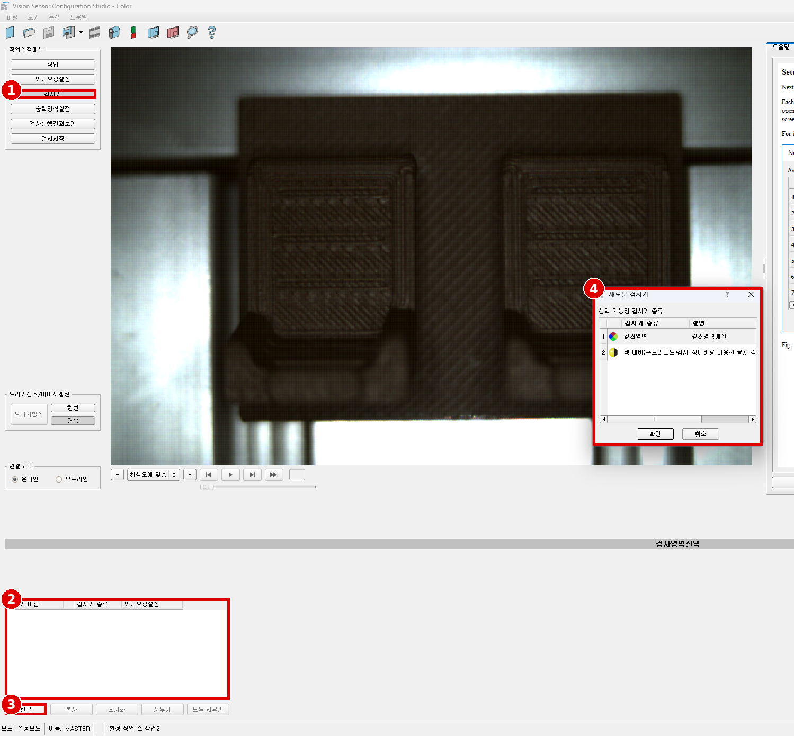
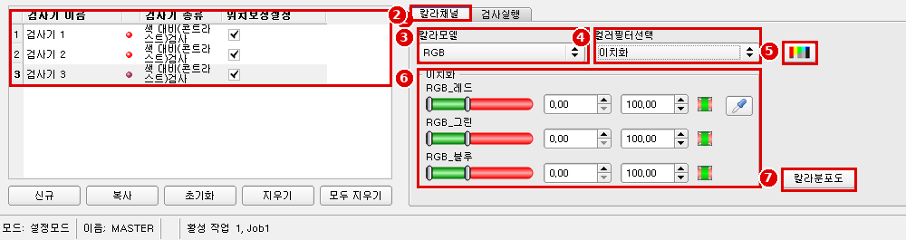
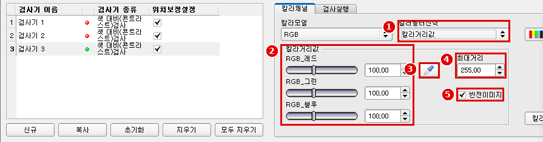
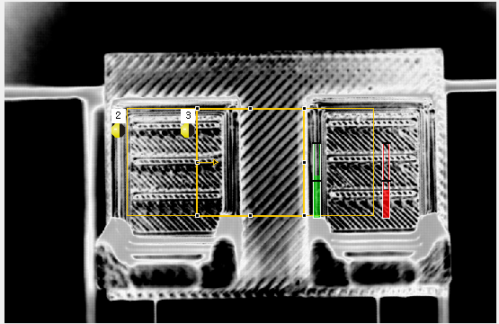
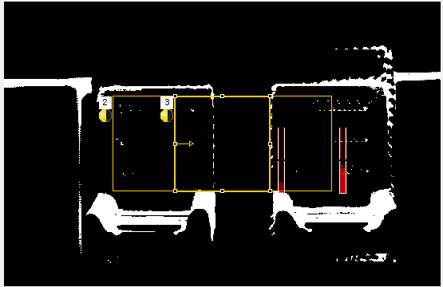
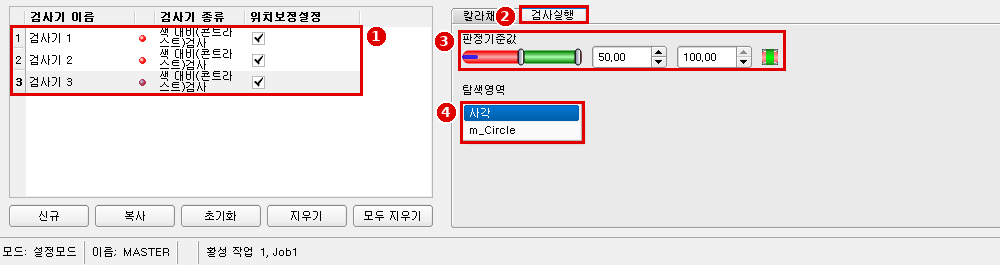

# Module 04 — 무엇을 판별하나 (검사 질문별 검출기)

> 📝 **v3 (2026-10-02 PC 제어 캡처)**: 색 대비 검사의 `칼라채널`·`검사실행` 탭 화면과 필터별 영상 추가 — V-01 ✅(검출기 3개), V-11 ✅(사각/원만). 컬러영역 검출기 화면은 아직 없음. 이전 판: [`04_inspection-detectors_v2.md`](04_inspection-detectors_v2.md)

> 📝 **v2 (2026-10-02)**: `새로운 검사기` 창 화면으로 검출기 2종 확인(V-04 ✅), 원형 영역 사용 확인, '검출기 없는 잡' 오류 추가. 1차 판: [`04_inspection-detectors.md`](04_inspection-detectors.md)

> 현장 질문: **"있나? 색이 맞나? 크기가 맞나?"**
> 이 장비(Color Standard)의 검출기는 **Contrast**, **Color area** 두 가지다(매뉴얼 p.19). 검사 질문을 이 둘로 푼다.

| 레슨 | 검사 질문 | 검출기 | 대표 처리 시간 |
|---|---|---|---|
| [04-1](#04-1-있나없나--contrast) | 있나/없나 | Contrast | typ. 2 ms (매뉴얼 p.396, 데이터시트) |
| [04-2](#04-2-색이-맞나--color-area) | 색이 맞나 / 얼마나 덮였나 | Color area | typ. 30 ms (매뉴얼 p.397, 데이터시트) |
| [04-3](#04-3-크기가-맞나--gono-go-대체-기법) | 크기가 맞나 (Go/No-Go) | Color area 면적·Object size + Contrast 경계 띠 | 위 두 값의 합 |

## 📋 공통 선행 조건 / 준비물
- [Module 02](02_image-quality.md) 조명·WB 확정, OK/NG 필름스트립
- [Module 03](03_alignment-contour.md) 정렬 완료(검출기 Alignment = Active)
- 시료: OK 10개(또는 OK 1개를 10번 다시 놓기), NG 유형별 10회
- 마진 정의(이 튜토리얼 공통):
  - 합격 범위 = Threshold `[min, max]`
  - **마진 = 측정값과 가장 가까운 합격 경계 사이의 거리(%p)**. OK 시료는 범위 안쪽으로, NG 시료는 범위 바깥쪽으로 잰다.
  - 기준: OK·NG 모두 **마진 ≥ 15 %p**

---

## 4.0 검출기 공통 조작

### ⚙️ 메뉴 경로
`Setup › Detector` → 목록 아래 `New` `Copy` `Reset` `Delete` `Delete all` (스크린샷 cs_04)

| 번호 | 화면 표기 |
|---|---|
| ① | Setup `Detector` |
| ② | 목록 열: `Detector name` `Detector type` `Alignment` |
| ③ | `New` (검출기 종류 선택 창이 열림) |

| # | 한국어 표기 | 영문 |
|---|---|---|
| 1 | 검사기 | Detector |
| 2 | 목록: 검사기 이름 / 검사기 종류 / 위치보정설정 | Detector name / Detector type / Alignment |
| 3 | 신규 (옆: 복사 / 초기화 / 지우기 / 모두 지우기) | New (Copy / Reset / Delete / Delete all) |
| 4 | `새로운 검사기` 창 › 선택 가능한 검사기 종류: **1 컬러영역** (컬러영역계산), **2 색 대비(콘트라스트)검사** | New detector: **Color area**, **Contrast** |

✅ **V-04 확인**: 목록에 검출기가 **두 종류뿐**이다(매뉴얼 p.19와 일치). 오른쪽 Help 그림의 7종 목록은 Object 센서 예시다.

> [!NOTE]
> 기존 Job1에는 이미 **원형 검색 영역**의 검출기가 있다(스크린샷 cs_ko_main). 지금 Job1의 검출기는 **색 대비(콘트라스트)검사 3개**다(아래 cs_ko_04_det_contrast_check-tab) → 잡당 검출기 **3개 이상 가능**(V-01 ✅, 데이터시트 "2"와 상충 → [B-02](reports/conflict-report_v4.md#b-02)). 검색 영역은 `사각` / `m_Circle` 두 가지뿐이고 **Free shape 없음**(V-11 ✅).

📖 Help 번역 — Setup Detectors (Help: scdetector)

각 잡에는 하나 이상의 검사 단계(검출기)가 들어 있으며 여기서 정의한다. "Detector" 버튼이나 Detector 목록 아래의 "New" 버튼을 누르면 쓸 수 있는 모든 검출기의 목록 창이 열린다. 이미지의 그림(노랑, 빨강 프레임 등)은 메뉴 항목 "View/all drawings"에서 검출기나 분류별로 켜고 끌 수 있다. "View/drawings of current detector only"를 쓰면 현재 처리 중인 검출기를 빼고 화면의 모든 그림을 끌 수 있다.
여러 프레임의 의미와 조정은 Search and parameter zones 장을 본다.

📖 Help 번역 — Creating and adjusting detectors (Help: scdetectoredit)

**검출기 종류:** Pattern matching, Contour, Contrast, Brightness, Gray, BLOB, Caliper, Barcode, Datacode, OCR, Color area, Color list, Color value
(※ 이 품번에서 쓸 수 있는 것은 **Contrast, Color area**뿐)

**새 검출기 만들기:**
1. 설정 창의 선택 목록 아래 "New" 버튼을 누르고 필요한 검출기 종류를 고른다. 선택 목록에 새 검출기 항목이 나타난다.
2. "Name"을 더블클릭해 검출기 이름을 편집한다.

**검출기 설정하기:**
1. 선택 목록에서 검출기를 활성화하고 검출기마다 이름을 붙인다.
2. 이미지 안에 알맞은 검색 영역과 파라미터 영역을 그래픽으로 정한다.
3. 설정 창의 Parameters 탭과 필요하면 Advanced 탭에서 파라미터를 입력/조정해 검출기를 설정한다. 어떤 탭이 보이는지는 고른 검출기 종류에 따라 다르다.

**오버레이 설정:** 메뉴 "View / Overlay settings ..."에서 이미지의 오버레이(노랑, 빨강 ROI 등)를 검출기나 분류별로 켜고 끌 수 있다. "View / Overlay current detector only"나 프레임 기호 버튼으로 현재 처리 중인 검출기를 빼고 이미지의 모든 표시를 끌 수 있다.

**검출기 관리 기능**

| 버튼 | 기능 |
|---|---|
| New | 새 검출기 추가 → 위의 검출기 선택 목록 대화상자가 나타남 |
| Copy | 한 검출기의 모든 파라미터를 다른 검출기 하나 이상에 복사한다. 파라미터 영역은 복사되지 않는다. 모든 검출기가 같은 종류여야 한다. 복사 순서: 원하는 대상 검출기를 모두 만든다(원본과 같은 종류여야 함). 목록에서 원본 검출기를 표시한다. "copy" 버튼을 누른다. 목록이 나타나면 원하는 대상 검출기를 모두 표시한다(여러 개는 "Ctrl" 키). "Copy"로 확인한다. |
| Reset | 선택한 검출기의 파라미터, 검색·파라미터 영역을 표준값으로 되돌린다 |
| Delete | 선택한 검출기 삭제 |
| Delete all | 목록의 모든 검출기 삭제 |

참고: 화면 아래 모서리에 "Flash x.x/yyyy.y kB"가 나타난다. 앞은 현재 설정이 쓰는 메모리(x.x), 뒤는 센서에서 쓸 수 있는 메모리(yyyy.y)이며 kB 단위다. 사용 메모리가 가용 메모리를 넘으면 센서에 현재 설정을 담을 공간이 부족하다는 뜻으로 표시가 빨갛게 바뀐다. 이 경우 전송 전에 센서의 다른 잡을 지울 수 있다.

📖 Help 번역 — Selecting a suitable detector (Help: scdetectormethod)

| 검출기 종류 | 설명 |
|---|---|
| Pattern matching | 패턴 매칭으로 부품 검출, X·Y 평행 이동 (※ 해당 없음) |
| Contour | 물체 윤곽으로 부품 검출, 360°까지 회전 (※ 해당 없음) |
| **Contrast** | 선택한 검색 영역의 명암 평가 |
| Brightness | 선택한 검색 영역의 밝기 평가 (※ 해당 없음) |
| Gray level | 선택한 검색 영역의 회색값 평가 (※ 해당 없음) |
| BLOB | 물체 개수 세기와 평가 (※ 해당 없음) |
| Caliper | 엣지 사이 거리 (※ 해당 없음) |
| **Color area** | 영역 안의 색 확인 |
| Color list | 목록 안의 색 확인 (※ 해당 없음) |
| Color value | 색 값 출력 (※ 해당 없음) |
| Barcode / Datacode / OCR | 1D 코드 / 데이터 코드 / 광학 문자 인식 (Code reader) (※ 해당 없음) |

※ 원문 표는 설명 열이 한 칸씩 어긋나 있어 매뉴얼 p.125 및 각 검출기 장의 설명으로 맞춰 옮겼다.

📖 Help 번역 — Function: Mask (Help: sceditroi)

"Mask" 기능으로 검색 영역을 바꿀 수 있다. 여러 검출기의 검색·특징 영역 안에서 영역을 포함하거나 제외할 수 있다.

응용 예: 바깥·안쪽 윤곽선과 구멍은 고려하지 않고 물체 표면의 모든 결함만 중요할 때. 이 예에서는 검출기 ROI 안에서 표시하지 않은 영역만 의미가 있다(노랗게 마스크한 영역은 더 이상 평가에 쓰이지 않는다).

| 파라미터 | 기능 |
|---|---|
| Cursor (shape) | 커서 모양 바꾸기(사각형, 원, 선) |
| Cursor size | 커서 크기 바꾸기 |
| Add pixels / Remove pixels | 커서가 픽셀을 더할지 뺄지 선택 |
| Add all | 모든 픽셀 추가 |
| Remove all | 모든 픽셀 제거 |
| Invert all | 모든 픽셀 반전 |
| Undo | 마지막 동작 취소 |
| Redo | 마지막 취소 동작 다시 실행 |
| Display | 표시 모드 선택(확대/축소) |

커서 모양과 크기, 그리고 동작이 픽셀을 더할지 뺄지를 자유롭게 고를 수 있어 복잡한 기하 형상이나 자유 형상 검색 영역을 쉽고 빠르게 정의할 수 있다. 이 영역은 검색 영역에 포함(= 관련)되거나 제외(노랑)된다.

"Mask" 기능을 쓰려면 검출기 종류별로 다음 설정이 필요하다.

| 검출기 종류 | Mask 사용에 필요한 설정 |
|---|---|
| Pattern matching, Contour | 일반적으로 "Edit pattern"으로 가능 |
| Contrast, Brightness, Gray, BLOB, Color value, Color area, Color list | 검색 영역 "Free shape" |

위 검출기에는 검색 영역 모양 세 가지(Circle, Rectangle, Free shape)가 있다. Circle과 Rectangle은 화살표 끝을 잡아 움직여 회전할 수 있다. 검색 영역 모양을 물체 모양에 만족스럽게 맞출 수 없으면 "Free shape" 기능을 쓴다. 이 기능으로 어떤 형상이든 검색 영역을 만들 수 있다. 커서는 어떤 크기의 사각형, 원, 선으로도 정할 수 있다.
(예 1: 관련 영역이 있는 로고 — 초기화한 마스크 앞에서 원 하나를 더하고 원 하나를 빼서 만든다. 예 2: 표면 결함만 중요하고 물체 윤곽선은 가려야 할 때 — Mask로 윤곽선을 가리면 표면 결함만 검출된다.)

> ✅ 이 품번은 "Free shape of ROI: **Contour only**"(매뉴얼 p.20)이고, 실제 화면의 `탐색영역` 목록도 `사각` / `m_Circle`뿐이다(V-11). 따라서 Mask 기능은 Contrast·Color area에서 쓸 수 없다.

---

## 04-1 있나/없나 — Contrast

### 🎯 목표
1. Contrast 검출기로 부품(예: 캡)이 **있는지/없는지** 판별한다.
2. OK/NG 각 10회 판정과 **마진 ≥ 15 %p**를 확인한다.

### 🏭 왜 필요한가
조립 라인에서 캡 하나 빠진 제품이 출하되면 리콜이다. "있나/없나"는 가장 흔하고 가장 빨라야 하는 검사다(2 ms).

### 쓸 때 / 쓰면 안 될 때 / 대체

| 구분 | 내용 |
|---|---|
| 언제 쓰나 | 있을 때와 없을 때 **밝은 픽셀과 어두운 픽셀의 섞인 정도**가 크게 다를 때 (예: 검은 하우징 속 반짝이는 금속, 무늬 있는 캡 vs 빈 구멍) |
| 쓰면 안 될 때 | 있을 때와 없을 때 모두 균일한 면(명암 차이 없음)일 때, 위치가 중요할 때(픽셀 위치는 평가하지 않음, Help) |
| 사이클 타임 | typ. 2 ms |
| 대체 | 색이 다르면 Color area(04-2). 상위 모델이면 Brightness/Gray |

📖 Help 번역 — Detector Contrast (Help: scdetectorcontrast)

이 검출기는 선택한 검색 영역의 명암(contrast)을 구한다. 이를 위해 검색 영역 안의 모든 픽셀을 회색값으로 평가해 명암 값을 계산한다. 명암 값이 파라미터 threshold에서 정한 한계 안에 있으면 결과는 양호(positive)다. 개별 밝은/어두운 픽셀의 위치는 상관없다. 명암은 가장 어두운 픽셀과 가장 밝은 픽셀 사이의 폭과 그 개수에만 달려 있다. 회색값 "0"(= 검정)이 50 %, 회색값 "255"(= 흰색)가 50 %일 때 명암 값이 가장 높다.

**Contrast 탭 설정**

| 파라미터 | 기능 |
|---|---|
| Threshold | 받아들이는 명암 범위 |
| Search region | 검색 영역 모양을 Rectangle, Circle, Free shape 중에서 정한다. Free shape 모드에서는 "Edit search region"이 활성화된다. |
| Edit search region | 검색 영역의 일부를 가릴 수 있다. 이 검사에 상관없는 부분을 지우개처럼 칠해 지울 수 있다. 마스크는 반전할 수도 있다. 즉 관심 있는 부분을 표시할 수 있다. Function: Mask 장 참조 |
| Overlay search region | 편집한 검색 영역 표시 켜기/끄기 |

새로 만든 검출기의 모든 파라미터는 많은 응용에 알맞은 표준값으로 미리 설정되어 있다.

📖 Help 번역 — Contrast application (Help: scdetectorcontrastappl)

예에서는 금속 접점이 있는지를 contrast 검출기로 확인한다.
검은 플라스틱 하우징 가운데에 반짝이는 금속 접점이 있는지를 contrast 검출기로 확인한다. 이 구성에서는 명암이 꽤 높으므로 contrast 검출기는 높은 점수를 내고, 정렬과 함께 쓰면 잡 전체가 안정적으로 동작한다.
같은 검출기를 금속 접점이 빠진 위치에 두면 결과는 불량(negative)이 된다. 검은 주변과 이제 보이는 접점 자리의 검은 배경 사이 명암 값이 낮기 때문이다.

**Contrast 검출기의 기능**
- 어두운 픽셀과 밝은 픽셀을 개수와 세기/밝기에 따라 평가한다.
- 밝은 픽셀이나 어두운 픽셀의 위치는 상관없다.

### ⚙️ 메뉴 경로
`Setup › Detector › New › Contrast` (한국어: `검사기 › 신규 › 색 대비(콘트라스트)검사`) → 탭 **`칼라채널`**(Color channel), **`검사실행`**(Contrast) (매뉴얼 p.143–144)

**① `칼라채널` 탭 — 컬러 영상을 회색 영상 1채널로 바꾸는 방법**

| # | 한국어 표기 | 영문(Help) | 캡처 당시 값 |
|---|---|---|---|
| 1 | 검사기 목록 (검사기 1·2·3, 모두 색 대비) | Detector list | 3개 — V-01 |
| 2 | `칼라채널` 탭 | Color channel | |
| 3 | `칼라모델` | Color model (RGB / HSV / LAB) | RGB |
| 4 | `컬러필터선택` | Selection color filter: **컬러채널(기본값)** = Color channel (default) / **칼라거리값** = Color distance / **이치화** = Binarization | 이치화 |
| 5 | 컬러/흑백 영상 전환 버튼 | (Help 그림의 색 막대 아이콘) Switching the image between color and monochrome | |
| 6 | 필터 설정 칸 — 이치화: `RGB_레드/그린/블루` 각 **하한~상한 0–100** + 스포이드(색 집기) | Binarization ranges | 0.00–100.00 × 3 |
| 7 | `칼라분포도` | Color histogram | |

`칼라거리값`을 고르면 아래처럼 바뀐다(사용자 캡처 174945):

| # | 한국어 표기 | 영문(Help) | 캡처 당시 값 |
|---|---|---|---|
| 1 | `컬러필터선택` = 칼라거리값 | Color distance | |
| 2 | 기준색 `RGB_레드/그린/블루` | reference color | 100.00 / 100.00 / 100.00 |
| 3 | 스포이드 — 이미지에서 기준색 집기 | (pipette) | |
| 4 | `최대거리` | max. distance | 255.00 |
| 5 | `반전이미지` | invert image | 체크 |

같은 장면에서 필터에 따라 검출기가 보는 영상(왼쪽 = 칼라거리값, 오른쪽 = 이치화 0–100 전체):

| 칼라거리값 | 이치화 |
|---|---|
|  |  |

> [!NOTE]
> 이치화 범위를 0–100으로 모두 열면 대부분이 흰색(통과)이 된다. 범위를 좁혀 **캡 색만 흰색**이 되게 한 뒤 Contrast 점수를 보면 OK/NG 차이가 커진다. Help의 Color channel 번역은 [Help 번역 모음](help-ko/README_v2.md) 참고.

**② `검사실행` 탭 — 판정 기준과 검색 영역**

| # | 한국어 표기 | 영문(Help) | 캡처 당시 값 |
|---|---|---|---|
| 1 | 검사기 목록 (3개) | | |
| 2 | `검사실행` 탭 | Contrast | |
| 3 | `판정기준값` (하한, 상한) | Threshold | 50.00 – 100.00 |
| 4 | `탐색영역` 목록: **사각 / m_Circle** | Search region: Rectangle / Circle (Free shape 없음) | 사각 |

> `m_Circle`은 번역되지 않은 내부 이름이 그대로 보이는 것이다(`m_DetectorType`과 같은 경우, [UI 대응표](appendix/ui-label-map_v2.md)).

### 📝 단계별 조작
1. OK 시료를 놓고 `Single`로 한 장 찍는다.
2. `Detector › New › Contrast`. 이름을 `D1_cap_presence`로.
3. 노란 검색 영역을 **캡이 있는 부위만** 덮게 맞춘다(주변 배경을 넣지 않는다 — 배경의 명암도 섞인다).
4. `Color channel` 탭: 캡과 빈 구멍의 밝기 차이가 가장 큰 채널을 고른다(Module 03 Color channel 번역 참조).
5. Result 탭(오른쪽 위)에서 OK 시료의 **Score**를 읽는다.
6. NG 시료(캡 없음)로 바꿔 Score를 읽는다.
7. `Threshold`를 OK·NG 값 **사이 한가운데**로 둔다. (예: OK 70, NG 20 → 합격 범위 45–100)
8. 검출기 목록의 `Alignment` = Active 확인.

| 파라미터 | 시작값 | 의미 | 올리면(하한↑) | 내리면(하한↓) |
|---|---|---|---|---|
| Threshold min | OK·NG 중간 | 합격 명암 하한 | NG를 더 잘 잡음, OK도 떨어질 위험 | OK는 안정, NG가 통과할 위험 |
| Threshold max | 100 | 합격 명암 상한 | — | 지나치게 밝은 반사(이상)를 NG로 잡을 때 사용 |
| Search region | Rectangle | 모양 | Circle: 둥근 부위에 맞춤 | — |
| 검색 영역 크기 | 부위에 딱 맞게 | 평가 픽셀 | 크게: 배경 섞임 → OK/NG 차이 줄어듦 | 작게: 위치 편차에 민감 |

### 🧪 실험 — Threshold 마진

| # | 시료 | Score | 판정 | 마진(%p) |
|---|---|---|---|---|
| 1–10 | OK (다시 놓기 10회) | | | |
| 11–20 | NG 캡 없음 | | | |

| 요약 | 값 |
|---|---|
| OK Score 최소 | |
| NG Score 최대 | |
| 설정 Threshold | |
| OK 최소 마진 = OK 최소 − Threshold min | |
| NG 최소 마진 = Threshold min − NG 최대 | |

**변수 하나 실험**: 검색 영역 크기만 1×, 1.5×, 2×로 바꿔 OK 평균 − NG 평균 차이를 기록.

| 검색 영역 크기 | OK 평균 | NG 평균 | 차이 |
|---|---|---|---|
| 1× (부위에 딱 맞게) | | | |
| 1.5× | | | |
| 2× | | | |

### 🔍 검증
- OK 10/10 Pass, NG 10/10 Fail
- 마진 OK·NG 모두 ≥ 15 %p
- 필름스트립 `film_OK.flm`, `film_NG_cap.flm`으로 Offline 재검증 시 결과 동일

### 💥 고장 주입

| 해 볼 것 | 관찰 |
|---|---|
| 검색 영역을 배경까지 크게 | NG도 Score가 올라 통과 |
| 내장 조명 Off | 모든 Score 하락 → OK가 떨어짐 |
| Alignment = 비활성 후 시료 5 mm 이동 | OK가 NG로 |
| 캡 위에 반짝이는 테이프 | Score 급상승 → Threshold max의 쓰임 확인 |

---

## 04-2 색이 맞나 — Color area

### 🎯 목표
1. Color area 검출기로 **정해진 색이 영역의 몇 %를 덮는지**로 색 맞음/틀림을 판별한다.
2. 같은 시료를 **RGB / HSV / LAB** 색 모델로 각각 설정해 마진을 비교한다.

### 🏭 왜 필요한가
색이 비슷한 다른 품번 캡(예: 빨강 vs 주황)이 섞여 조립되면 기능은 같아도 고객 불량이다. 사람 눈은 피로하면 놓친다.

### 쓸 때 / 쓰면 안 될 때 / 대체

| 구분 | 내용 |
|---|---|
| 언제 쓰나 | 색이 있는 물체가 일정 크기로 ROI 안 어딘가에 있을 때(위치가 변해도 됨) — Help "Predestined applications" |
| 쓰면 안 될 때 | 조명이 계속 바뀌는 곳(색 범위가 흔들림), 색이 아니라 밝기만 다를 때(→ Contrast) |
| 사이클 타임 | typ. 30 ms |
| 대체 | 상위 모델: Color value, Color list |

📖 Help 번역 — Detector Color area (Help: scdetectorcolorareabase)

어떤 색 또는 색 범위가 덮는 면적의 백분율을 구한다. 면적에 따라 양호/불량 판정을 만들 수 있다.
탭: Color channel, Color area, Thresholds

📖 Help 번역 — Tab Color channel (Help: sccolorselection)

검출기가 동작할 색 모델이나 색 채널을 고른다.
컬러 칩으로 찍은 이미지에는 흑백 이미지보다 색 성분만큼 정보가 더 많다. 색 채널 선택으로 이 특성을 쓸 수 있다. 개별 색 채널을 고르면 특정 영역을 강조하거나 약화할 수 있다. 이미지 표시는 이미지 칩과 선택한 검출기에 따라 다르다.
- 흑백 칩: 항상 흑백으로 표시
- 컬러 칩 + Color 검출기: 항상 컬러로 표시
- 컬러 칩 + Object 검출기: 흑백 이미지. 선택한 색 모델과 색 채널에 따라 표시

| 파라미터 | 기능 |
|---|---|
| Color model | 색 모델: RGB, HSV, LAB |
| Color channel | 하나 이상의 채널을 고를 수 있다 |

📖 Help 번역 — Tab Color area (Help: scdetectorcolorarea)

어떤 색 또는 색 범위가 덮는 면적의 백분율을 구한다. 면적에 따라 양호/불량 판정을 만들 수 있다.

| 파라미터 (색 채널은 색 모델 설정에 따름) | 기능 |
|---|---|
| Red (Hue / Lightness) | 선택한 채널의 최소/최대 임계값 |
| Green (Saturation / A) | 선택한 채널의 최소/최대 임계값 |
| Blue (Value / B) | 선택한 채널의 최소/최대 임계값 |
| Search region | 검색 영역을 사각형, 원, 자유 형상으로 정한다. 자유 형상을 고르면 "Edit search region"이 활성화된다. |
| Edit search region | ROI를 편집해 검색 영역 일부를 가릴 수 있다. 이 검사에 상관없는 부분을 지우개처럼 칠해 지울 수 있다. 마스크는 반전할 수도 있다. 즉 관심 있는 부분을 표시할 수 있다. |
| Overlay search region | 자유 형상 검색 영역의 오버레이 켜기 |
| Overlay | 정한 색 범위 안 또는 밖 픽셀에 색 표시. 설정할 때 검출기 결과를 눈으로 보고 임계값을 더 정확히 정하는 데 도움이 된다. |
| Color histogram | 색 히스토그램 안에서 임계값을 입력할 수 있다. |

**알맞은 응용:** ROI 안에서 위치가 변하는, 일정 크기의 색 있는 물체

새로 만든 검출기의 모든 파라미터는 많은 응용에 알맞은 표준값으로 미리 설정되어 있다.

📖 Help 번역 — Color histogram (Help: scdetectorcolorhistogram)

선택한 색 모델에 따라 RGB, HSV 또는 LAB 히스토그램이 표시된다. 히스토그램은 관심 영역 안의 색 분포를 보여 준다. 버튼으로 개별 채널을 켜고 끌 수 있다. 히스토그램 아래의 작은 표시를 움직여 색 검출 한계를 정한다. 선택한 색 범위는 색칠된 영역으로 보인다. 한계를 서로 엇갈리게 넘기면 선택이 반전된다. 채널 하나만으로 색을 안정적으로 검출할 수 있으면 다른 채널은 최소/최대 한계로 두어 검출을 방해하지 않게 해야 한다.

📖 Help 번역 — Tab Thresholds (Help: scdetectorcolorareabasictab)

어떤 색 또는 색 범위가 덮는 면적의 백분율을 구한다. 임계값 설정.

| 파라미터 | 기능 |
|---|---|
| Threshold | 면적 백분율의 최소/최대 임계값 |
| Object size | 최소/최대 물체 크기(연결된 영역) |

새로 만든 검출기의 모든 파라미터는 많은 응용에 알맞은 표준값으로 미리 설정되어 있다.

📖 Help 번역 — Color models / RGB / HSV / LAB (Help: sccolormodels, sccolormodelrgb, sccolormodelhsv, sccolormodellab)

**Color models** — 색을 기술하기 위한 색 모델이 있다. SBS Color는 여러 색 모델로 작업할 수 있다. 고를 수 있는 색 모델: RGB, HSV, LAB.

**Color model RGB** — RGB 색 모델은 가산 색 모델로, 기본색 빨강·초록·파랑 성분을 더해 색을 기술한다. RGB 색 공간은 선형 색 공간으로, Red·Green·Blue 세 축을 가진 정육면체로 기술된다. Red, green, blue 각 0–255.
RGB 색 모델은 촬상 칩과 디스플레이가 색을 정의하는 데 쓴다. 그러나 촬상 칩과 디스플레이는 채널마다 감도가 다르다. 그래서 보정이 필요하며, 즉 (칩의) RGB와 (화면의) RGB는 결코 같지 않다.
**Linear RGB** — RGB 값은 선형 RGB 값으로 계산된다. 센서 칩이 선형 RGB 값을 내기 때문이다. 선형 RGB의 장점은 물리적 영향과 RGB 값이 선형 관계라는 점이다. 예: 다른 조명 조건이 같을 때 셔터 시간을 두 배로 하면 RGB 값도 두 배가 된다.

**Color model HSV** — HSV 색 모델은 사람 눈이 보는 것을 가장 비슷하게 기술한다.
- H (hue, 색상): 색상환의 각도 (예: 0° = 빨강, 120° = 초록, 240° = 파랑)
- S (saturation, 채도): 백분율 (0 % = 밝은 회색, 50 % = 채도 낮은 색, 100 % = 채도 최대)
- V (value, 명도): 백분율 (0 % = 어두움, 100 % = 최대 밝기)

**Color model LAB** — LAB 또는 L\*a\*b\* 색 모델은 3차원 좌표계로 이루어진다.
- a\* 축: 색의 빨강·초록 성분. 음수는 초록, 양수는 빨강. 값 범위 −150 ~ +100.
- b\* 축: 색의 파랑·노랑 성분. 음수는 파랑, 양수는 노랑. 값 범위 −100 ~ +150.
- L\* 축: 색의 밝기, 0 ~ 100.
L\*a\*b 색 모델의 가장 중요한 특성 중 하나는 이미지를 찍고 표시하는 기술에 독립적이라는 점이다. LAB 값은 선형 RGB 값에서 계산된다. D65 광원과 2° 관찰자를 기준으로 한다.

### ⚙️ 메뉴 경로
`Setup › Detector › New › Color area` → 탭 `Color channel`, `Color area`, `Thresholds` (매뉴얼 p.217–219) ⚠️ [스크린샷 필요: `cs_det_colorarea_*.png`]

### 📝 단계별 조작
1. 정답 색 시료(OK)를 놓고 `Single`.
2. `Detector › New › Color area`, 이름 `D2_cap_color`.
3. 검색 영역을 색 부위에 맞춘다.
4. `Color channel` 탭: 우선 **HSV**를 고른다(색상 H가 조명 밝기 변화에 비교적 덜 흔들리므로 출발점으로 적합 — 경험칙).
5. `Color area` 탭: `Color histogram`을 열어 H의 봉우리 양쪽에 최소/최대 표시를 둔다. S는 회색 배경을 빼도록 최소를 올린다. V는 처음엔 최소/최대 끝까지(Help: "다른 채널은 최소/최대로").
6. `Overlay`를 켜서 선택된 픽셀이 색 부위만 칠해지는지 확인한다.
7. `Thresholds` 탭: Result의 면적 %를 OK·NG에서 읽고 `Threshold min`을 둘 사이에 둔다.
8. 같은 과정을 **RGB**, **LAB**로 반복해 검출기 `D2_rgb`, `D2_lab`를 만든다(실험용, 끝나면 하나만 남긴다).

| 파라미터 | 시작값 | 의미 | 올리면 | 내리면 |
|---|---|---|---|---|
| H min/max 폭 | 봉우리 ± 소폭 | 허용 색상 범위 | 넓게: 비슷한 색(주황)도 통과 | 좁게: 조명 변화에 OK가 떨어짐 |
| S min | 회색 제거 수준 | 최소 채도 | 탁한 색 제외 | 배경 회색이 섞임 |
| V min | 0 | 최소 밝기 | 그림자 부분 제외 | 그림자도 포함 |
| Threshold min (%) | OK·NG 사이 | 색이 덮어야 할 최소 면적 | 일부 가려진 OK가 떨어짐 | 색이 조금만 있어도 통과 |
| Threshold max (%) | 100 | 면적 상한 | — | 04-3 크기 상한 판정에 사용 |
| Object size min/max | 기본값 | 연결된 덩어리 크기 | 작은 색 점(잡티) 무시 | 잡티도 셈 |

### 🧪 실험 — 색 모델 비교 (바꾸는 변수: 색 모델 하나)

| 색 모델 | OK 면적 % (10회 최소) | 비슷한 색 NG 면적 % (10회 최대) | 다른 색 NG 면적 % (10회 최대) | 최소 마진 (%p) |
|---|---|---|---|---|
| RGB | | | | |
| HSV | | | | |
| LAB | | | | |

**조명 강건성**: 최종 색 모델로 셔터만 ×0.5, ×2로 바꿔 OK 면적 % 변화를 기록 (Help: 선형 RGB는 셔터 2배 → 값 2배).

| 셔터 | OK 면적 % | 판정 |
|---|---|---|
| ×0.5 | | |
| ×1 (기준) | | |
| ×2 | | |

### 🔍 검증
- OK 10/10 Pass, 색 NG 10/10 Fail (비슷한 색 포함)
- 최종 색 모델에서 마진 ≥ 15 %p
- 셔터 ×0.5~×2에서도 판정 유지(유지 안 되면 조명을 고정하고 그 한계를 기록)

### 💥 고장 주입

| 해 볼 것 | 관찰 |
|---|---|
| 화이트 밸런스 Reset | 색 범위가 어긋나 OK 면적 % 하락 |
| H 범위를 0–360 전체로 | 모든 색 통과 |
| 색 부위 절반을 손가락으로 가림 | 면적 % 절반 → Threshold min과 비교 |
| 주변 실내등 끄고 켜기 (내장 조명 On) | 변화가 작아야 정상 |

---

## 04-3 크기가 맞나 — Go/No-Go (대체 기법)

> [!IMPORTANT]
> 이 품번에는 Caliper(치수)와 Calibration(mm 환산)이 없다(매뉴얼 p.19). **치수 값을 출력할 수 없다.** 대신 "공차 안/밖"만 판정한다 → [상충 A-04](reports/conflict-report_v3.md#a-04)

### 🎯 목표
1. 크기가 다른 시료(예: 지름 ±1 mm)를 **면적 기반**과 **경계 띠 기반** 두 방법으로 Go/No-Go 판정한다.
2. 두 방법의 마진과 처리 시간을 비교해 하나를 고른다.

### 🏭 왜 필요한가
금형 마모로 부품이 조금씩 커지는 것을 초기에 잡지 못하면 조립 불량이 대량으로 난다. 정밀 측정이 안 되는 센서라도 "공차 밖"은 걸러낼 수 있다.

### 방법 A — Color area 면적 / Object size
면적 % = (색 픽셀 수 / 검색 영역 픽셀 수). 검색 영역 크기를 고정하면 **면적 %는 부품 면적에 비례**한다.
- `Thresholds › Threshold min / max` 를 공차 하한·상한 시료의 면적 %로 정한다.
- 또는 `Object size min / max`(연결 영역 크기)를 쓴다 ⚠️ 단위(px?)는 화면에서 확인(V-15).
- 픽셀 → mm²: Module 00의 실측 mm/px로 `면적(mm²) ≈ 픽셀 수 × (mm/px)²` 를 **손으로** 환산해 기록한다.

### 방법 B — Contrast 경계 띠
공차 경계 위치(정상 윤곽 바깥 +δ mm)에 **폭이 좁은 Contrast 검색 영역**을 둔다.
- 부품이 커지면 경계 띠 안에 부품 엣지가 들어와 명암이 올라간다 → 상한 초과 NG.
- 안쪽(−δ mm)에도 띠를 하나 더 두면 하한 미달도 잡는다. 두 띠는 Module 05에서 논리식으로 묶는다.
- 띠 폭(px) = δ(mm) ÷ mm/px. 정렬(Module 03) Active 필수.

### 🧪 실험

| 시료 | 실제 지름 (캘리퍼스, mm) | 방법 A 면적 % | 방법 B 바깥 띠 Score | 방법 B 안쪽 띠 Score | 판정 기대 | A 판정 | B 판정 |
|---|---|---|---|---|---|---|---|
| 작음 (−1 mm) | | | | | NG | | |
| 정상 | | | | | OK | | |
| 큼 (+1 mm) | | | | | NG | | |

각 시료 10회 반복 → 최소/최대 기록. 3D 프린터로 지름만 다른 시료 3종을 출력해 쓴다.

| 방법 | 최소 마진 (%p) | 처리 시간 (Module 05 Statistics) | 정렬 편차에 민감도 |
|---|---|---|---|
| A 면적 | | | |
| B 경계 띠 | | | |

### 🔍 검증
- 정상 10/10 OK, 작음·큼 각 10/10 NG
- 선택한 방법의 마진 ≥ 15 %p
- 판별 가능한 최소 크기 차이(mm)를 기록 (예: ±0.5 mm는 불가, ±1 mm 가능)

### 💥 고장 주입
- 정렬을 끄고 시료를 2 mm 이동 → 방법 B가 크게 흔들리는 것 확인(경계 띠는 위치에 민감)
- 검색 영역을 바꾼 뒤 방법 A의 면적 %가 모두 바뀌는 것 확인(면적 % 기준은 검색 영역 크기에 묶여 있음)

---

## ⚠️ 함정과 해결 (Module 04 공통)

| 증상 | 원인 | 조치 |
|---|---|---|
| `New` 창에 검출기가 2개뿐 | Color Standard 사양 | 정상 (매뉴얼 p.19) |
| (해결됨) 3번째 검출기 | 실제로 3개 사용 중 (V-01 ✅) | 최대 개수(32?)는 미확인 — 필요 시 계속 추가해 확인 |
| Flash 표시가 빨강 | 센서 메모리 부족 (Help: scdetectoredit) | 안 쓰는 잡 삭제 |
| OK인데 Score가 매번 다름 | 정렬 미적용, 조명 흔들림 | Alignment Active, Module 02 조건 재확인 |
| 색 판정이 오후에 틀림 | 주변광, WB | 내장 조명 + 짧은 셔터, WB 재Teach |
| 면적 %가 너무 작게 나옴 | 검색 영역이 지나치게 큼 | 부위에 맞게 줄이기 |
| Free shape 없음 | Standard 제약 "Contour only" (V-11 ✅) | 사각/원 + 검출기 여러 개로 대체 |
| `검사시작` 때 "에 검사기가 없습니다. 작업2 적어도 하나의 검사기를 생성해야 합니다." | 검출기가 0개인 잡이 있음 (스크린샷 cs_error_no-detector) | 그 잡에 검출기를 만들거나 잡을 지운다 — **센서의 모든 잡**이 검출기를 1개 이상 가져야 한다 |

## ✅ 체크리스트
- [x] `New` 창 캡처(V-04), 검출기 3개 이상 확인(V-01)
- [ ] 04-1 Contrast: OK/NG 10/10, 마진 기록
- [ ] 04-2 Color area: 색 모델 3종 비교, 최종 모델 선택 이유
- [ ] 04-3 크기 Go/No-Go: 방법 A/B 비교, 최소 판별 크기
- [ ] 실험용 검출기 정리(최종 검출기만 남김), 백업

## 📁 포트폴리오 기록
- 스크린샷: 각 검출기 OK/NG 결과 화면(초록/빨간 막대), Color histogram 설정 화면
- 수치: 검출기별 마진, 색 모델 비교표, 최소 판별 크기, 처리 시간
- 한 줄 요약 예: "검출기 2종뿐인 기본형 센서에서 Color area 면적과 Contrast 경계 띠를 조합해 크기 공차 ±1 mm Go/No-Go 구현(OK/NG 10/10, 마진 ○ %p)"

---
출처 링크: Festo 다운로드·문서 안내 <https://www.festo.com/sp> (8058732 검색) · 매뉴얼 8.3장(p.123–125), 8.3.5(p.143–146), 8.3.14(p.217–219), 8.16(p.273–275)
