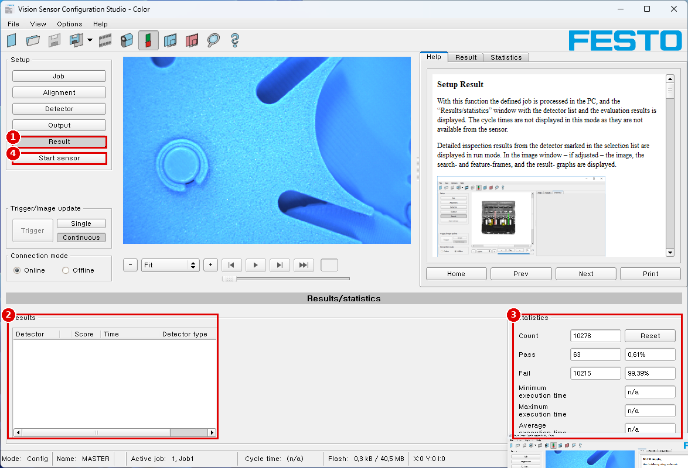
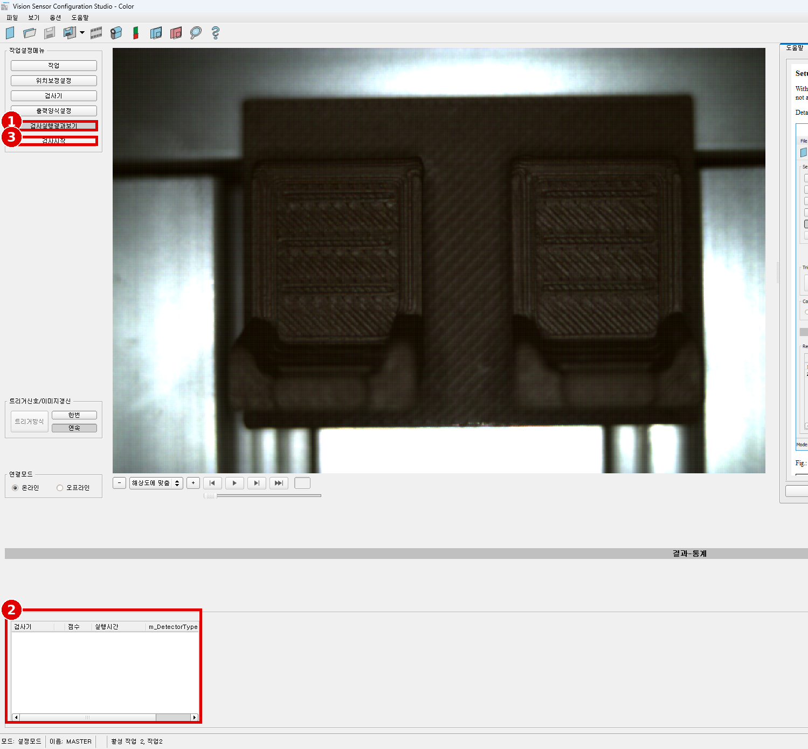
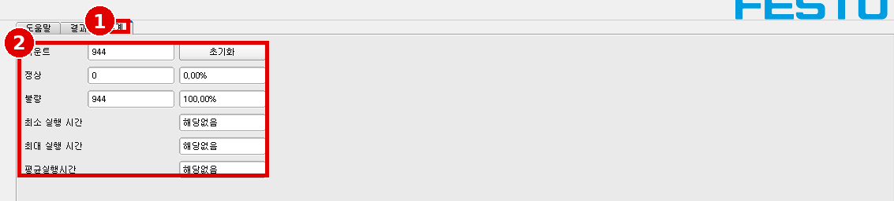
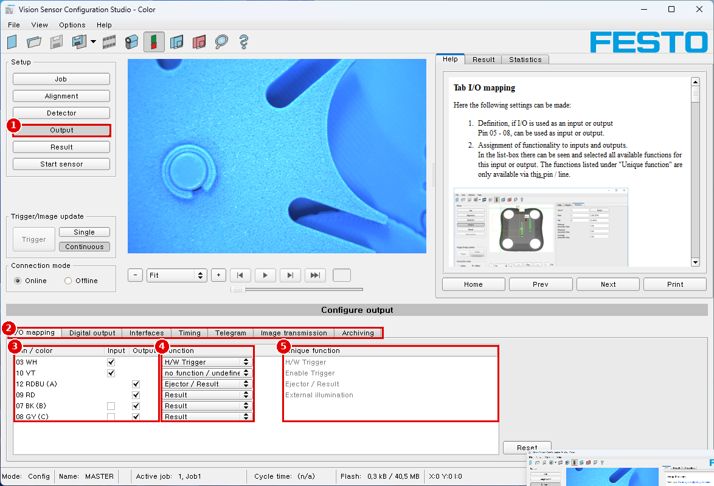
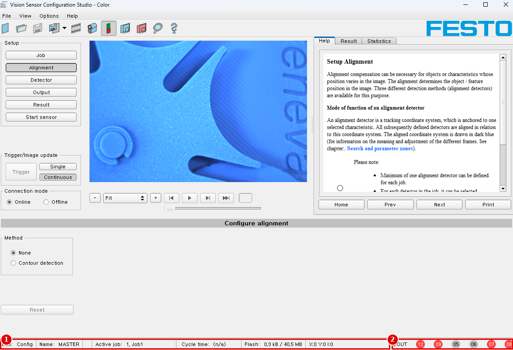
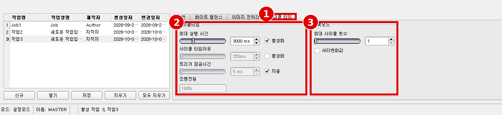

# Module 05 — 판정과 출력 로직

> 📝 **v2 (2026-10-02)**: 한국어 결과·통계·사이클 타임 화면, 사이클 타임 기본값(최대 실행 시간 3000 ms 활성) 반영, '검출기 없는 잡' 오류 추가. 1차 판: [`05_judgement-and-output.md`](05_judgement-and-output.md)

> 현장 질문: **"검출기 결과를 묶어 하나의 판정을 내리고, 언제 어떤 출력으로 알리나?"**
> 이 모듈은 **논리·트리거·타이밍**까지 다룬다. 실제 24 V 결선과 전압 확인은 [Module 06](06_output-24v.md).

## 🎯 목표
1. 검출기 결과를 **논리식(AND/OR/NOT)** 으로 묶어 출력 핀별 판정을 만든다.
2. **트리거(화면 버튼 / 핀 03 하드웨어)** 로 한 번 찍고 한 번 판정하게 한다.
3. Timing·Cycle time 설정을 바꿔 **출력 시점과 처리 시간**이 어떻게 변하는지 수치로 기록한다.

## 🏭 왜 필요한가
검출기 하나하나가 맞아도, 출력 논리를 잘못 묶거나 결과 유지 시간이 너무 짧으면 배출기가 엉뚱한 부품을 밀어낸다. 판정 로직과 타이밍은 "검사"가 "공정"이 되는 지점이다.

## 📋 선행 조건 / 준비물
- [Module 04](04_inspection-detectors.md) 검출기 완성(예: D1 Contrast, D2 Color area)
- 푸시 버튼(NO) 1개 — 핀 03 하드웨어 트리거용(없으면 화면 `Trigger` 버튼만)
- [사양서 5절](hardware/sensor-spec-and-cabling.md) 결선

---

## 5.1 Result — PC에서 미리 판정하기

### ⚙️ 메뉴 경로
`Setup › Result` → 아래 `Results` 표(Detector / Score / Time / Detector type), 오른쪽 `Statistics` (스크린샷 cs_06)

| 번호 | 화면 표기 |
|---|---|
| ① | Setup `Result` |
| ② | Results 표 |
| ③ | Statistics: `Count` `Pass` `Fail` `Minimum/Maximum/Average execution time` `Reset` |
| ④ | Setup `Start sensor` |

한국어 화면:

| # | 한국어 표기 | 영문 |
|---|---|---|
| 1 | 검사설정결과보기 | Result |
| 2 | 결과 표: 검사기 / 점수 / 실행시간 / `m_DetectorType` | Detector / Score / Time / Detector type (한국어판에서 번역이 빠진 열 이름) |
| 3 | 검사시작 | Start sensor |

| # | 한국어 표기 | 영문 |
|---|---|---|
| 1 | `통계` 탭 | Statistics |
| 2 | 카운트 / 정상 / 불량 / 최소·최대·평균 실행 시간 / 초기화 | Count / Pass / Fail / Min·Max·Average execution time / Reset |

캡처 당시 값: 카운트 944, 정상 0, 불량 944(100 %), 실행 시간 `해당없음` — 설정모드(Config)에서 PC 실행 중이라 실행 시간이 없다(Help: scresult). **실행 시간은 `검사시작` 후에만 나온다.**

📖 Help 번역 — Setup Result (Help: scresult)

이 기능을 쓰면 정의한 잡이 PC에서 처리되고, 검출기 목록과 평가 결과가 담긴 "Results/statistics" 창이 표시된다. 이 모드에서는 사이클 타임이 표시되지 않는다. 센서에서 받을 수 없기 때문이다.
선택 목록에서 표시한 검출기의 자세한 검사 결과는 run 모드에서 표시된다. 이미지 창에는 — 설정되어 있으면 — 이미지, 검색·특징 프레임, 결과 그래프가 표시된다.

**표시되는 결과 파라미터** (값 뒤 [1/1000] 표시는 각주 *1 참조)

| 결과 | 설명 | 해당 검출기 |
|---|---|---|
| Detector result | 불(Boolean) 검출기 결과 | 모든 검출기 |
| Score value 1 ... n | 점수(0..100 %). 예: pattern matching 검출기에서 찾은 패턴과 학습한 패턴의 일치도 | 모든 검출기 |
| Execution time | 개별 검출기의 실행 시간 [msec] | 모든 검출기 |
| Distance | 계산한 거리 | Caliper |
| Position X / Y 1 ... n | 찾은 위치 X / Y 좌표 | Pattern matching, Contour, Edge detector, Caliper, Datacode, Barcode, OCR |
| DeltaPos X / Y | 학습한 물체와 찾은 물체의 위치 차 X / Y | Pattern matching, Contour, Edge detector |
| Angle | 찾은 물체의 방향(0°..360°) | Pattern matching, Contour, Edge detector, Datacode, Barcode, OCR |
| Delta Angle | 학습한 물체와 찾은 물체 사이 각도(0°..360°) | Pattern matching, Contour, Edge detector |
| Scaling | contour에서만(0.5 ... 2) | Contour |
| R, G, B, H, S, V, L, A, B | 색 파라미터 값, 부호 있는 정수 | Color value, Color list |
| Result index | 목록 안의 번호 | Color list |
| Color distance | 학습한 색과 현재 색의 거리 | Color list |
| Area / Area (incl. holes) | BLOB 면적(구멍 제외 / 포함), 픽셀 | BLOB |
| Contour length | 바깥 윤곽의 픽셀 수 | BLOB |
| Compactness | BLOB의 조밀도(원 = 1, 나머지 > 1) | BLOB |
| Center of gravity X / Y | BLOB 무게중심 좌표 | BLOB |
| Center X / Y | 맞춘 기하 요소(사각형, 타원)의 중심 좌표 | BLOB |
| Width / Height | 기하 요소의 폭/높이. 폭 ≥ 0, 폭 ≥ 높이. 음수는 실패 | BLOB |
| Angle (360) | 물체 폭 방향(−180 ... +180°, 0° = 동쪽, 반시계) | BLOB |
| Eccentricity | 이심률(0.0 ... 1.0) | BLOB |
| Face up/down, area | 면적 기반 앞/뒷면 구분, 부호로 표시 | BLOB |
| String / String length / Truncated / Compare result | 코드 내용 / 길이(바이트) / 잘림 / 문자열 비교 결과 | Datacode, Barcode, OCR |
| Quality parameter | 선택한 품질 파라미터 출력 | Datacode, Barcode |
| Contrast / Correction | 코드의 명암(0–100 %) / 오류 정정된 모듈 수 | Barcode |
| Module height / width | 모듈 높이/폭(픽셀) | Datacode |
| Confidence / Result / Min. Quality | 문자별 신뢰도 / 읽은 문자열과 기준 문자열의 유사도(0–100 %) / 최소 품질 달성 | OCR |

\*1) 소수점이 있는 모든 검출기별 데이터는 정수(1000을 곱한 값)로 전송되므로 받은 뒤 1000으로 나눠야 한다. 값은 "big endian" 형식으로 전송된다.

표시되는 파라미터는 고른 검출기 종류에 따라 다르다. 다른 검출기의 결과를 보려면 검출기 목록에서 그 검출기를 표시한다.
Vision Sensor Visualisation Studio 모듈에서는 수치 결과, 통계, 선택한 프레임이 있거나 없는 이미지를 아카이빙할 수 있다.

(Caliper 점수 설명: Score 1 / Score 2는 회색값 기준 엣지 세기를 100으로 정규화한 값, Score는 둘 중 작은 값 — ※ 이 품번 해당 없음)

※ 이 품번에서 의미 있는 행: Detector result, Score, Execution time. Contour 정렬의 위치·각도 값이 Result에 나오는지는 ⚠️ 화면에서 확인.

## 5.2 Start sensor — 센서에서 실제로 돌리기

📖 Help 번역 — Setup Start sensor (Help: scstart)

이 기능은 센서를 run 모드로 바꾸고 잡을 실행한다.

**잡 실행 시작:** "Start Sensor" 버튼을 누른다. 활성(= 선택 목록에서 표시된) 잡이 센서로 전송되어 센서의 비휘발성 메모리에 저장되고 시작된다(run 모드).
찾은 특징은 표시 창에, 첫 번째 검출기 또는 선택 목록에서 고른 검출기의 검사 결과는 통계 파라미터와 함께 설정 창에 표시된다.

**검출기 표시 바꾸기:** 다른 검출기의 검사 결과를 보려면 선택 목록에서 그 검출기를 표시하거나 표시 창에서 그 그래픽을 클릭한다.

**잡 실행 끝내기:** "Stop Sensor" 버튼을 누른다. 설정 모드로 돌아와 잡을 편집할 수 있다.

> [!WARNING]
> 센서에 **검출기가 없는 잡이 하나라도 있으면** `검사시작`이 막힌다: "에 검사기가 없습니다. 작업2 적어도 하나의 검사기를 생성해야 합니다." (스크린샷 cs_error_no-detector). 실습 중 빈 잡(작업2, 작업3)을 만들어 두었다면 지우거나 검출기를 넣는다.

> [!IMPORTANT]
> `Start sensor`를 눌러야 설정이 **센서 플래시에 저장**된다(Help: scstart). Result(PC 실행)만으로는 센서에 반영되지 않는다. 사이클 타임도 Start sensor 상태에서만 측정된다(Help: scresult).

## 5.3 Digital output — 출력 논리

### ⚙️ 메뉴 경로
`Setup › Output › Digital output` ⚠️ [스크린샷 필요: `cs_output_digital-output.png`]

(② 탭 줄: `I/O mapping` `Digital output` `Interfaces` `Timing` `Telegram` `Image transmission` `Archiving`)

📖 Help 번역 — Setup Output (Help: scoutput)

여기서 디지털 신호 출력의 할당과 논리 연결, 그리고 SBS의 인터페이스와 출력 데이터를 정한다.
탭: I/O mapping / Output signals (Digital outputs / Logic) / Interfaces / Timing / Telegram, Data output / Image transmission / Archiving

📖 Help 번역 — Tab Output signals (Digital outputs / Logic) (Help: scoutputlogic)

이 탭에서 디지털 출력의 스위칭 동작과 논리 연결을 정한다. 출력 수는 IO mapping 탭 설정에 따라 다르다. 그 밖에 시리얼 인터페이스로 IO 확장 모듈을 연결할 수 있다(※ 이 품번 해당 없음).

각 핀(출력)마다 다음을 설정할 수 있다.

| 파라미터 | 기능 |
|---|---|
| Overall job result | 물리 출력 없음. 레코더, 통계, 아카이빙 기능에 영향을 준다 |
| Invert | 이 핀(출력)의 전체 결과를 반전 |
| Mode | Standard: 여러 검출기를 AND(&) / OR(\|) / NOT(!) 같은 논리식으로 묶어 하나의 논리식으로. Advanced: 논리식을 자유 편집 |
| NOT | 연산자 NOT(!) 선택 |
| Logic | 연산자 AND(&) / OR(\|) 선택 |
| D1 - D... | 검출기 수에 따라 모든 활성 검출기가 이 목록에 표시된다. 이를 해당 출력에 할당할 수 있다. 각 검출기를 on, off, invert로 설정할 수 있다 |
| Logical Expression | standard 모드로 자동 생성된 논리식이 표시되거나, advanced 모드로 논리식을 자유롭게 입력할 수 있다 |

**논리 연결 정의:** 개별 검출기의 검사 결과와 선택한 출력 상태 사이의 논리 연결을 정한다. 입력 방법은 두 가지다.
- Standard mode (체크박스와 연산자)
- Extended mode (수식)

📖 Help 번역 — Logical connection – Standard mode (Help: scoutputlogicstandard)

standard 모드에서는 연산자 옵션 버튼과 검출기 선택 목록의 체크박스로 검출기 검사 결과와 선택한 출력을 연결한다. 결과는 논리식 창에 표시된다(편집 불가).

**결과 연결하기:**
1. 선택 목록의 검출기를 연결하는 데 쓸 논리 연산자를 operator 창에서 고른다.
2. 선택 목록에서 결과에 기여할 검출기를 활성화한다(Active 열에 체크).
3. "Inverted" 열을 활성화하면 각 검출기 결과를 개별로 반전할 수 있다.
4. "Result" 열의 항목이 그에 따라 바뀐다.

**예:** 검출기 결과는 한 가지 논리 연산으로만 연결할 수 있다. 예: (D1&D2&D3) 또는 !((!D1)|D2|D3) 등

참고: 검출기가 특정 영상 취득에 할당되면("Repeat mode", Tab Cycle time 장 참조), 나머지 영상 취득에서는 그 결과가 논리 결과에 영향을 주지 않는다.

📖 Help 번역 — Logical connection – Formula mode (Help: scoutputlogicadvanced)

formula 모드에서는 논리 수식을 직접 입력해 검출기 검사 결과와 선택한 출력의 연결을 정한다. 연산자 AND, OR, NOT과 둥근 괄호를 쓸 수 있다.
수식 편집 시 논리 연산자는 다음 문자를 쓴다.
- "&" = AND
- "|" = OR ("AltCtrl" 키와 "<>" 키) (※ 독일어 키보드 기준 설명. 한국어 키보드는 Shift + \\)
- "!" = NOT

**예:** 어떤 복잡도의 논리식도 만들 수 있다.
- (D1&D2)|(D3&D4)
- !((D1|D2)&(D3|D4))
- (D1|D2)&(D3|D4)&(D5|D6)

참고: 검출기가 특정 영상 취득에 할당되면("Repeat mode", Tab Cycle time 장 참조), 나머지 영상 취득에서 그 결과는 논리 "0"으로 설정된다. 논리 결과를 그에 맞게 조정해야 한다.

### 📝 단계별 조작 — 판정 설계
1. 출력 계획을 먼저 표로 정한다(예):

| 출력 | 논리식 | 의미 |
|---|---|---|
| Overall job result | `D1&D2` | 통계·레코더·아카이빙 기준(물리 출력 없음) |
| 07 BK | `D1` | 캡 **있음**이면 ON |
| 08 GY | `D1&D2` | 전체 OK면 ON |
| 12 RDBU (Ejector) | `!(D1&D2)` | NG면 ON (배출) |

2. `Output › Digital output`에서 각 핀을 선택하고 Standard 모드로 체크박스·연산자를 설정한다.
3. 같은 식을 Formula 모드로 직접 써 보고, 화면의 Logical Expression이 같은지 확인한다.
4. Start sensor 후 OK/NG를 번갈아 넣으며 상태표시줄 **DOUT** 표시(스크린샷 cs_07)와 뒷면 LED A(핀12)/B(핀07)/C(핀08) 상태를 기록한다.

## 5.4 트리거 — 한 번 찍고 한 번 판정

1. `Job › Image acquisition › Trigger mode = Trigger` (Help: scjobgeneral)
2. 화면 왼쪽 `Trigger/Image update`의 `Trigger` 버튼이 활성화되는지 확인 → 누를 때마다 한 번 판정.
3. 하드웨어: +24 V → 푸시 버튼 → **핀 03 WH**. I/O mapping에서 03 = `H/W Trigger`(스크린샷 cs_05 ④)인지 확인.
4. 버튼을 누를 때마다 Statistics `Count`가 1씩 늘어나는지 확인.

> [!NOTE]
> 입력은 최소 신호 길이 2 ms가 필요하다(Help: scoutputiosettings). 기계식 버튼의 채터링으로 Count가 2씩 늘면 기록한다(Min. processing time으로 막을 수 있음 → 5.6).

## 5.5 Timing 탭

### ⚙️ 메뉴 경로
`Setup › Output › Timing` ⚠️ [스크린샷 필요: `cs_output_timing.png`]

📖 Help 번역 — Tab Timing (Help: scoutputtiming)

이 탭에서 선택한 신호 출력의 시간 응답을 정한다. 엔코더를 선택했다면 지연은 엔코더 스텝 단위로 입력한다. I/O 설정에 따라 이하 모든 시간 지연은 ms 또는 엔코더 스텝 단위다. (※ 이 품번은 엔코더 없음 → ms)

| 파라미터 | 기능 |
|---|---|
| Trigger delay | 트리거부터 영상 취득 시작까지의 시간(ms 또는 엔코더 펄스). 최대 3000 ms / 엔코더 펄스. H/W 트리거(디지털 입력)를 쓰면 이 지연이 적용된다. 트리거를 Ethernet, PROFINET으로 보내면 이 지연은 적용되지 않는다(트리거 즉시 촬영). |
| Digital outputs | 모든 출력을 지연하거나 이젝터 출력만 지연할 수 있다. |
| Ejector / result delay | 트리거부터 신호 출력에 결과 레벨이 나타날 때까지의 시간(ms 또는 엔코더 펄스). 트리거와 이젝터 사이에는 최대 20개 부품까지 허용된다(버퍼 크기). 최대 3000 ms / 엔코더 펄스. H/W 트리거(디지털 입력)를 쓰면 이 지연이 적용되고 트리거와 함께 시작된다. 트리거를 Ethernet, PROFINET으로 보내면 이 지연은 적용되지만 트리거가 아니라 이미지 처리가 끝난 뒤 시작된다! |
| Reset signal | 출력을 어떻게 리셋할지 정한다: 다음 결과에서 변경(기본) / 트리거와 함께 변경 / Result Duration(정한 ms 동안 유지 후 비활성으로 리셋) |
| Duration of result | 결과 신호의 지속 시간(ms 또는 엔코더 펄스). 최대 3000 ms / 엔코더 펄스 |

**주의:** 잡 변경 시와 Run에서 Config 모드로 바뀔 때 출력은 다음 상태가 된다. 지연된 출력의 버퍼는 지워진다.
**디지털 출력:** "Run"에서 "Config"로 바뀌면 기본값으로 리셋된다. 기본값은 Vision Sensor Configuration Studio output 탭의 "Invert" 플래그로 정한다. "Invert"는 기본 설정과 결과를 함께 반전한다.

**디지털 출력의 리셋:** 결과 출력의 리셋은 여러 설정에 따라 일어날 수 있다.
- "Change on result"(기본): 다음 논리 결과가 만들어져 유효해지면 출력이 그 논리 결과에 따라 레벨을 바꾼다. 대표 용도: 예를 들어 분류 응용에서 스위치 포인트 제어.
- "Change on trigger": 다음 트리거에서 출력이 "inactive"(PNP 모드에서 = low)가 된다. 대표 용도: PLC와 함께 운전.
- "Valid duration": 여기서 정한 "Valid" 지속 시간(ms)이 지나면 출력이 비활성으로 돌아간다. 대표 용도: 예를 들어 공압 이젝터.

**READY와 VALID**
- Ready = high: 다음 이미지/평가 준비됨
- Valid = high: 출력의 결과가 유효함

**PNP 또는 NPN 동작 모드:** 설명한 모든 예는 "PNP" 동작 모드 기준이다. "NPN"으로 설정하면 예는 그대로 유효하지만 신호 레벨이 반전된다. (Output/Interfaces/Internal I/O 참조)

**출력 타이밍의 경우들**

1. **일반 트리거, 지연 없음** (Signalling: Change in result)
   - 트리거 입력(핀03 WH)에 상승 엣지
   - 트리거 = high의 결과: Ready = low, Valid = low
   - SBS가 이미지를 평가하고 결과가 유효해지면 정의된 출력이 해당 논리 상태로 바뀐다. Ready와 Valid가 다시 high가 된다(SBS가 다음 작업 준비됨, 출력 유효).

2. **Trigger delay 활성** (Trigger delay는 하드웨어 트리거에만 해당)
   광센서나 PLC 등이 만든 실제 물리 트리거보다 영상 취득/평가 시작을 늦출 때 쓴다. 기구나 PLC 프로그램을 바꾸지 않고 트리거 시점을 미세 조정할 수 있다.
   - 트리거 지연 시간이 지난 뒤 이미지를 찍는다. 사이클 타임은 트리거 지연 + 평가 시간이다.
   - 트리거 입력(핀03 WH)에 상승 엣지 → Ready = low, Valid = low, 정의된 모든 결과 출력 = low (Signalling = Change on trigger)
   - 평가용 이미지를 찍기 전에 설정한 Trigger delay가 지난다.
   - 평가가 시작된다. 결과가 유효해지면 출력이 해당 논리 레벨로 바뀐다. Ready와 Valid가 다시 high.

3. **Trigger delay + Result delay (여기서는 이젝터만)**
   result delay(모든 출력 또는 이젝터만)는 평가 시간이 조금씩 흔들려도 그와 무관하게 이젝터 시점을 미세 조정하는 데 쓴다.
   - 트리거 지연 후 이미지를 찍는다. 또 Result delay가 활성이며, 이 예에서는 이젝터 출력(핀 12 RDBU)에만 적용된다.
   - 이젝터를 뺀 모든 결과 출력의 사이클 타임: 트리거 지연 + 평가 시간
   - 이젝터 출력의 사이클 타임: Result delay만(트리거부터 계산. 위 시간의 합보다 길 때만 의미가 있다!)
   - 트리거 입력(핀03 WH)에 상승 엣지 → Ready = low, Valid = low, 이젝터를 뺀 모든 결과 출력 = low(이젝터는 고정 result delay가 정의되어 있으므로)
   - Trigger delay가 지난 뒤 이미지를 찍고 평가한다. 결과가 유효해지면 출력이 해당 레벨로 바뀌고 Ready와 Valid가 다시 high.
   - 이 모드에서는 Result delay가 지난 뒤에야 이젝터 출력이 설정된다. 이 예에서는 이젝터 출력에 Result duration도 쓰므로 Result duration이 지나면 리셋된다.

4. **Trigger delay + Result delay (여기서는 모든 출력)**
   - 트리거 지연 후 이미지를 찍는다. Result delay가 이 예에서는 모든 출력에 적용된다.
   - 정의된 모든 출력의 사이클 타임: Result delay만(트리거부터 계산. Trigger delay + 평가 시간의 합보다 길 때만 의미가 있다!)
   - 트리거 입력(핀03 WH)에 상승 엣지 → Ready = low, Valid = low
   - Trigger delay가 지난 뒤 평가가 시작된다. 결과가 유효해지면 이제 Ready 신호만 바로 high로 돌아간다(다음 평가 준비됨). 이제 result delay가 지나야 한다. 그 뒤 정의된 모든 출력이 해당 논리 레벨로 바뀐다. 이때 Valid도 high로 돌아간다(Valid = high: 결과/출력 유효). (Signalling = Change on result)
   - 이 동작 모드에서는 Trigger delay + 평가 시간이 지나면 Ready만 high로 돌아간다. 나머지 출력이 나중에 설정되는 것과 무관하게 SBS가 이미 다음 평가 작업을 할 수 있으므로 이것이 합리적이다.

5. **Result duration 활성 (여기서는 예로 모든 출력)**
   불량 부품일 때 공압 이젝터를 제어하는 것처럼, 출력에서 정해진 길이의 펄스를 얻는 데 쓴다. 정의된 모든 결과 출력은 Result duration(ms)이 지나면 low(PNP 동작에서 비활성)로 리셋된다.

6. **Cycle time (Min, Max) 활성** (여기서는 Signalling: Change on Trigger)
   잡의 최소·최대 시간을 제어하는 파라미터.
   - 최소 잡 시간은 최소 잡 시간에 도달하기 전에 들어오는 트리거 신호를 막는다(Min Cycle time 동안 들어온 다른 트리거는 무시된다).
   - 최대 잡 시간은 정한 시간이 지나면 잡을 중단한다. 타임아웃 뒤 잡 결과는 "not o.k."다. 최대 잡 시간은 1회 실행에 필요한 시간보다 크게 잡아야 한다.
   - 사이클 타임은 트리거부터 출력 설정까지의 시간을 잰다. 이 사이클 타임을 제한해야 하면(예: 기계 사이클을 넘으면 안 될 때) 이 기능을 쓴다. 이 처리 시간이 지날 때까지 처리/완료되지 않은 모든 검출기의 결과는 "failed"가 된다. 현재 처리 중인 검출기는 끝까지 처리되므로, 설정한 잡 시간이 100 % 정확히 지켜지지 않고 잡이 중단되기까지 몇 ms 더 걸릴 수 있다. 실제 운전에서 이런 사이클 타임 초과를 확인하고 그만큼 설정값을 줄이는 것이 좋다.
   - 순서: 모든 출력과 "Valid"(출력 유효) 신호는 평가 직후 설정된다. 그러나 "Ready"(다음 평가 준비) 신호는 Min Cycle time이 지나야 설정된다. 따라서 그때부터만 다음 트리거를 받아들인다.

7. **이젝터용 다중 Result delay**
   부품 A의 트리거/평가와 배출 사이 시간/거리가 길어서, SBS가 그 사이에 나중에 배출해야 할 다른 부품 n개(최대 20개)를 이미 검사해야 할 때 쓰는 동작 모드. ("Vision Sensor Configuration Studio/Output/Timing/Delay: Ejector only / Ejector- / result delay" 모드에서만 가능. 여기서는 Signalling = Result duration, 또는 "Change on result") 트리거와 이젝터 사이 20개 부품으로 제한된다.

### 📝 파라미터 표

| 파라미터 | 시작값 | 의미 | 올리면 | 내리면 |
|---|---|---|---|---|
| Trigger delay | 0 ms | 트리거 → 촬영 | 촬영이 늦어짐(H/W 트리거만) | 즉시 촬영 |
| Ejector / result delay | 0 ms | 트리거 → 출력 | 출력이 늦게 나옴. 평가 시간보다 짧으면 의미 없음 | 평가 끝나는 즉시 |
| Reset signal | Change on result | 출력 리셋 방식 | — | — |
| Duration of result | (Result duration일 때) | 펄스 길이 | 길게 켜져 있음 (램프·실린더 확인 쉬움) | 짧은 펄스 (최대 3000 ms) |

## 5.6 Cycle time 탭

### ⚙️ 메뉴 경로
`Setup › Job › Cycle time` (한국어: `작업 › 사이클 타임`)

| # | 한국어 표기 | 영문 (Help 그림 순서 대조) | **새 잡 기본값** (캡처) |
|---|---|---|---|
| 1 | `사이클 타임` 탭 | Cycle time | |
| 2 | 최대 실행 시간 + 활성화 | Max. cycle time + Active | **3000 ms, 활성화** |
| 2 | 사이클 타임아웃 + 활성화 | Max. processing time per image + Active | 255 ms, 비활성 |
| 2 | 트리거 잠금시간 + 자동 | Min. processing time per image + Auto | 5 ms, 자동 |
| 2 | 조명전원 | LED power | 100 % |
| 3 | 반복모드: 최대 사이클 횟수 / 셔터변화값 | Repeat mode: Number of images (max.) / Shutter variation | 1 / 끔 |

📖 Help 번역 — Tab Cycle time (Help: scjobtimeout)

Cycle time 탭에서 SBS 비전 센서의 타이밍 조건을 정할 수 있다.

**(A) Cycle time**

| 파라미터 | 기능 |
|---|---|
| Max. cycle time | 한 사이클의 최소·최대 시간을 제어하는 파라미터. 한 사이클 안에서 여러 이미지를 평가할 수 있다("Number of images (max)" > 1인 경우). 이미지당 최대 처리 시간은 정한 시간이 지나면 잡을 중단한다. 타임아웃 뒤 사이클 결과는 항상 "not ok"다. 최대 처리 시간은 1회 실행에 필요한 시간보다 크게 잡아야 한다. 처리 시간은 트리거부터 디지털 출력 설정까지 걸린 시간이다. 이 사이클 타임을 제한해야 하면(예: 기계 사이클을 넘으면 안 될 때) 이 기능을 쓴다. 처리 시간이 지날 때까지 처리/완료되지 않은 모든 검출기의 결과는 "failed"가 된다. 현재 처리 중인 검출기는 끝까지 처리되므로 설정한 잡 시간이 100 % 정확히 지켜지지 않고 잡이 중단되기까지 몇 ms 더 걸릴 수 있다. 실제 사이클 타임을 시험하고 이 파라미터를 그보다 조금 작게/짧게 고르는 것이 좋다. |
| Max. processing time per image | 사이클 안에서 영상 취득을 포함한 평가 1회의 최대 시간 |
| Min. processing time per image | 사이클 안에서 영상 취득을 포함한 평가 1회의 최소 시간. 최소 처리 시간에 도달하기 전에 들어오는 트리거 신호를 막는다. "Number of images" = 1(기본)이면 이미지당 최소 처리 시간은 최소 사이클 타임과 같다. |
| LED-Power | 자동으로 계산되는 값. 표준값은 100 %. 셔터 시간이 꽤 길고 최소 잡 시간이 꽤 짧으면 LED 회복 시간이 부족해 LED 출력이 줄어들 수 있다. LED 출력 100 %를 얻으려면 최소 잡 시간이 셔터 시간의 10배 이상이어야 한다. |
| Auto | "Auto"를 고르면 LED 출력이 100 %가 되도록 최소 사이클 타임을 자동 조정한다 |

**(B) Repeat mode**

| 파라미터 | 기능 |
|---|---|
| Number of images (max.) | 트리거 1회 뒤 처리하는 최대 촬영 횟수. 다음 정지 조건을 만족하지 않는 동안 반복한다: "Overall job result" = positive(Output/Digital output에서 설정) / "Max. cycle time"이 지나지 않음(활성인 경우). 옵션: 검출기를 특정 이미지에 할당(아래 Repeat Mode 참조) |
| Shutter variation | "active"이면 표로 여러 셔터 속도를 설정할 수 있다. 설정한 셔터 속도마다 이미지를 한 장씩 찍는다. 즉 첫 이미지는 셔터 값 1, 둘째는 셔터 값 2, 셋째는 셔터 값 3 … 으로 찍는다. "Shutter variation"의 기본 설정은 off이며, 이때 표는 표시되지 않는다. |
| Factor and Shutter speed | "Factor" 기본값: 첫 값 = 1.00(첫 배수는 항상 1.00이며 읽기 전용). 사용자가 표에서 배수를 바꾸면 "Shutter speed"(둘째 열, 읽기 전용)가 자동으로 갱신되고 이미지를 찍는다. 표의 한 행을 클릭하면 그 행 설정으로 이미지를 찍는다. 참고: "Image acquisition" 탭의 "Shutter speed"를 바꾸면 "Shutter variation" 목록의 셔터 속도가 다시 계산된다. |

**Repeat Mode: 검출기를 이미지에 할당**
"Detector" Setup에 선택한 모든 검출기가 나열된다. repeat mode의 "Number of images (max)" 파라미터가 1보다 크면 검출기를 특정 영상 취득에 할당하는 옵션이 생긴다. "Repeat mode" 열에서 검출기마다 설정할 수 있다.
- Always: 모든 영상 취득에서 실행
- Recording n: 해당 영상 취득에서만 실행

더블클릭하면 선택 표가 열린다.

| 파라미터 | 시작값 | 올리면 | 내리면 |
|---|---|---|---|
| Max. cycle time | **3000 ms 활성(기본값)** | 여유 | 실제 처리 시간보다 작으면 **항상 NG**(타임아웃) |
| Min. processing time per image | Auto | 빠른 연속 트리거·채터링 무시 | 트리거를 다 받음 |
| LED-Power | 100 % 목표 | — | 100 % 미만이면 영상이 어두워짐 → 최소 잡 시간 ≥ 셔터 × 10 |
| Number of images (max.) | 1 | OK가 나올 때까지 재촬영(최대 n장) | 1장 판정 |

---

## 🧪 실험

**A. 처리 시간 측정** — Start sensor, Trigger mode = Trigger, 버튼 20회. Statistics에서 읽는다.

| 잡 구성 | Min (ms) | Max (ms) | Average (ms) |
|---|---|---|---|
| D1 Contrast만 | | | |
| D1 + D2 Color area | | | |
| 정렬(Contour) + D1 + D2 | | | |
| 위 + Speed 탭 fast | | | |

데이터시트 typ. 값(Contrast 2, Color area 30, 위치 추적 30 ms)과 비교한다.

**B. Result duration** — 핀 12 출력, Reset signal = Result Duration

| Duration (ms) | 램프/LED A 켜짐 시간(눈·폰 슬로모션) | DOUT 12 표시 |
|---|---|---|
| 100 | | |
| 500 | | |
| 2000 | | |

**C. 타임아웃** — Max. cycle time을 실험 A 평균의 50 %로

| 설정 | OK 시료 10회 결과 | 메모 |
|---|---|---|
| Max. cycle time = 평균 × 0.5 | | 모두 NG여야 함 |
| Max. cycle time = 평균 × 2 | | 정상 |

## 🔍 검증
- 출력 계획 표의 모든 핀이 OK/NG 시료에서 기대대로 동작: OK 10/10, NG 10/10 (DOUT·LED 기준)
- 버튼 20회 → Count +20 (채터링 0)
- 처리 시간 평균·최대 기록, Max. cycle time은 실측 최대보다 크게 설정
- LED-Power 100 %

## 💥 고장 주입

| 해 볼 것 | 관찰 |
|---|---|
| 핀 12 논리식에 `!` 빠뜨리기 | OK일 때 배출 램프 켜짐 |
| Invert 체크 | Config 상태에서 출력 기본값까지 반전되는 것 확인 (Help: scoutputtiming) |
| Trigger mode = Free run 상태로 버튼 누르기 | Count가 계속 증가(버튼과 무관) |
| Result delay를 평가 시간보다 짧게 | 지연 효과 없음 확인 |
| 셔터 8 ms + Min. processing time 최소 | LED-Power 저하 표시 |

## ⚠️ 함정과 해결

| 증상 | 원인 | 조치 |
|---|---|---|
| 설정했는데 센서가 옛 판정 | Start sensor 안 함 | Start sensor (Help: scstart) |
| Result에서 사이클 타임이 n/a | PC 실행 모드 | Start sensor 후 Statistics (Help: scresult) |
| 버튼 한 번에 2회 판정 | 채터링 | Min. processing time ↑ |
| 모든 결과가 NG | Max. cycle time 초과 | 실측 후 재설정 |
| `검사시작`이 오류로 막힘 | 검출기 없는 잡 존재 | 빈 잡 삭제 또는 검출기 추가 (cs_error_no-detector) |
| Run→Config 시 출력이 꺼짐 | 사양(기본값 리셋) | 정상 동작 (Help: scoutputtiming) |

## ✅ 체크리스트
- [ ] 출력 계획 표 작성, Standard/Formula 모드 각각 확인
- [ ] 화면 Trigger, 핀 03 H/W 트리거 동작
- [ ] Timing: Reset signal 방식 결정 이유 기록
- [ ] 처리 시간 표, Max. cycle time 설정
- [ ] Start sensor, 백업

## 📁 포트폴리오 기록
- 스크린샷: Digital output 논리식, Statistics(처리 시간), Timing 설정
- 수치: 평균/최대 처리 시간, 출력 계획 표
- 한 줄 요약 예: "검출기 결과를 핀별 논리식으로 묶고 처리 시간 실측(평균 ○ ms, 최대 ○ ms)으로 타임아웃 기준을 설정"

---
출처 링크: Festo 다운로드·문서 안내 <https://www.festo.com/sp> (8058732 검색) · 매뉴얼 8.1.6(p.95–97), 8.4.2(p.229–231), 8.4.4(p.236–243), 8.5–8.6(p.252–258)
