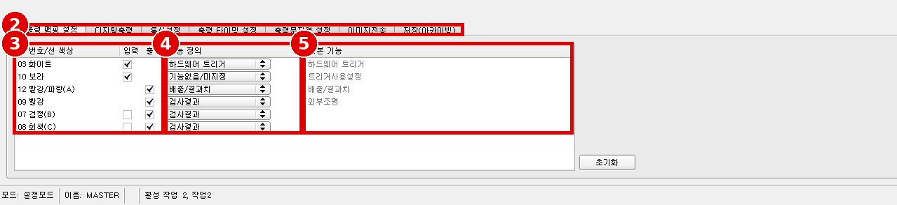
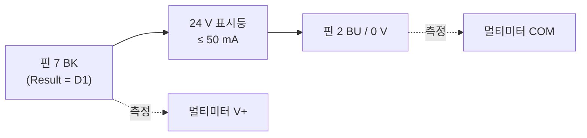

# Module 06 — 검출 시에만 출력 24 V ON

> 📝 **v2 (2026-10-02)**: 한국어 입/출력 핀맵 설정 화면과 탭 이름 대응 추가(Interfaces = 통신설정). 1차 판: [`06_output-24v.md`](06_output-24v.md)

> 현장 질문: **"검출되면 출력선에 24 V가 나오고, 아니면 0 V인가?"**
> PLC 통신은 하지 않는다(사용자 규칙 9). 외부로 나가는 신호는 **디지털 출력 24 V 하나로 마무리**한다 → [상충 A-07](reports/conflict-report_v3.md#a-07)

## 🎯 목표
1. I/O mapping과 Internal I/O(PNP)를 설정해 **검출기 결과 → 출력 핀**을 연결한다.
2. 검출됐을 때만 출력 핀–0 V 사이에 **약 24 V**, 아닐 때 **약 0 V**임을 멀티미터로 확인한다(10/10).
3. 램프(또는 릴레이)를 물려 실제 부하가 동작하는 것을 확인한다.

## 🏭 왜 필요한가
설비 쪽은 "화면의 초록 막대"가 아니라 **전선의 전압**만 본다. 소프트웨어 판정이 맞아도 PNP/NPN 설정이나 결선이 틀리면 설비는 반대로 움직인다.

## 📋 선행 조건 / 준비물
- [Module 05](05_judgement-and-output.md): 출력 논리(예: 핀 07 = `D1`) 완료
- [사양서 4.1·5절](hardware/sensor-spec-and-cabling.md) 핀 표, V-06(케이블 색 확인) 완료
- 멀티미터(DC V), 24 V 표시등(LED형 권장, ≤ 50 mA)
- OK 시료(검출됨), NG 시료(검출 안 됨)

> [!NOTE]
> SBS 출력은 기계식 **접점이 아니라** PNP/NPN 트랜지스터 출력이다(매뉴얼 p.395 "Outputs PNP / NPN"). 무전압 접점이 꼭 필요하면 출력에 24 V 릴레이를 물리고 릴레이 접점을 쓴다. 이때 릴레이 코일 전류가 50 mA(핀 12는 100 mA) 이하인지 먼저 계산한다.

---

## 6.1 I/O mapping — 어느 핀을 출력으로

### ⚙️ 메뉴 경로
`Setup › Output › I/O mapping` (스크린샷 cs_05)

| 번호 | 화면 표기 | 현재 값 (스크린샷) |
|---|---|---|
| ① | Setup `Output` | |
| ② | 탭 `I/O mapping` | |
| ③ | `Pin / color` + `Input` / `Output` 체크 | 03 WH 입력, 10 VT 입력, 12 RDBU 출력, 09 RD 출력, 07 BK 출력, 08 GY 출력 |
| ④ | `Function` | 03 H/W Trigger, 10 no function / undefined, 12 Ejector / Result, 09 Result, 07 Result, 08 Result |
| ⑤ | `Unique function` (그 핀에서만 가능한 기능) | H/W Trigger, Enable Trigger, Ejector / Result, External illumination |

한국어 화면:

| # | 한국어 표기 | 영문 |
|---|---|---|
| 2 | 탭: 입/출력 핀맵 설정 / 디지털출력 / **통신설정** / 출력 타이밍 설정 / 출력문자열 설정 / 이미지전송 / 저장(아카이빙) | I/O mapping / Digital output / **Interfaces** / Timing / Telegram / Image transmission / Archiving |
| 3 | 핀 번호/선 색상: 03 화이트 / 10 보라 / 12 빨강/파랑(A) / 09 빨강 / 07 검정(B) / 08 회색(C) + 입력·출력 체크 | Pin / color, Input, Output |
| 4 | 기능 정의: 하드웨어 트리거 / 기능없음/미지정 / 배출/결과치 / 검사결과 | Function: H/W Trigger / no function / Ejector / Result / Result |
| 5 | 기본 기능: 하드웨어 트리거 / **트리거사용설정** / 배출/결과치 / 외부조명 | Unique function: H/W Trigger / **Enable Trigger** / Ejector / Result / External illumination |

※ `Internal I/O`(PNP/NPN)는 한국어 화면의 **`통신설정`** 탭에 있다.

📖 Help 번역 — Tab I/O mapping (Help: scoutputiosettings)

여기서 다음을 설정할 수 있다.
1. I/O를 입력으로 쓸지 출력으로 쓸지 정의. 핀 05 - 08은 입력이나 출력으로 쓸 수 있다. (※ 이 품번은 07, 08만 표시됨: [상충 B-04](reports/conflict-report_v3.md#b-04))
2. 입력과 출력에 기능 할당. 목록 상자에서 그 입력이나 출력에 쓸 수 있는 모든 기능을 보고 고를 수 있다. "Unique function" 아래 나열된 기능은 이 핀/선에서만 쓸 수 있다.

**입력 기능**

| 기능 | 설명 |
|---|---|
| H/W Trigger | 하드웨어 트리거(핀 03 WH에서만 가능) |
| Encoder A+ | 엔코더 입력, 트랙 A+ (핀 10 VT에서만 가능) (※ 이 품번 해당 없음) |
| Encoder B+ | 엔코더 입력, 트랙 B+ (핀 05 PK에서만 가능) (※ 이 품번 해당 없음) |
| Enable Trigger | 트리거 신호를 허용하거나 막는 기능. 이 기능을 읽는 데 약 1 ms가 걸린다. 그동안은 Enable Trigger 신호가 있어도 트리거 신호가 무시된다. |
| Job 1 or 2 | 이 입력 상태에 따라 Job 1과 Job 2 사이를 전환. Low = Job 1, High = Job 2 |
| Job 1 … N | 입력 하나에 펄스를 넣어 잡 전환. 가능하면 2진 신호(2진 부호)로 잡을 바꾸는 것이 좋다. |
| Teach temporary / Teach permanent | 모든 검출기 학습. 이 입력의 상승 엣지와 트리거로 학습을 시작한다. Temporary: RAM에 저장, 리셋 후 사라짐. Permanent: 플래시에 저장, 리셋 후에도 유지. |
| Job switch (BitX), binary coded | 이 용도로 정한 최대 5개 입력에 2진 비트 패턴을 넣어 잡 전환, 즉 1–32개 잡 사이 전환. 비트 순위는 할당된 입력 번호 1 - 5의 오름차순. Bit 1 = LSB. ("Job 1… 31 via binary bit pattern" 장 참조) |
| Repeat mode enable | 이 입력이 high이고 다음 정지 조건을 만족하지 않는 동안 이미지를 찍고 평가한다: "Overall job result" = positive(Output/Digital output에서 설정) / "Max. cycle time"이 지나지 않음(활성인 경우). "Repeat mode enable"을 쓰면 암묵적으로 "Trigger enable" 기능도 동시에 적용된다. 즉 이 입력이 high일 때만 트리거를 받아 실행한다. |
| No function, undefined | 기능 없음, 사용 안 함 |

이미 사용 중인 기능은 다시 쓸 수 없으므로 회색으로 표시된다. 모든 입력은 최소 신호 길이 2 ms가 필요하다.

**엔코더 연결:** 트랙 A+와 B+를 둘 다 쓰면 증가/감소 계수, 즉 전진/후진을 구분할 수 있다. 엔코더 입력은 최대 18 kHz 주파수로 동작한다. (※ 이 품번 해당 없음)

**출력 기능**

| 기능 | 설명 |
|---|---|
| Ejector | 전용 이젝터 출력, 최대 부하 100 mA(다른 출력은 50 mA), 핀 12 RDBU에서만 가능(LED "A"에 해당). |
| Result | 결과 출력. 모든 결과 출력에는 검출기 결과나 논리식을 할당할 수 있다. |
| Acknowledge job change | 디지털 I/O로 잡을 바꿀 때("Job 1..N" 또는 "Job PinX, binary coded") 성공을 확인하는 low/high 엣지를 여기서 낼 수 있다. high 엣지는 새 잡 내용이 로드되어 활성화된 뒤, 즉 전환 후 ready 신호의 high 엣지와 같은 시점에 나온다(타이밍 참조). high 레벨은 20 ms 유지된 뒤 지워진다. 잡 전환이 실패하면 신호는 low로 남는다. |
| External illumination | 이 설정을 고르면(핀 09 RD에서만 가능) 외부 조명을 연결/트리거할 수 있다. |
| No function, undefined | 기능 없음, 사용 안 함 |

미리 정의된 출력이 두 개 있다.
- **Ready:** 센서가 트리거를 받을 준비가 되었음을 나타낸다.
- **Valid:** 출력의 데이터가 유효함을 나타낸다.

**프로그래머블 디지털 입력의 기능:** 공정 제어와 함께 운전할 때 입력으로 다음 경우를 수행할 수 있다: 비활성 / 허용·차단 / 잡 로드(2진 부호) / 잡 1 … n 로드 / 임시 학습 / 영구 학습. 이하 모든 신호도는 "PNP" 설정 기준이다.

- **입력: "Trigger enable"** — 트리거 입력을 허용(high)하거나 차단(low)한다.
- **입력: 2진 잡 전환 또는 "Job 1 or 2" 기능**
  - 최대 5개 입력으로 2진 잡 전환(Job 1 – 최대 31): 2진 입력 신호가 바뀌는 즉시 Ready가 low가 된다. 새 잡으로 전환이 끝날 때까지 Ready는 low로 남는다. "Job change confirm" 옵션을 쓰면 이 신호가 잡 전환 뒤에 나오고, 그 다음 Ready가 다시 high가 된다. 2진 입력으로 잡을 바꾸는 동안 트리거 신호를 보내면 안 된다. 해당 입력들의 논리 레벨 변화는 동시에 일어나야 한다(최대 10 ms 안에 모든 입력이 안정된 논리 레벨이어야 한다).
  - "Job 1 or 2" 기능으로 잡 전환: 해당 입력의 레벨이 바뀌면 Ready가 low가 된다. 새 잡으로 전환이 끝날 때까지 Ready는 low로 남는다. "Job change confirm" 옵션을 쓰면 이 신호가 잡 전환 뒤에 나오고 그 다음 Ready가 다시 high가 된다. 잡을 바꾸는 동안 트리거 신호를 보내면 안 된다. high 레벨이면 job 2, low 레벨이면 job 1로 평가한다.
  - 2진 전환과 Job 1 or 2의 차이: 2진 잡 전환에서는 원하는 잡 번호를 선택한 입력들에 2진 부호로 나타내야 한다. 그래서 이 모드로 두 잡 사이를 전환하려면 최소 2개 입력이 필요하다. Job 1 or 2에서는 high 레벨이면 job 2, low 레벨이면 job 1로 평가한다. 이렇게 입력 하나로 두 잡 사이를 전환할 수 있다.
- **입력: Job 1 ... n** — 펄스로 잡 전환. 처음으로 ≥ 50 ms의 쉼이 올 때까지 펄스를 센 다음 해당 잡으로 전환한다. 새 잡으로 전환될 때까지 Ready는 low로 남는다. "Job change confirm" 옵션을 쓰면 이 신호가 잡 전환 뒤에 나오고 그 다음 Ready가 다시 high가 된다. 잡 전환용 펄스는 5 ms 펄스와 5 ms 쉼이 좋다. 잡을 바꾸는 동안 트리거 신호를 보내면 안 된다. 가능하면 2진 부호 신호로 잡을 바꾸는 것이 더 빠르다.
- **주의 — 잡 전환 시 다음을 지킨다:** 모든 잡이 잡 전환 설정이 같아야 한다 / 모든 잡이 트리거 모드여야 한다 / 트리거 순서가 시작될 때 Ready 신호가 high여야 한다.
- **입력: Teach temp. / perm.** — 현재 잡의 모든 검출기 샘플을 다시 학습한다. 상승 엣지가 학습을 시작하며, 검사 부품 이미지를 올바른 위치에서 찍을 수 있도록 최소한 다음 트리거까지 high 레벨을 유지해야 한다. 학습이 끝날 때까지 Ready는 low로 남는다. 설정에 따라 임시(RAM에만) 또는 영구(플래시) 저장된다.
- **참고:** Job 1 or 2, Job 1 ... n, teach temp./perm. 기능은 트리거 모드에서만 쓸 수 있다.
- **입력: Repeat Mode Enable, 트리거와 함께** — 이 입력이 high이고 다음 정지 조건을 만족하지 않는 동안 이미지를 찍고 평가한다: "Overall job result" = positive / "Max. cycle time"이 지나지 않음(활성인 경우). "Repeat mode enable"을 쓰면 암묵적으로 "Trigger enable" 기능도 동시에 적용된다. 즉 이 입력이 high일 때만 트리거를 받아 실행한다.
- **입력: Repeat Mode Enable, Free run에서** (신호도 참조)

### 📝 단계별 조작
1. `I/O mapping`에서 **07 BK**의 `Output` 체크, Function = `Result` 확인(현재 설정 그대로).
2. (선택) 부하 전류가 50 mA를 넘으면 **12 RDBU**(최대 100 mA)를 쓴다.

## 6.2 Interfaces — PNP 확인

### ⚙️ 메뉴 경로
`Setup › Output › Interfaces › Internal I/O` (매뉴얼 p.232) ⚠️ [스크린샷 필요: `cs_output_interfaces.png`]

📖 Help 번역 — Tab Interfaces (Help: scoutputsettings)

이 탭에서 사용할 디지털 입출력과 데이터 출력용 인터페이스를 고르고 활성화한다. 출력과 인터페이스는 Active 열에서 각각 활성/비활성화할 수 있다.

| 파라미터 | 기능 |
|---|---|
| Internal I/O | I/O 종류 선택: PNP 또는 NPN |
| RS422 (baud rate) | 데이터 출력용 RS422, 전송 속도 선택. 기본 설정: 8 데이터 비트, 1 정지 비트, 패리티 없음. (※ 이 품번 해당 없음) |
| External (digital I/O) | 외부 입력·출력(I/O 및 엔코더 확장 모듈) (※ 이 품번 해당 없음) |
| Ethernet | 데이터 출력용 Ethernet TCP/IP. 센서는 소켓 서버다. 사용자가 정할 수 있는 두 포트를 쓴다. 기본은 센서로 보내는 명령용 포트 2006(IN), 데이터 전송용 포트 2005(OUT). Festo는 Ethernet 통신 설명용 유틸리티를 제공하며, 이 소프트웨어와 함께 utilities 디렉터리에 설치된다. (※ 이 PC에는 없음: [B-12](reports/conflict-report_v3.md#b-12)) |
| EtherNet/IP | 데이터 출력용 필드버스 EtherNet/IP (※ 규칙 9로 사용 안 함) |
| PROFINET | 데이터 출력, PLC 통신용 필드버스 PROFINET. 참고: PROFINET이 있는 잡을 고르면 센서가 PROFINET 스택을 시작한다. 이 때문에 실행 속도가 조금 느려진다. PROFINET이 없는 다른 잡으로 바꿔도 PROFINET 스택은 멈추지 않는다. 새로 시작/리셋해야 스택 없이 센서가 시작된다. (※ 규칙 9로 사용 안 함) |
| Vision Sensor Visualisation Studio | "Vision Sensor Visualisation Studio" 모듈 활성/비활성. 체크를 끄면 Vision Sensor Device Manager의 "View" 버튼으로 Vision Sensor Visualisation Studio에 들어갈 수 없다. 체크가 켜져 있으면(기본) 이미지 전송에 다음 설정을 고를 수 있다. **Overlay:** 오버레이만 전송. 이미지와 전처리 설정은 전송하지 않는다. **Image and overlay:** 오버레이가 있는 이미지를 전송. 전처리 설정은 전송하지 않는다. **Image with pre-processing and overlay:** 전처리 설정이 적용된 이미지와 오버레이를 전송. |
| SBSxWebViewer | SBS 비전 센서의 웹서버를 활성화한다. 로컬에 설치된 "Vision Sensor Visualisation Studio" 모듈처럼 SBSxWebViewer로 웹 브라우저에서 이미지와 결과 데이터를 볼 수 있다. 지원 브라우저: Microsoft Internet Explorer IE10 이상, Google Chrome, Mozilla Firefox. 시작 방법: Output/Interfaces/SBSxWebViewer 활성화 → "Start sensor"(Vision Sensor Configuration Studio의 버튼) → 브라우저 열기 → 주소창에 센서 IP 주소 입력(Vision Sensor Device Manager 참조). 형식: "http://센서 IP", 예: "http://192.168.100.100"(기본). (→ Module 07) |

자세한 정보는 사용자 매뉴얼 "Communication" 장을 본다.

**논리 출력:** RS422, Ethernet, EtherNet/IP 인터페이스를 쓰면 논리적으로만 존재하고 이 인터페이스로만 전달되는 순수 논리 출력을 추가로 정의할 수 있다. 논리 출력은 예를 들어 검출기 결과나 논리식(수식)에 할당할 수 있다. (※ 이 튜토리얼에서는 사용 안 함)

### 📝 단계별 조작
1. `Interfaces › Internal I/O` = **PNP** 인지 확인(V-07). 결선(출력 → 부하 → 0 V)이 PNP 기준이다(매뉴얼 p.34).
2. Ethernet / EtherNet/IP / PROFINET은 이 튜토리얼에서 켜지 않는다.

## 6.3 결선과 출력 논리

| 설정 | 값 | 위치 |
|---|---|---|
| 핀 07 Function | Result | Output › I/O mapping |
| 핀 07 논리식 | `D1` (예: 캡 있음 Contrast) | Output › Digital output (Module 05) |
| Invert | 끔 | Output › Digital output |
| Reset signal | Change on result | Output › Timing |
| Internal I/O | PNP | Output › Interfaces |

1. **전원을 끄고** 핀 7(BK) – 표시등 – 0 V로 결선한다. 안 쓰는 선은 하나씩 절연.
2. 전원 ON → 13 s 대기 → `Start sensor`.
3. Trigger mode는 먼저 `Free run`(계속 판정)으로 확인하고, 그 다음 `Trigger` + 버튼으로 확인한다.

## 🧪 실험 — 검출 ↔ 전압

**A. Free run**

| # | 시료 | D1 결과(화면) | DOUT 07 | LED B | 핀7–0 V 전압 (V) | 표시등 |
|---|---|---|---|---|---|---|
| 1–10 | OK(검출됨) | | | | | |
| 11–20 | NG(검출 안 됨) | | | | | |
| 21 | 시료 없음 | | | | | |

**B. Trigger mode + 버튼 (Reset signal 비교)** — 시료를 바꾼 뒤 버튼을 누르기 전/후 전압

| Reset signal | 버튼 전 (이전 결과) | 버튼 후 OK | 버튼 후 NG |
|---|---|---|---|
| Change on result | | | |
| Change on trigger | | | |
| Result Duration 1000 ms | | | |

**C. 출력 전압 (PNP, 부하 유/무)**

| 조건 | 공급 전압 (핀1–핀2) | ON 전압 (핀7–0 V) | 전압 강하 |
|---|---|---|---|
| 무부하(멀티미터만) | | | |
| 표시등 연결 | | | |

## 🔍 검증
- OK 10/10에서 **≥ 공급 전압 − 2 V** (예: 22 V 이상) ⚠️ 출력 전압 강하 값은 자료에 없음 → 실측값을 기준으로 기록
- NG 10/10에서 **≤ 1 V**
- 표시등이 판정과 일치 20/20
- Config 모드로 돌아가면 출력이 기본값(OFF)으로 리셋되는 것 확인 (Help: scoutputtiming)

## 💥 고장 주입

| 해 볼 것 | 관찰 |
|---|---|
| Internal I/O = NPN (결선은 PNP 그대로) | 램프가 반대로 동작하거나 켜지지 않음 → 원복 |
| Invert 체크 | NG일 때 24 V |
| 핀 07 Function = no function | 판정과 무관하게 0 V |
| 0 V 선을 빼 두기 | 전압 측정값 불안정 → 공통 0 V의 중요성 |
| 핀 12 대신 핀 07에 100 mA 부하(계산상) | **실제로 하지 않는다.** 왜 안 되는지 사양(50 mA)으로 설명만 |

## ⚠️ 함정과 해결

| 증상 | 원인 | 조치 |
|---|---|---|
| 화면은 OK인데 전압 0 V | Start sensor 안 함 / Config 모드 | Start sensor |
| 항상 24 V | Invert, 논리식 오류, NPN | 설정 표 재확인 |
| 램프가 깜빡거림 | Free run에서 판정이 흔들림(경계값) | Module 04 마진 재확인 |
| 이전 결과가 계속 유지 | Change on result + Trigger mode | 의도한 동작. 필요하면 Change on trigger |
| 전압이 20 V 이하로 낮음 | 부하 과다, 공급 전압 낮음 | 부하 전류 확인, 공급 18–26.4 V 범위(데이터시트) |

## ✅ 체크리스트
- [ ] 핀 07(또는 12) = Result, 논리식 = 검출기
- [ ] Internal I/O = PNP, 결선 PNP
- [ ] OK → 24 V, NG → 0 V, 각 10/10
- [ ] Reset signal 방식별 차이 기록
- [ ] Start sensor, 백업

## 📁 포트폴리오 기록
- 사진: 결선 사진, 멀티미터 24 V / 0 V 사진, 표시등 ON/OFF
- 수치: ON 전압·OFF 전압, 20/20 일치
- 한 줄 요약 예: "비전 판정을 PNP 디지털 출력으로 연결해 검출 시에만 24 V(실측 ○ V) 출력, 20회 판정-전압 일치 100 %"

---
출처 링크: Festo 다운로드·문서 안내 <https://www.festo.com/sp> (8058732 검색) · 매뉴얼 4.2.1.6(p.31–34), 8.4.1(p.222–228), 8.4.3(p.232–234)
