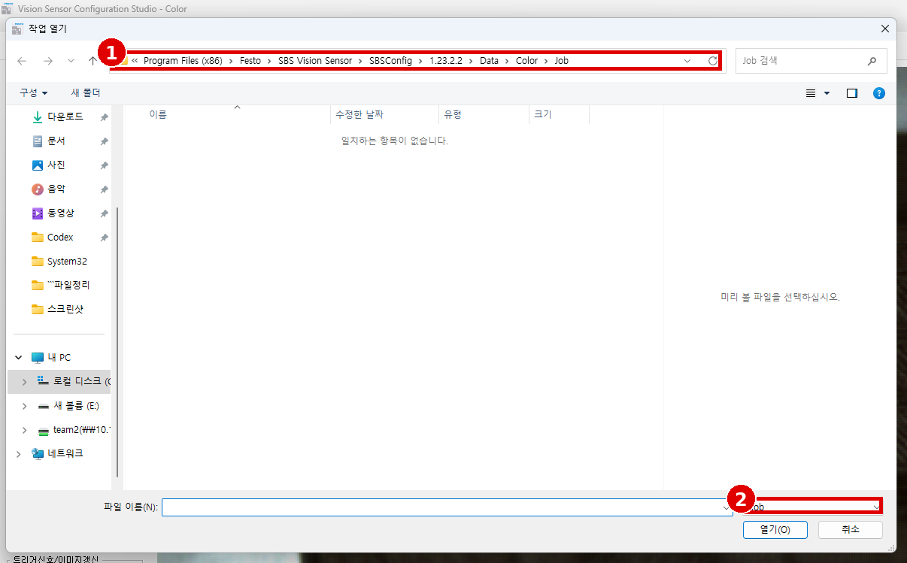
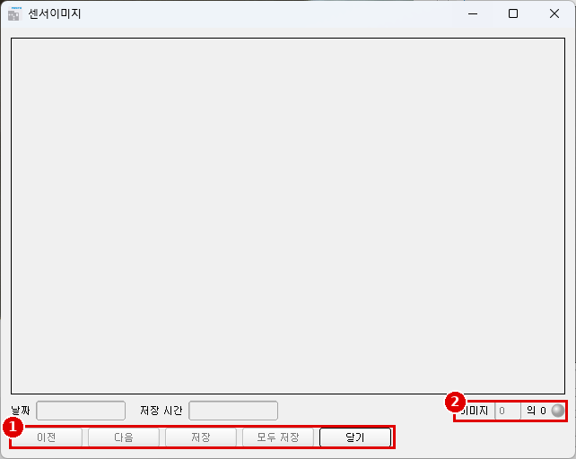
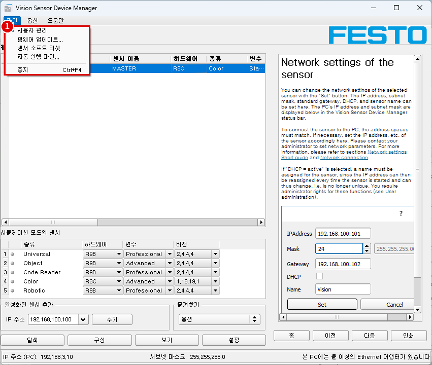

# Module 07 — 운영과 유지보수

> 📝 **v2 (2026-10-02)**: File 메뉴 표기 확인, 작업 열기 기본 폴더, 레코더 창, Device Manager 파일 메뉴(센서 소프트웨어 리셋 주의) 추가. 1차 판: [`07_operation-maintenance.md`](07_operation-maintenance.md)

> 현장 질문: **"품종을 바꾸고, 불량을 기록하고, 고장 나면 되살릴 수 있나?"**

## 🎯 목표
1. 잡/잡셋을 **백업 → 삭제 → 복원**하고, 복원 후 판정이 같은지 확인한다.
2. 디지털 입력으로 **Job 1 ↔ Job 2**를 전환한다(품종 전환).
3. **NG 이미지만** PC에 저장하고, 운전 화면(Visualisation Studio / 웹 뷰어)으로 감시한다.
4. 비밀번호·펌웨어 업데이트·Auto Start Up의 **절차**를 안다(펌웨어 업데이트는 실행하지 않음).

## 🏭 왜 필요한가
이 품번은 단종 품번이다(데이터시트 "Available until 2024"). 센서가 고장 나 교체품을 꽂았을 때 백업이 없으면 처음부터 다시 설정해야 한다. 불량 이미지가 없으면 고객 클레임에 근거를 댈 수 없다.

## 📋 선행 조건 / 준비물
- [Module 06](06_output-24v.md) 완료한 잡 1개(`JobA`)
- 토글 스위치(또는 점퍼선) 1개 — 핀 10 VT 입력용
- PC 공유 폴더(SMB 아카이빙용) 또는 Visualisation Studio 아카이빙 폴더

---

## 7.1 잡·잡셋 저장/불러오기/보호

### ⚙️ 메뉴 경로
`Configuration Studio › File › Save job as ...` / `Save job set (Backup) ...` / `Load job ...` / `Load job set (Backup) ...` / `Protect job set ...` (Help: scjobset, scprotectjobset)


✅ 화면 표기 확인: `New job` (Ctrl+N) / `Load job...` / `Load job set (Backup)...` / `Save job` / `Save job as...` / `Save job set (Backup) ...` / `Protect job set ...` / `Save current image...` / `Configure filmstrip...` / `Get recorder images...` / `Examples` / `Quit`



| # | 화면 | 내용 |
|---|---|---|
| 1 | 기본 폴더 | `C:\Program Files (x86)\Festo\SBS Vision Sensor\SBSConfig\1.23.2.2\Data\Color\Job` (비어 있음) |
| 2 | 파일 형식 | `*.job` |

> [!TIP]
> 기본 폴더는 프로그램 설치 폴더라 권한 문제가 생기거나 재설치 때 지워질 수 있다. 저장·불러오기는 항상 이 저장소의 `backups\` 폴더로 바꿔서 한다.

<details>
<summary>📖 Help 번역 — Load and save jobs and job sets (File) (Help: scjobset)</summary>

잡은 하나씩, 또는 여러 잡을 묶은 잡셋으로 불러오고 저장할 수 있다. 센서에 잡이 여러 개 저장되어 있으면 이들이 잡셋이 되며, 개별 잡처럼 PC나 외부 저장 매체에 XML 파일로 저장할 수 있다.

**잡 / 잡셋 저장:** File 메뉴에서 Save job as ...를 고른다. File 메뉴에서 Save job set (Backup) ...를 고른다.

**잡 / 잡셋 불러오기:** File 메뉴에서 "Load job ..." 또는 "Load job set (Backup) ..."를 고른다. "Start Sensor" 버튼을 눌러 잡을 센서로 전송한다.

**새 잡 / 잡셋을 불러오면 센서에 저장된 모든 잡이 지워진다!**
</details>

<details>
<summary>📖 Help 번역 — Protect job set ... (File) (Help: scprotectjobset)</summary>

Vision Sensor Configuration Studio 메뉴의 "Protect job set ..." 기능으로 잡셋을 비밀번호로 보호할 수 있다. 잡셋과 그 안의 모든 잡이 비밀번호로 보호된다. 올바른 비밀번호를 넣어야만 Vision Sensor Configuration Studio로 열 수 있다. 비밀번호가 틀리면 잡셋을 표시하거나 바꿀 수 없다. SBS 비전 센서나 센서 접근은 막히지 않는다. 즉 SBS 비전 센서는 run 모드에서 정상 동작한다.

**주의:** 잊어버리거나 잃어버린 비밀번호를 되찾을 방법은 없다. 그 경우 잡셋 전체를 다시 만들어야 한다.

**비밀번호 입력**
1. "Vision Sensor Configuration Studio/Menu/Protect job set ..."에서 "Protect job set ..."를 고른다.
2. 비밀번호를 넣고 원하면 추가 정보를 넣는다. 참고: 비밀번호는 1–100자여야 한다.
3. "Set" 버튼으로 확인한다. 비밀번호 확인 창이 하나 더 열린다.
4. 비밀번호를 다시 넣어 확인한다.
5. "Set"을 누른다.

**보호된 잡셋 저장** … "Start Sensor" Setup을 골라 SBS 비전 센서에 / … 메뉴의 잡·잡셋 저장으로
참고: 잡이나 잡셋을 저장할 때 저장 형식 "With password protection (* .job)"과 "Without password protection (* .job)" 중에서 고를 수 있다.
- "With password protection (* .job)": 입력한 비밀번호와 함께 잡/잡셋을 저장한다. 올바른 비밀번호를 넣어야만 열 수 있다.
- "Without password protection (* .job)": 비밀번호 보호 없이 저장한다. 비밀번호 없이 언제든 열고 편집할 수 있다.

**보호/미보호 잡셋에 보호/미보호 잡을 불러올 때의 동작**

| | 센서의 잡셋이 보호됨 | 센서의 잡셋이 보호 안 됨 |
|---|---|---|
| 보호된 잡 불러오기 | 잡셋 보호가 유지된다. 열려면 보호된 잡의 비밀번호를 넣어야 하며, 그 뒤 활성 잡셋의 비밀번호가 적용된다. | 보호된 잡을 열고 잡셋을 저장하거나 센서를 시작하면 비밀번호 보호가 잡셋 전체에 적용된다. |
| 보호 안 된 잡 불러오기 | 잡셋 보호는 그대로이며 저장할 때 보호 안 된 잡에도 적용된다. | 잡셋은 보호 안 된 채로 남는다. |

보호된 잡셋은 "열쇠 기호"로 표시된다.
- Vision Sensor Device Manager: 보호된 잡셋이 있는 SBS 비전 센서는 "Active sensors" 목록에 열쇠 기호로 표시된다.
- Vision Sensor Configuration Studio / Vision Sensor Visualisation Studio: 보호된 잡/잡셋은 상태표시줄에 열쇠 기호로 표시된다.
- Vision Sensor Visualisation Studio: 보호된 잡/잡셋은 "Job upload" 탭에 열쇠 기호로 표시된다.

**비밀번호 바꾸기:** "Protect job set ..."를 고른다 → 기존 비밀번호를 넣고 "Change" 버튼 → 새 비밀번호를 다시 넣어 확인하고 "Set" → 새 비밀번호 저장("Start Sensor" 또는 메뉴 저장).

**비밀번호 끄기:** "Protect job set ..."를 고른다 → 기존 비밀번호를 넣고 "Deactivate" 버튼 → 잡셋 저장("Start Sensor" 또는 메뉴 저장).
</details>

### 📝 단계별 조작 — 백업·복원 훈련
1. `File › Save job set (Backup) ...` → `backups/YYYYMMDD_jobset_v1.*`
2. 잡 목록에서 `JobA`를 선택해 `File › Save job as ...` → `backups/JobA_v1.*`
3. **복원 훈련**: 잡 목록 `Delete all` → `Start sensor`(센서가 빈 상태가 됨) → `File › Load job set (Backup) ...`로 1번 파일 → `Start sensor`.
4. Module 06의 OK/NG 시료로 판정과 24 V 출력이 복원 전과 같은지 확인한다.

> [!CAUTION]
> `Protect job set`의 비밀번호는 **되찾을 수 없다**(Help). 실습에서는 비밀번호를 기록해 두고, 끝나면 `Deactivate`로 해제한다. 저장소에 비밀번호를 커밋하지 않는다.

## 7.2 품종 전환 — 디지털 입력으로 Job 1 ↔ Job 2

> 최대 잡 수는 8(매뉴얼 p.19, V-08). 이 품번에서 IN2(핀 10 VT)는 `Job switch (1 or 2)` 기능을 가진다(설정파일 Configuration_R3C.xml, IN2 `capability="Advanced/Standard/Professional"`). ⚠️ 화면 목록에 실제로 보이는지 확인(V-19).

### 📝 단계별 조작
1. `JobA`를 복사해 두 번째 잡 `JobB`를 만든다(예: 다른 색 캡을 OK로 보는 잡 — Color area 범위만 변경).
2. **두 잡 모두** Trigger mode = `Trigger` (잡 전환 조건: 모든 잡 트리거 모드, 같은 잡 전환 설정 — Help: scoutputiosettings).
3. 두 잡 모두 `Output › I/O mapping`에서 10 VT = `Input`, Function = `Job 1 or 2` (화면 표기 확인).
4. 결선: +24 V → 토글 스위치 → 핀 10 VT.
5. `Start sensor`. 스위치 OFF(Low) = Job 1, ON(High) = Job 2 (Help).
6. 상태표시줄 `Active job`이 바뀌는지, **첫 트리거 이후에** 표시가 바뀌는지 확인(매뉴얼 p.323 "The display of the active job changes with the first following trigger").

## 7.3 이미지 전송·이미지 레코더·RAM 디스크

### ⚙️ 메뉴 경로
`Setup › Output › Image transmission` ⚠️ [스크린샷 필요: `cs_output_image-transmission.png`]

<details>
<summary>📖 Help 번역 — Tab Image transmission (Help: scjobtransmit)</summary>

Image transmission 탭에서 이미지 전송 및/또는 이미지 레코더와 RAM 디스크를 활성화할 수 있다. 이미지 선명도는 SBS 비전 센서 뒷면의 초점 조절 나사로 맞춘다.

**주의:** 라이브 이미지 안에 (경고) 아이콘이 나오면, PC의 이미지 표시/전송이 SBS의 이미지 처리보다 느리다는 뜻이다. SBS가 찍은 모든 그림이 표시되지는 않는다. 이 때문에 불량(fail) 이미지 아카이빙 중 이미지를 잃을 수 있다. 이 아이콘이 자주 나오면 PC 성능을 높이기 위해 백그라운드에서 도는 PC 프로그램을 닫는다.

| 파라미터 | 기능 |
|---|---|
| Image recorder | 센서 내부 링 버퍼에 최대 10장 저장. 팝업 메뉴로 설정: Off, Any, Pass, Fail |
| Ram Disk | 마지막 이미지를 RAM에 저장하며, FTP 클라이언트로 가져갈 수 있다. 설정: Off, Any, Pass, Fail. 이미지는 SBS의 RAM 폴더 /tmp/results/에 "image.bmp" 이름으로 저장된다. FTP 클라이언트 파라미터: 사용자 "user", 비밀번호 "user" |

Windows 콘솔 예:
```text
C:\>ftp 192.168.100.100
220 Welcome to SBS ftp-server!
User (192.168.100.100:(none)): user
331 Please specify the password.
Password: user
230 Login successful.
ftp> cd /tmp/results
250 Directory successfully changed
ftp> get image.bmp
226 File send OK.
```
이제 이미지가 실행한 PC의 C 드라이브에 있다. 활성화하면 결과도 같은 방법으로 "results.csv" 파일로 받을 수 있다("Output/Telegram"에서 정의한 모든 데이터, 구분자 ";").

**이미지 아카이빙 방법 비교**

| 접근 | 설명 | 최대 이미지 수 | 이미지 필터 | 그림(오버레이) |
|---|---|---|---|---|
| SBS 안의 이미지 레코더(RAM) | run 모드에서 SBS에 저장. Vision Sensor Configuration Studio나 Vision Sensor Visualisation Studio로 PC에 옮길 수 있다 | 10 | "Filter" 설정대로 | 없음 |
| Vision Sensor Visualisation Studio 아카이빙 / Configuration Studio 이미지 저장 | Visualisation Studio로 전송된 이미지를 PC 하드디스크에 저장 | 무제한(PC 디스크 크기까지) | "Filter" 설정대로 | 선택 가능 |
| Configuration Studio 필름스트립 저장 | 필름스트립의 현재 이미지를 필름스트립(*.flm)이나 비트맵(*.bmp)으로 PC에 저장 | 50 | 필터 없음 | 없음 |
| SBS의 마지막 이미지(RAM Disk) | 마지막 이미지가 SBS RAM 디스크에 저장되며 /tmp/results 디렉터리에서 FTP로 가져갈 수 있다 | 1 | 필터 없음 | 없음 |
| FTP 또는 SMB로 이미지 아카이빙 | FTP 또는 SMB로 이미지 아카이빙 | 무제한(PC 디스크 크기까지) | 필터 사용/미사용 선택 가능 | 없음 |
| Get Image Request | PLC나 PC 프로그램에서 GetImage 명령으로 SBS의 마지막 이미지를 가져옴 | 무제한 | "Filter" 설정대로 | 없음 |
</details>

<details>
<summary>📖 Help 번역 — Image recorder (Help: scimagerec)</summary>

이미지 레코더는 Vision Sensor Configuration Studio와 Vision Sensor Visualisation Studio 프로그램에 있다. 레코더를 켜면 모든 이미지 또는 오류 이미지만 내부 메모리로 계속 들어온다. 10장까지 담으며 가장 오래된 이미지부터 차례로 바뀐다(FIFO 버퍼). 기록된 이미지는 PC로 불러와 표시하거나, PC 또는 외부 저장 매체에 저장할 수 있으며, 그 뒤 분석이나 오프라인 시뮬레이션에 쓸 수 있다.
Vision Sensor Visualisation Studio에서 레코더 이미지를 불러오려면 (활성화된 경우) 비밀번호가 필요할 수 있다(User 사용자 그룹, user administration 참조).

**레코더 켜기:** "output" Setup의 "Image transmission" 탭에서 기록 기능을 켠다. 레코더 파라미터 팝업 목록에서 모든 이미지("Any"), "Pass" 이미지만, "Fail" 이미지만 중 고른다.

**이미지 선택과 기록:** File 메뉴에서 "Get images from sensor"(※ 화면 표기 `Get recorder images...`)를 고르거나 "Rec.images" 버튼을 누른다(Vision Sensor Visualisation Studio에서만). 센서 RAM에 저장된 이미지를 PC로 불러와 살펴보고 저장할 수 있는 창이 나타난다.

| 파라미터 | 기능 |
|---|---|
| Back | 이전 이미지 표시 |
| Next | 다음 이미지 표시 |
| Save | 표시된 이미지를 PC나 외부 저장 매체에 저장 |
| Save all | 모든 이미지 저장 |

참고:
- 선택한 이미지의 순번과 센서에 기록된 전체 이미지 수(최대 10)가 표시 창 아래 카운터에 표시된다.
- 저장할 때 이미지는 해상도 640 x 480 픽셀(VGA)의 비트맵 형식(확장자 .bmp)으로 저장된다.
- 이미지와 연결된 검사 결과(OK 또는 오류)와 날짜는 파일 이름에 저장된다(형식 YYMMDD_순번_Pass/Fail.bmp, 예: 090225_123456_Pass.bmp).
- 이미지와 함께 자세한 검사 결과를 기록하려면 Vision Sensor Visualisation Studio의 Archive 기능을 쓴다.
- 한 장만 오버레이 있이/없이 기록하려면 레코더 대신 file 메뉴의 save current image 기능을 쓸 수 있다.
- 이미지는 (센서에서) 불러올 때 타임스탬프가 붙는다.
- 센서에서 PC로 이미지를 불러오면 센서의 데이터가 지워진다. 이미지를 저장하지 않고 레코더 창을 닫으면 PC에서도 지워진다.
- 전원이 끊기면 버퍼의 이미지는 사라진다.
</details>

### 이미지 레코더 창



| # | 한국어 표기 | 영문 |
|---|---|---|
| 1 | 이전 / 다음 / 저장 / 모두 저장 / 닫기 | Back / Next / Save / Save all / Close |
| 2 | 이미지 n 의 m (+ 상태 LED) | Images n / 10 |

캡처 당시 `이미지 0 의 0` — 레코더가 꺼져 있거나(Image transmission › Image recorder = Off) 센서가 Run 상태가 아니었다. 7.3 설정 후 다시 확인한다.

## 7.4 아카이빙 — NG 이미지만 PC에 저장

두 가지 방법이 있다. **방법 1(Visualisation Studio)** 은 "불량 이미지만" 선택이 Help에 명시되어 있으므로 기본으로 쓴다. 방법 2(센서가 SMB로 직접 저장)는 PC를 꺼 두어도 센서가 쓰는 구조를 배우기 위해 해 본다.

### 방법 2 — Output › Archiving (센서 → SMB/FTP)

<details>
<summary>📖 Help 번역 — Tab Archiving (Help: scjobarchive)</summary>

Archiving 탭에서 데이터 아카이빙을 정의할 수 있다.

| 파라미터 | 기능과 가능한 설정 |
|---|---|
| (방식) | Off: 아카이빙 없음 / FTP: FTP 서버로 아카이빙 / SMB: SMB 서비스(Server Message Block)로 드라이브에 아카이빙. 아카이빙 서버가 다른 서브넷에 있으면 먼저 Vision Sensor Device Manager로 게이트웨이를 설정한다. |
| IP-Address of target server | 대상 서버의 IP 주소 |
| Sharing name | PC의 "고급 공유" 대화상자에서 지정한 공유 이름 |
| Workgroup (Domainname) | 옵션! 서버/클라이언트의 작업 그룹 / 도메인 이름 |
| User name | FTP / SMB 연결용 사용자 이름 |
| Password | FTP / SMB 연결용 비밀번호 |
| Result files | 프로토콜 파일이 활성이면 검사(트리거)마다 .csv 파일이 자동으로 만들어진다. 파일 내용은 "Output / Telegram"에서 정한다. 파일 이름에 증가하는 카운터가 붙는다. |
| Image files | 이미지 아카이빙을 켠다. 참고: 이미지는 전처리 설정 없이 저장되지만 배치(arrangement) 설정(예: 회전, 대칭)은 반영된다. FTP와 SMB는 오버레이 없이 이미지를 저장한다. 오버레이가 있는 이미지를 저장하려면 Vision Sensor Visualisation Studio를 쓴다. |
| Storage mode | Limit: 최대 파일 수에 도달하면 전송을 멈춘다. Unlimited: 대상 드라이브가 찰 때까지 저장한다. Cyclic: 최대 파일 수에 도달하면 오래된 파일을 새 파일로 바꾼다. |
| Max. number of files | 대상 디렉터리에 저장할 수 있는 파일 세트(이미지+프로토콜)의 최대 수 |
| Directory name (pass) | 양품(pass) 데이터를 아카이빙할 디렉터리 (C:\TESTPASS면 TESTPASS만 입력) |
| Directory name (fail) | 불량품(fail) 데이터를 아카이빙할 디렉터리 (C:\TESTFAIL이면 TESTFAIL만 입력) |
| Filename | 이미지와 프로토콜 파일의 이름. 이 이름 뒤에 이미지 번호가 자동으로 붙는다(예: TESTFILE) |
| Add expression | 파일 이름에 동적인 부분(날짜, 시간 같은 정보)을 붙인다. 아래 표 참조 |

**파일 이름에 붙일 수 있는 표현식**

| 표현식 | 설명 | 예 |
|---|---|---|
| TIME | HHhMMmSSsSSSms | 09h05m11s034ms |
| HOUR | hh | 09 |
| MIN | mm | 05 |
| SEC | ss | 11 |
| MSEC | sss | 034 |
| DATE | YYYY-MM-DD | 2011-09-21 |
| YEAR | YYYY | 2011 |
| 2YEAR | YY | 11 (2011이면) |
| MONTH | MM | 09 |
| DAY | DD | 21 |
| STRINGID | 확장 트리거 요청 "TRX"의 "Data" 항목 | Part 34 |
| COUNTER | 통계에서 가져옴 | 3824 |
| XXCOUNTER | 정한 자릿수로 표시하는 통계 카운터. XX는 표시 자릿수이며 01–09. 자릿수가 부족하면 앞에 0을 붙이고, 너무 크면 가장 높은 자리부터 버린다. | 06COUNTER → 003824 |
| RESULT | 잡 전체 결과 | Pass 또는 Fail |
| SENSORNAME | Vision Sensor Device Manager에서 정한 이름 | |
| JOBNAME | Vision Sensor Configuration Studio에서 정한 이름 | |
</details>

<details>
<summary>📖 Help 번역 — Tab Telegram, Data output (Help: scoutputtelegram) — 결과 CSV 내용 정의</summary>

※ 이 튜토리얼은 통신을 쓰지 않지만, 아카이빙 .csv에 들어갈 내용이 이 탭에서 정해지므로 번역을 싣는다.

시리얼 인터페이스 RS422와 Ethernet으로 내보내는 데이터 출력, 그리고 .csv 파일 아카이빙을 설정한다. SBS의 어떤 결과 데이터를 앞서 고른 인터페이스로 보낼지 여기서 모두 설정할 수 있다.

| 파라미터 | 기능 |
|---|---|
| Binary / ASCII | 출력 데이터를 Binary(Hex) 또는 ASCII 형식으로 |
| Save to file | 현재 결과로 파일 형식을 .csv로 내보낸다. 자유 정의 출력 문자열의 상세 파일 형식(.csv): 바이트 위치(문자열 시작 위치), 데이터 형식, 필드 이름, 검출기 이름, 값, 길이(바이트), 검출기 번호, 검출기 종류 |
| Reset | 이 탭의 모든 파라미터 초기화 |

**프로토콜 표준 내용** — 자주 필요한 표준 내용은 칸을 채우거나 체크박스를 켜기만 하면 출력 문자열에 들어간다.

| 파라미터 | 기능 |
|---|---|
| Start | 페이로드 데이터 문자열 앞에 넣는 문자(Binary 또는 ASCII) |
| Trailer | 페이로드 데이터 문자열 끝에 넣는 문자(Binary 또는 ASCII) |
| Separator | 각 페이로드 값 뒤에 넣는 문자(ASCII만) |
| End of telegram | PC나 PLC에 보내는 응답 끝에 붙는 문자(명령에 대한 응답, 페이로드 데이터 아님, ASCII 모드만, ANSI 또는 16진수로 선택) |
| Selected fields | 아래 체크박스 중 어떤 것이 켜졌는지 표시 |
| … 기타 표준 내용 | 예: "Selected fields, Data length". 데이터 문자열 순서: Selected fields, Data length, Status, Detector result, Digital outputs, Logical outputs, Execution time, Active job no., Checksum |

**검출기별 개별 결과** — 먼저 "+" 버튼으로 새 항목을 만든다. 버튼: "+" 새 항목 넣기 / "-" 표시한 항목 삭제 / "Up", "Down" 표시한 항목 이동. 선택 목록으로 검출기별 개별 결과를 원하는 순서대로 데이터 텔레그램에 넣을 수 있다.

| 열 | 기능 |
|---|---|
| Active | 표시한 출력 값 활성/비활성 |
| Detector | 검출기 이름(드롭다운에서 선택) |
| Value | 쓸 수 있는 검출기 결과(드롭다운에서 선택) |
| Min. length | 값 칸의 최소 길이. 실제 길이가 더 짧으면 공백(ASCII)이나 0(binary)으로 채운다 |
| No. of results | BLOB 전용! (※ 해당 없음) |

**SBS 데이터 출력 방법 (Communication 장 참조)**
- (Ethernet) 포트 2005 / RS422: Output/Telegram에서 정의한 수치 데이터를 ASCII나 Binary 형식으로 보낼 수 있다. Ethernet에서는 센서가 (소켓) "서버"이며 "서버 소켓" 인터페이스로 데이터를 제공한다. 이는 기본적으로 "프로그래밍 인터페이스"다. 데이터를 읽거나 처리하려면 "소켓 클라이언트"(PC, PLC, …)가 센서에 (소켓) 연결을 (능동적으로) 맺어야 한다.
- PC 아카이빙(Vision Sensor Visualisation Studio): 이미지와 수치 결과 데이터(.csv)를 "Vision Sensor Visualisation Studio"가 PC 폴더에 저장할 수 있다. 이 아카이빙 기능(폴더 등)은 메뉴 File/Result archiving에서 설정한다. 순수한 PC 기능이다.
- 센서 아카이빙(ftp, smb): 이미지와 수치 결과 데이터(.csv)를 센서가 ftp/smb로 능동적으로 저장한다. 이 아카이빙은 "Job/Archiving"에서 설정한다. "ftp"를 쓰면 센서가 "ftp 클라이언트"로서 네트워크 드라이브의 "ftp 서버" 폴더에 데이터를 "쓴다". Job/Start 시 센서가 ftp 서버에 연결한다. "smb"를 쓰면 센서가 네트워크의 폴더에 데이터를 직접 "쓴다". Job/Start 시 센서가 이 폴더에 연결/마운트한다.
- RAM 디스크(센서 안): 센서 안의 RAM 디스크 폴더 "/tmp/results/"에 마지막 이미지와, Output/Telegram에서 설정한 마지막 평가의 수치 데이터(.csv)가 저장된다. 이 기능은 "Job/Image transmission"에서 켠다. 이 데이터에 접근하려면 센서에 ftp 연결을 능동적으로 맺어야 하므로 ftp 클라이언트가 필요하다.

참고: .csv 파일 형식은 항상 같다(ftp, smb, ram-disk, Vision Sensor Visualisation Studio). 데이터는 읽을 수 있는 형태(기본은 쉼표 구분)로 .csv 파일에 저장된다. Output/Telegram에서 정의한 페이로드 데이터만 전송된다.

**통신 설정** — TCP/IP: ASCII / Binary, RS422/RS232: ASCII / Binary, EtherNet/IP: Binary, PROFINET: Binary

**연결의 기본:** SBS는 항상 tcp/ip(소켓) 서버다. SBS 비전 센서는 항상 두 개의 (소켓) 통신 포트를 연다(기본: 2005 + 2006). 2005 = 수치 결과를 보내는 데이터 포트. 2006 = 명령을 받는 명령 포트. 한 포트에는 한 번에 (소켓) 클라이언트(PC 또는 PLC) 하나만 연결할 수 있다.
**권장:** 기존 소켓 연결은 오류가 났을 때만(예: PLC나 클라이언트가 정지 또는 오류 모드) 다시 연결한다. 정상 운전 중에는 연결을 다시 맺을 필요가 없다. Ethernet 데이터 처리: 특히 SBS를 여러 대 쓰면 Ethernet이 좋다.
설치된 도움말도 참조: …:\Program files\Festo\SBS vision sensor\Utilities\Ethernet (※ 이 PC에는 없음)
</details>

### 📝 단계별 조작 — SMB (선택)
1. PC에 폴더 `C:\SBS_ARCHIVE`를 만들고 Windows "고급 공유"로 공유 이름 `SBS_ARCHIVE`, 읽기/쓰기 권한 사용자 지정.
2. `Output › Archiving`: SMB / IP `192.168.3.10` / Sharing name `SBS_ARCHIVE` / 사용자·비밀번호 / Image files 체크 / Storage mode `Cyclic` / Max. number of files 50 / Directory name (pass) `PASS`, (fail) `FAIL` / Filename `M07` + Add expression `DATE`, `TIME`, `RESULT`.
3. `Start sensor` 후 OK 5회, NG 5회 트리거 → `FAIL` 폴더에만 NG가 쌓이는지 확인.
4. "PASS 폴더에는 저장하지 않기" 설정이 화면에 있는지 확인 ⚠️ (Help 표: "필터 사용/미사용 선택 가능" — 정확한 항목 V-18).

### 방법 1 — Visualisation Studio 아카이빙 (NG만)

<details>
<summary>📖 Help 번역 — Archiving test results and images (Help: svarchiving)</summary>

이미지(그래픽 있이/없이)와 검사 결과를 PC나 외부 저장 매체에 아카이빙해 분석이나 시뮬레이션(Offline mode 참조)에 쓸 수 있다. 이 기능에 접근하려면 비밀번호가 필요할 수 있다(user 그룹, user administration 참조).

**아카이빙 설정:** File 메뉴에서 Configure archiving ...을 고른다. 다음 옵션이 있는 대화상자가 나타난다.

| 파라미터 | 기능 |
|---|---|
| Path for archiving | 아카이빙 파일을 저장할 디렉터리 |
| Settings, Automatic Start | Vision Sensor Visualisation Studio 시작 후 아카이빙을 자동으로 시작 |
| Settings, Archive image circularly | 저장 한도에 도달하면 가장 오래된 이미지를 순환 덮어쓰기 |
| Settings, Limitation (max.) | 이 드롭다운에서 어떤 이미지(모든 이미지 또는 양품만 또는 불량만)를 저장할지 정할 수 있다 |
| Type of images | 모든 이미지, 양품 이미지, 불량 이미지 중 무엇을 저장할지 지정 |
| Graphics, Bar graph result | 이미지에 함께 아카이빙할 그래픽 선택 |
| Numerical results | "record with"를 켜면 좌표값 같은 수치 결과 데이터를 추가 .csv 파일로 아카이빙한다. "Legacy" / "Configured" 설정이 저장 형식(.csv)을 정한다. "Legacy"\*1는 내용이 미리 정해져 있고, "Configured"는 내용을 "Output/Telegram"에서 정할 수 있다. \*1) "Legacy" 저장 모드는 더 이상 쓰이지 않으며 하위 호환을 위해서만 있다. 다음 버전 중 하나에서 빠진다. |

원하는 옵션을 고르고 OK로 확인한다.

**아카이빙 시작/종료:** "Commands" 영역의 "Archive images" 버튼을 눌러 위 설정으로 아카이빙을 시작하거나 끝낸다. 지금 저장할 이미지 파일 이름이 상태표시줄에 나타난다. "Archive images" 버튼이 눌려 있는 동안 아카이빙한다.
</details>

1. Device Manager › 센서 선택 › `보기 (View)` → Visualisation Studio.
2. `File › Configure archiving ...` → Path `C:\SBS_ARCHIVE\VIS`, Type of images = **불량(bad)**, Graphics 체크, Numerical results = Configured.
3. `Archive images` 버튼을 누른 상태로 OK 10회, NG 10회 → 저장 파일 수가 **NG 수와 같은지** 확인.

## 7.5 Visualisation Studio — 운전 화면

⚠️ [스크린샷 필요: `vs_main.png`, `vs_tabs_*.png`]

<details>
<summary>📖 Help 번역 — Visualisation Studio 전체 기능 (Help: svgettingstarted, svimage, svfreeze, svzoom)</summary>

**전체 기능:** 이 프로그램으로 카메라 이미지와 검사 결과를 감시할 수 있다. 센서에 새 설정을 할 수는 없다. (기능: Image display, Tab Result, Tab Statistics, Tab Job select, Tab Job upload, Freeze image, Image recorder, Archiving test results and images)
센서에 이미 있는 잡 사이를 전환하거나, 권한 있는 작업자가 미리 정의한 잡셋을 PC/제어기에서 센서로 올릴 수만 있다. 따라서 이 표시 도구는 주로 이미지와 결과를 보이고, 예를 들어 기계에서 부품이 바뀔 때 잡을 바꾸는 데 쓴다.

**Image display (이미지 표시):** 표시 창의 이미지와 검사 결과의 그래픽 표시는 잡 설정의 "Image transmission" 탭 파라미터("Vision Sensor Configuration Studio의 이미지 전송 파라미터") 설정에 따라 다르다.
- 이미지 전송 활성: 현재 이미지와 함께 정의한 검색·파라미터·위치 영역 프레임과 찾은 특징이 표시된다.
- 이미지 전송 비활성: 정의한 검색·파라미터·위치 영역 프레임과 찾은 특징만 표시된다(현재 이미지는 표시되지 않음).

찾으려는 특징과 찾은 특징의 일치도는 각 검출기 검색 영역 오른쪽에 설정 임계값이 있는 세로 결과 막대로 나타난다.
- 초록 막대: 찾으려는 특징을 찾았고 설정 일치도 임계값에 도달했다.
- 빨간 막대: 요구 일치도로 물체를 찾지 못했다.

주의: 라이브 이미지 안에 아이콘이 나오면 PC의 이미지 표시/전송이 SBS의 이미지 처리보다 느리다는 뜻이다. SBS가 찍은 모든 그림이 표시되지는 않는다. 불량 이미지 아카이빙 중 이미지를 잃을 수 있다. 이 아이콘이 자주 나오면 백그라운드 PC 프로그램을 닫는다.
Vision Sensor Visualisation Studio / view 메뉴에서 검사 결과의 그래픽 표시를 설정할 수 있다.
아카이빙을 뺀 Vision Sensor Visualisation Studio의 모든 기능은 Vision Sensor Configuration Studio 모듈에도 있다.

**Freeze image (이미지 고정):** "Freeze image" 버튼으로 원하는 종류(현재 이미지, 다음 이미지, 다음 불량 이미지)의 단일 이미지를 요청해 표시 창에 고정할 수 있다. 요청한 이미지가 표시되고 이미지 카운터가 해당 번호에서 멈춘다. "Continue"를 누르면 고정 상태가 끝난다.

**Zoom:** "Zoom" 버튼으로 이미지를 새 창에서 확대해 연다.
</details>

<details>
<summary>📖 Help 번역 — Tab Result (Help: svresults)</summary>

이 기능은 PC에서 정의한 잡을 실행하고 Detector list와 Evaluation results가 담긴 Result statistics 창을 표시한다. 센서에서 받을 수 없으므로 이 모드에서는 실행 시간이 갱신되지 않는다.
선택 목록에서 표시한 검출기의 자세한 검사 결과는 run 모드에서 표시된다. 이미지, 검색·파라미터 영역, 결과 그래프가 — 설정되어 있으면 — 표시 창에 나타난다.

| 결과 | 검출기 종류 | 기능 |
|---|---|---|
| Result | 모두 | 부품/특징 검출됨(검출 = 초록, 미검출 = 빨강) |
| Score 1 .. n | 모두 | 찾은 패턴과 학습한 패턴의 일치도 |
| Execution time | 모두 | 평가 1회의 사이클 타임(ms) |
| Distance | Caliper | 계산한 거리 |
| Position X 1 ... n, Position Y 1 .. n | Pattern match., Contour, Caliper | 찾은 특징의 좌표(중심점) |
| Delta X, Delta Y | Pattern match., Contour | 학습 위치 대비/정렬을 통한 찾은 좌표의 편차 |
| Position check | Pattern match., Contour | 찾은 위치가 정의한 위치 프레임 안에 있음 |
| Angle | Pattern match., Contour | 찾은 특징의 방향(절대 각도) |
| Delta angle | Pattern match., Contour | 학습한 특징과 찾은 특징의 각도 편차 |
| Scale | Contour | 학습한 윤곽 대비 찾은 윤곽의 배율 |
| Result index | Color list | 목록 안의 번호 |
| Color distance | Color list | 측정한 색과 학습한 색의 거리 |
| Red / Green / Blue (RGB) | Color list, Color value | 빨강/초록/파랑 평균값 |
| Hue / Saturation / Brightness (HSV) | Color list, Color value | 색상 / 채도 / 명도 |
| Lightness / A / B (LAB) | Color list, Color value | 밝기 / A 값 / B 값 |

다른 검출기의 검사 결과를 보려면 선택 목록에서 표시한다. Vision Sensor Visualisation Studio 프로그램에서 선택한 그래픽을 포함해 검사 결과와 통계 평가를 아카이빙할 수 있다.
</details>

<details>
<summary>📖 Help 번역 — Tab Statistics (Help: svstatistics)</summary>

run 모드에서 검사 공정의 통계 데이터가 Statistics 탭에 표시된다. 표시되는 통계 데이터는 모든 검출기 종류에서 같다.

| 파라미터 | 기능 |
|---|---|
| All evaluations | 전체 검사 수 |
| Good parts | 결과가 "OK"인 검사 수 |
| Bad parts | 결과가 "Error"인 검사 수 |
| Min./max./mean execution time | 평가의 최소/최대/평균 실행 시간(ms) |

"Reset" 버튼으로 모든 통계 값을 0으로 되돌릴 수 있다. Vision Sensor Visualisation Studio 프로그램에서 선택한 그래픽을 포함해 검사 결과와 통계 평가를 아카이빙할 수 있다.
</details>

<details>
<summary>📖 Help 번역 — Tab Job select (Help: svjob)</summary>

Job 탭의 선택 목록에 센서에 있는 잡들이 표시된다. 여기서 센서에 저장된 여러 잡 사이를 전환할 수 있다. 초록 화살표가 활성 잡을 표시한다.
활성 센서를 멈추는 기능을 쓰려면 Vision Sensor Device Manager에서 비밀번호가 필요할 수 있다(User 그룹, user administration 참조).

**순서:** 목록에서 잡을 고르고 "Activated" 버튼으로 활성화한다. 이전 잡은 비활성화되고 고른 잡이 활성이 된다.

참고 — 잡 변경과 Run에서 Config 모드로 바뀔 때 출력 상태:
- 지연된 출력의 버퍼는 지워진다.
- 디지털 출력: "Run"에서 "Config"로 바뀌면 기본값으로 리셋된다. 기본값은 output 탭의 "Invert" 플래그로 정한다. "Invert"는 기본 설정과 결과를 함께 반전한다.
- Ready와 Valid: 잡 변경 시와 Run에서 Config로 동작 모드가 바뀔 때, (센서가) 준비되지 않았고 결과가 유효하지 않음을 Ready와 Valid가 보여 준다(Low 레벨).
</details>

<details>
<summary>📖 Help 번역 — Tab Job upload (Help: svupload)</summary>

Upload 탭에서 새 잡이나 잡셋 전체를 PC에서 센서 메모리로 올릴 수 있다. 쓸 수 있는 잡과 잡셋이 선택 목록에 표시된다.
잡과 잡셋은 Vision Sensor Configuration Studio 프로그램에서 만들어 File / Save Job / Save Jobset as ...로 저장할 수 있다.

참고:
- 잡셋은 센서나 하드디스크에 함께 저장되는 하나 이상의 잡으로 이루어진다.
- 활성 센서를 멈출 수 있는 기능을 쓰려면 비밀번호가 필요할 수 있다(User 사용자 그룹, user administration 참조).
- 목록에서 잡이나 잡셋을 고르고 "Upload" 버튼으로 센서에 올린다.
- **이 동작은 센서에 이전에 저장된 모든 잡을 지운다!**
</details>

## 7.6 SBSxWebViewer — 브라우저로 감시

<details>
<summary>📖 Help 번역 — SBS – SBSxWebViewer (Help: svwebviewbase)</summary>

이 프로그램으로 카메라 이미지와 검사 결과를 감시할 수 있다. 센서에 새 설정을 할 수는 없다.

**기능(화면 버튼):** 도움말 창 끄기 / 이미지 확대(이미지를 클릭하면 원래 작은 화면으로) / 결과 막대그래프 켜기·끄기 / 오버레이 켜기·끄기 / 현재 이미지를 파일로 저장 / 언어 전환 / Result, Statistics, 센서에 있는 Job 목록 사이 전환 / 이미지 제어 명령: 이미지를 "Freeze"할 수 있다(이미지 표시만 고정되고 촬영과 실행은 계속된다) / 출력 상태

**SBSxWebViewer 시작:**
1. Output/Interfaces/SBSxWebViewer를 활성화한다.
2. "Start sensor"(Vision Sensor Configuration Studio의 버튼)
3. 브라우저를 연다.
4. 브라우저 주소창에 센서 IP 주소(Vision Sensor Device Manager 참조)를 넣는다. 형식: "http://센서 IP", 예: "http://192.168.100.100"(기본).

참고:
- 지원 웹 브라우저: Microsoft Internet Explorer IE10 이상, Google Chrome, Mozilla Firefox.
- http://192.168.100.100/zoom.html (센서 IP 주소)로 확대 화면에 바로 들어갈 수 있다.
- SBS 비전 센서 하나당 브라우저 연결은 하나만 허용된다.
</details>

1. `Output › Interfaces › SBSxWebViewer` 체크 → `Start sensor`.
2. 브라우저에서 `http://192.168.3.40` 그리고 `http://192.168.3.40/zoom.html`.
3. 두 번째 브라우저 탭으로 같은 주소를 열어 **연결 1개 제한**을 확인한다.

## 7.7 Device Manager 관리 기능 — 즐겨찾기·비밀번호·펌웨어·Auto Start Up



| 한국어 메뉴 | 매뉴얼/Help 이름 | 이 튜토리얼 |
|---|---|---|
| 사용자 관리 | User administration | 7.7 비밀번호 (설정 후 해제) |
| 펌웨어 업데이트... | Update / Firmware update | **열어서 캡처만, 실행 금지** |
| 센서 소프트웨어 리셋 | ⚠️ Help 목록에 없음 (Rescue/초기화 계열로 추정) | **실행 금지**, 의미 확인 V-23 |
| 자동 실행 파일... | Auto Start Up file | 7.7 |
| 중지 (Ctrl+F4) | 프로그램 종료 | |

⚠️ [스크린샷 필요: `dm_useradmin.png`(사용자 관리 창), `dm_update.png`(펌웨어 업데이트 창 — 열기만), `dm_autostart.png`(자동 실행 파일 창)]

<details>
<summary>📖 Help 번역 — Favorites (Help: sffavorite)</summary>

즐겨찾기는 SBS 비전 센서에 빠르게 접근하고 관리하는 데 쓴다. 즐겨찾기에서 다음 파라미터를 고를 수 있다.

**Vision Sensor Device Manager에서 active sensors를 오른쪽 클릭:**

| 파라미터 | 기능 |
|---|---|
| Remove from list | 선택한 센서를 "Active sensors" 목록에서 제거 |
| Clear list | "Active sensors" 목록 전체 비우기 |
| Save as favorite | 선택한 센서를 즐겨찾기로 저장 |
| Save all as favorite | "Active sensors" 목록의 모든 센서를 즐겨찾기로 저장 |

**Vision Sensor Device Manager의 "Favorites":**

| 파라미터 | 기능 |
|---|---|
| Save as favorite | "Save as favorite" 창을 연다. 트리 구조에서 "Active sensors" 목록의 센서를 즐겨찾기로 저장할 위치를 고른다 |
| Save all as favorite | "Save all as favorite" 창을 연다. 트리 구조에서 "Active sensors" 목록의 모든 센서를 저장할 위치를 고른다 |
| Add to active sensors | "Add to active sensors" 창을 연다. "Active sensors" 목록에 추가할 센서/센서 그룹을 고른다 |
| Edit favorites | "Edit favorites" 창을 연다. 센서 그룹을 편집한다 |

**즐겨찾기 편집 — 그룹 만들기:** 창 왼쪽에서 트리 구조로 센서를 그룹으로 나눈다(예: 생산 현장별, 생산 라인별). 창 오른쪽에는 선택한 그룹 아래 센서가 표로 나온다(예: "Favorites" 그룹은 모든 센서를 보여 준다).
즐겨찾기는 PC의 SBS 비전 센서 설치 경로에 XML 파일로 저장된다. 위치: "Festo/SBS vision sensor/Vision Sensor Device Manager/Data". 여러 PC 사이에서 주고받을 수 있다.

**예 1:** 서로 다른 네트워크에 있는 SBS 비전 센서를 Vision Sensor Device Manager에서 로컬로 보고 관리할 수 있다. "Add active sensor" 칸에 IP 주소를 넣어 센서를 "Active sensors" 목록에 추가한다. 이후 즐겨찾기로 센서를 관리한다. "Vision Sensor Device Manager/Favorites/Saves as favorite"로 즐겨찾기에 추가할 수 있다. 즐겨찾기 안에서 센서를 여러 그룹에 넣을 수 있다.
**예 2:** 같은 로컬 네트워크에 여러 스테이션이 있다. 모든 사용자가 모든 SBS 비전 센서에 접근할 수 있지만 각자 업무에 필요한 센서는 일부뿐이다. "Auto Start Up" 기능과 함께 쓰면 일부 센서(즐겨찾기)만 표시되게 할 수 있다. 그러려면 센서를 즐겨찾기에 넣고 그룹으로 나눠야 한다. 그 뒤 Auto Start Up 파일에서 즐겨찾기 그룹을 고를 수 있다. 이제 사용자는 Auto Start Up 파일로 Vision Sensor Device Manager를 열 때 관련 센서에만 접근할 수 있다.
</details>

<details>
<summary>📖 Help 번역 — User administration / Passwords (Help: sfuseradmin)</summary>

SBS 설정은 권한이 다른 세 사용자 그룹을 구분한다.

| 비밀번호 수준 | Vision Sensor Device Manager | Vision Sensor Configuration Studio | Vision Sensor Visualisation Studio |
|---|---|---|---|
| Administrator 비밀번호 | 모든 기능 | 모든 기능 | 모든 기능 |
| Worker 비밀번호 | Config, Settings, Update를 뺀 모든 기능 | 없음 | Job Upload와 Image Recorder를 포함한 모든 기능 |
| User (비밀번호 없음) | Config, Settings, Update를 뺀 모든 기능 | 없음 | 이미지, 검사 결과, 통계 표시만 |

소프트웨어 설치 뒤에는 응용 프로그램을 부를 때 비밀번호 요청 없이 자동으로 로그인된다. 비밀번호가 지정되어 있지 않다.

**비밀번호 정하기:** File 메뉴에서 user administration을 고르거나 툴바의 (열쇠) 버튼을 눌러 administrator와 user 분류의 비밀번호를 지정한다. 비밀번호를 넣으면 자동으로 로그아웃되므로 새 비밀번호를 입력해야 한다. "빈" 비밀번호를 지정하면 OK만 눌러 들어갈 수 있다.

**로그인 / 로그아웃:** 비밀번호를 정한 뒤에는 예를 들어 센서를 설정하려면 로그인이 필요하다. 툴바의 로그인 버튼을 누르고 정한 비밀번호를 넣어 "OK"로 확인한다. "deactivate password request" 칸에 체크하면 다음에 응용 프로그램을 시작할 때 비밀번호를 묻지 않는다. 사용자 그룹에서 나가려면 로그아웃 버튼을 누른다.
</details>

<details>
<summary>📖 Help 번역 — Update / Firmware update (Help: sfupdate)</summary>

선택한 센서의 펌웨어는 메뉴 항목 "Vision Sensor Device Manager/File/Update"로 업데이트할 수 있다. 알맞은 펌웨어 업데이트 파일을 먼저 웹사이트에서 내려받거나 지원 부서에서 받아야 한다. 열리는 파일 대화상자에서 알맞은 펌웨어 파일을 고르고 안내를 따른다. 화면 안내가 요구하지 않는 한 이 과정 중 센서 전원을 끊지 않는다.

**주의:** 펌웨어 업데이트 전에 반드시 최신 백업을 만든다! 메뉴 항목 "Vision Sensor Configuration Studio/File/Save job set (Backup) ..."으로 잡셋을 저장한다.
</details>

<details>
<summary>📖 Help 번역 — Auto Start Up (Help: sfautostart)</summary>

Auto Start Up으로 SBS 소프트웨어를 자동 시작할 수 있다. 이를 위해 배치 파일을 만들며, PC를 켤 때마다 자동으로 불리도록 Windows 시스템 폴더 "Startup"에 둘 수 있다. Auto Start up 파일 창은 mode, window settings, user 영역으로 나뉜다.

**순서**
1. Vision Sensor Device Manager 모듈에서 Vision Sensor Device Manager/File/Auto Start Up file 경로로 Auto Start Up 파일을 연다.
2. "Mode" 영역에서 자동으로 시작할 SBS 소프트웨어 모듈을 정한다.
3. window settings에서 모듈 보기 방식을 고른다: Normal 또는 panel mode(전체 화면, 제목 표시줄 없음).
4. "User" 영역에서 Auto Start Up 파일의 사용자를 정한다. 권한 기능은 User administration / Passwords를 본다.
5. "Save" 버튼을 눌러 배치 파일(.bat)을 원하는 위치에 저장한다. PC 부팅 시 자동 시작하려면 파일을 Windows 시스템 폴더 "Startup"에 둬야 한다.
6. SBS 소프트웨어를 닫는다.
7. 배치 파일을 실행한다. 설정대로 SBS 소프트웨어가 시작된다.

**Mode**

| 파라미터 | 기능 |
|---|---|
| Vision Sensor Device Manager / Vision Sensor Visualisation Studio / Vision Sensor Configuration Studio / Simulation | Auto Start Up 파일로 자동으로 열 SBS 소프트웨어 모듈. 시뮬레이션 모드를 시작할 때는 Vision Sensor Device Manager에서 현재 선택된(파랗게 표시된) 모델 변형을 쓴다. |
| Select favorites | 즐겨찾기 그룹을 Auto Start Up 파일에 넣는다 |
| Show favorites only | "Select favorites"를 고르면 "Active sensors" 목록을 비우고 선택한 즐겨찾기로만 채운다 |

**Window settings**

| 파라미터 | 기능 |
|---|---|
| Normal | 선택한 SBS 소프트웨어 모듈을 제목 표시줄이 있는 일반 창으로 연다 |
| Panel Mode (fullscreen, without title bar) | 선택한 모듈을 제목 표시줄 없이 전체 화면으로 연다. 대표 용도: 터치스크린 패널 PC |

**User**

| 파라미터 | 기능 |
|---|---|
| Administrator / User / Worker | Auto Start Up 파일 안에서 사용자가 가져야 할 권한에 따라 사용자를 고른다. 권한 기능은 User administration / Passwords를 본다. |
</details>

> [!CAUTION]
> **펌웨어 업데이트는 이 튜토리얼에서 실행하지 않는다.** 단종 품번이고(데이터시트), 실패 시 복구 수단(Rescue, 매뉴얼 10.8장 p.387)이 있지만 장비 소유자는 교육기관이다. 메뉴 위치 캡처와 절차 설명만 한다.

---

## 🧪 실험

**A. 백업·복원 일치**

| 항목 | 복원 전 | 복원 후 | 일치 |
|---|---|---|---|
| 잡 수 / 잡 이름 | | | |
| D1 OK Score (평균 5회) | | | |
| D2 OK 면적 % (평균 5회) | | | |
| 핀 07 OK 전압 | | | |
| 걸린 시간 (Delete all → 판정 복구) | — | ___ 분 | |

**B. 잡 전환 (핀 10)**

| 스위치 | Active job (트리거 전) | Active job (트리거 후) | 판정 기준(색) |
|---|---|---|---|
| OFF | | | |
| ON | | | |

**C. NG만 저장**

| 방법 | OK 트리거 수 | NG 트리거 수 | 저장된 파일 수 | PASS 폴더 파일 수 | FAIL 폴더 파일 수 |
|---|---|---|---|---|---|
| Visualisation 아카이빙 (bad) | 10 | 10 | | — | — |
| SMB 아카이빙 | 10 | 10 | | | |
| Image recorder = Fail (최대 10) | 10 | 15 | | — | — |

## 🔍 검증
- 백업 → `Delete all` → 복원 후 판정·전압 **완전 일치**, 복구 시간 기록
- 잡 전환 4/4 성공(ON/OFF 각 2회)
- NG만 저장: 저장 파일 수 = NG 트리거 수 (Visualisation 방법)
- 웹 뷰어 표시, 연결 1개 제한 확인

## 💥 고장 주입

| 해 볼 것 | 관찰 |
|---|---|
| Visualisation `Job upload`로 잡 하나만 올림 | **센서의 기존 잡 전부 삭제** (Help: svupload) → 백업에서 복원 |
| SMB 비밀번호를 틀리게 | 저장 안 됨 → 어떤 오류가 보이는지 기록 |
| 잡 하나만 Free run으로 두고 잡 전환 | 전환 실패(조건: 모든 잡 Trigger 모드) |
| 이미지 레코더 이미지를 저장 안 하고 창 닫기 | 센서·PC 모두에서 사라짐 (Help: scimagerec) |
| 전원 OFF 후 레코더 확인 | 버퍼 이미지 소실 (Help) |

## ⚠️ 함정과 해결

| 증상 | 원인 | 조치 |
|---|---|---|
| 잡이 다 사라짐 | Load job set / Job upload는 센서 잡 전체를 지움 | 항상 먼저 백업 |
| 잡 전환이 안 됨 | 어느 잡이 Free run, 전환 설정 불일치 | 모든 잡 Trigger + 같은 I/O 설정 |
| Active job 표시가 늦게 바뀜 | 첫 트리거 후 표시 (매뉴얼 p.323) | 정상 |
| 아카이빙 중 이미지 누락 | PC 표시가 센서 처리보다 느림(경고 아이콘) | 백그라운드 프로그램 종료 (Help) |
| SMB 이미지에 오버레이 없음 | 사양 | 오버레이 필요 시 Visualisation 아카이빙 |
| 레코더 이미지 640×480 | 저장 시 VGA로 저장 (Help) | 원본 해상도가 필요하면 다른 방법 |
| 보호 잡셋 비밀번호 분실 | 복구 불가 (Help) | 비보호 백업을 별도 보관 |

## ✅ 체크리스트
- [ ] 잡셋 백업 파일 `backups/`, 복원 훈련 완료
- [ ] 잡 2개 + 핀 10 전환
- [ ] NG 이미지만 저장(Visualisation) + SMB 시도 결과
- [ ] Visualisation Studio: Freeze, Zoom, Result, Statistics, Job select 사용
- [ ] 웹 뷰어 확인
- [ ] 비밀번호·펌웨어·Auto Start Up 메뉴 캡처(실행은 하지 않음)

## 📁 포트폴리오 기록
- 스크린샷: 백업 파일 목록, FAIL 폴더 파일 목록, Visualisation Studio 운전 화면, 웹 뷰어
- 수치: 복구 시간(분), NG 저장 정확도(저장 수/NG 수)
- 한 줄 요약 예: "단종 센서 교체 대비 잡셋 백업·복원 절차를 만들어 ○분 안에 동일 판정 복구, 불량 이미지만 자동 기록(○/○)"

---
출처 링크: Festo 다운로드·문서 안내 <https://www.festo.com/sp> (8058732 검색) · 매뉴얼 7장(p.54–66), 8.4.5–8.4.7(p.243–252), 8.10–8.13(p.262–270), 9장(p.277–286), 10.1.4(p.311), 10.2(p.322), 10.3(p.323–325)
