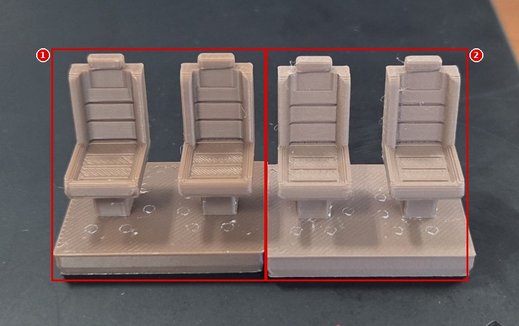
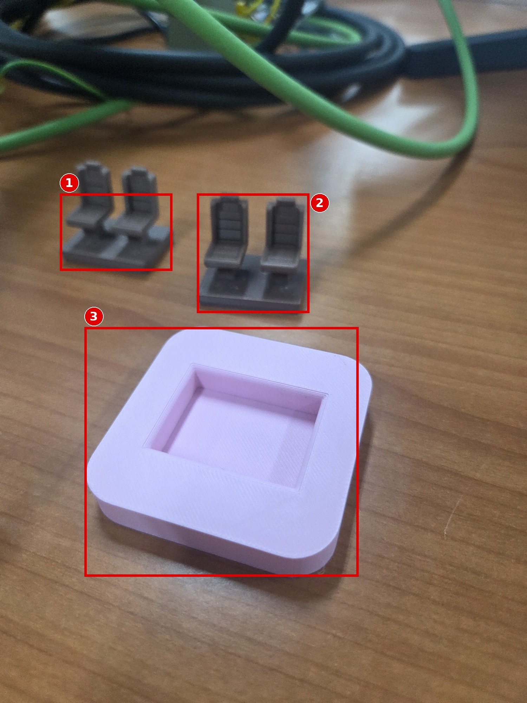
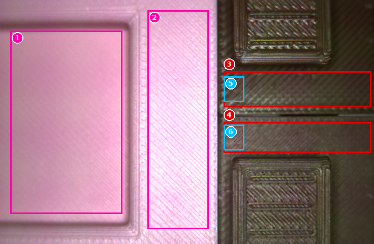
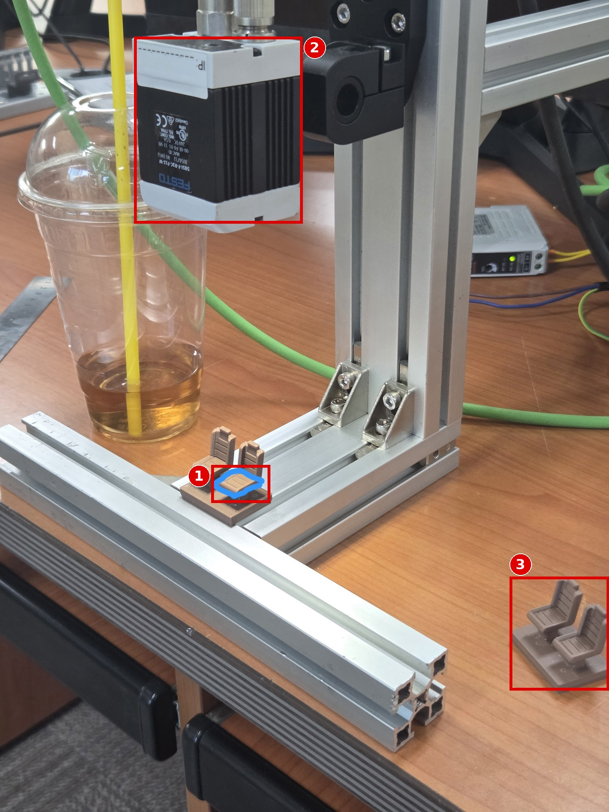
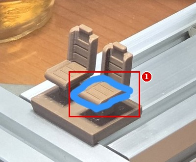
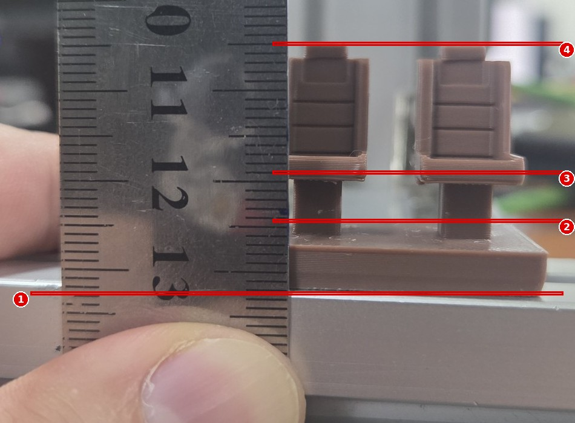

# Module 08 — 최종 프로젝트 v3: 3D 프린트 좌석 2단계 색 판별 셀

> 📝 **v3 (2026-10-03)**: **센서 원본 이미지로 잰 값**을 반영했다 → [측정 기록](../results/live-color_20261003_1134.md). 1단계는 색상만으로 충분, 2단계는 **조명 기울기 때문에 작은 영역을 같은 자리에 고정**해야 마진이 나온다. 이전 판: [`08_capstone_v2.md`](08_capstone_v2.md)

> 📝 **v2 (2026-10-02 19:06, 사용자 계획 변경)**: 시나리오를 "캡 조립품 외관 검사"에서 **실제 시료(좌석 모형)의 2단계 색 판별**로 바꿨다.
> **1단계** 분홍인가 갈색인가 → **분홍 = NG**. **2단계** 갈색인가 연한 갈색인가 → 사진 `20261002_173545.jpg`에 표시한 **위치(좌석 방석)** 에서 판단.
> 이전 판(캡 시나리오)은 [`08_capstone.md`](08_capstone.md)에 그대로 둔다. 상충 보고서 [A-13](reports/conflict-report_v6.md#a-13).

## 🎯 목표
1. 한 잡(Job) 안에서 **1단계(분홍 NG 거르기) → 2단계(갈색/연한 갈색 분류)** 를 검출기 3개로 구현한다.
2. 결과를 **검출 시에만 24 V ON**(Module 06 방식)으로 핀 3개에 나눠 낸다. PLC 통신은 하지 않는다(규칙 9).
3. 시료별 10회 이상 반복해 **오분류 0, 마진 ≥ 15 %p**를 수치로 증명한다.

## 🏭 왜 필요한가
같은 모양에 색만 다른 부품(좌석 시트 색상 옵션 등)은 조립 라인에서 자주 섞인다. 색이 **완전히 다른 것(분홍)** 은 쉽지만, **같은 계열의 진하기 차이(갈색 ↔ 연한 갈색)** 는 조명·노출이 조금만 바뀌어도 뒤집힌다. 이 프로젝트는 "쉬운 판별"과 "어려운 판별"을 단계로 나눠, 어려운 쪽의 마진을 어떻게 지키는지 보여 준다.

## 📋 선행 조건 / 준비물
- Module 02(조명·노출·화이트 밸런스), 03(위치 보정), 04-2(Color area), 05(출력 논리), 06(24 V 출력), 07(백업)
- 시료 3종 (아래 1절)
- 멀티미터, [실험 기록 양식](../templates/experiment-log.md)

---

## 1. 시료와 판정 기준

| 시료 | 사진 | 기대 판정 | 출력 |
|---|---|---|---|
| **A 갈색** 좌석 유닛 (좌석 2개 + 받침) | 아래 사진 ① | OK · 분류 "갈색" | 12 ON, **07 ON**, 08 OFF |
| **B 연한 갈색** 좌석 유닛 | 아래 사진 ② | OK · 분류 "연한 갈색" | 12 ON, 07 OFF, **08 ON** |
| **C 분홍** (사각 트레이) | 아래 분홍 사진 ③ | **NG** | 모두 OFF |

| # | 시료 |
|---|---|
| 1 | A 갈색 유닛 |
| 2 | B 연한 갈색 유닛 — 받침·좌석 모두 A보다 밝다 |

| # | 시료 |
|---|---|
| 1, 2 | 갈색 유닛 2개 (이 사진은 휴대폰 화이트 밸런스 때문에 회색에 가깝게 보인다) |
| 3 | **C 분홍 트레이 = NG** — 모양도 좌석과 다르다 |

> [!NOTE]
> **휴대폰 사진으로 미리 잰 색 (참고용, 센서 값 아님)** — 같은 사진(`20261002_155712.jpg`) 안에서 평균 RGB를 뽑았다.
>
> | 위치 | 평균 RGB | HSV (H°, S %, V %) |
> |---|---|---|
> | A 갈색 방석 | 109, 101, 100 | 7, 8, 43 |
> | B 연한 갈색 방석 | 128, 115, 114 | 7, 11, 50 |
> | A 갈색 받침 | 130, 112, 104 | 18, 20, 51 |
> | B 연한 갈색 받침 | 147, 130, 126 | 13, 14, 58 |
>
> → **두 갈색은 색상(H)이 거의 같고 밝기(V)만 7–8 %p 다르다.** 2단계는 "색"보다 **밝기 차이**를 보는 판별이라 노출·조명을 고정하지 않으면 마진이 금방 사라진다.
> 분홍은 밝기·색상 모두 크게 다르다(휴대폰 사진은 화이트 밸런스가 달라 수치 비교는 하지 않는다). **실제 기준값은 센서 화면에서 다시 잰다** — 아래 1.1절에 센서 원본 값을 넣었다.

### 1.1 센서 원본 이미지 값 (2026-10-03, 내부조명, 셔터 1.174 ms)

| 시료 (화면 위치) | H (°) | S (%) | V (%) |
|---|---|---|---|
| 분홍 트레이 (1, 2) | 316–334 | 16–28 | 84–99 |
| 위쪽 유닛 (3) — **갈색으로 추정** | 34 | 31 | 29 |
| 아래쪽 유닛 (4) — **연한 갈색으로 추정** ⚠️ 사용자 확인 | 32 | 25 | 35 |

- **1단계**: 분홍과 갈색은 색상이 약 60° 이상 떨어져 있다(중앙값 331° ↔ 35°) → 쉽다.
- **2단계**: 두 갈색은 색상이 같고(32–35°) 밝기만 **같은 위치에서 4–9 %p** 다르다. 그런데 **조명이 화면 가로로 15–20 %p 기운다**(왼쪽이 밝음). 기울기가 차이보다 크므로 검사 영역을 작게, 같은 자리에 고정해야 한다.
- 같은 자리 40×50 px 영역의 "어두운 화소 면적 %": 위쪽 70–97 % ↔ 아래쪽 6–8 % (차이 64–89 %p). 받침 띠 전체(290×70 px)로 넓히면 차이가 28 %p로 줄어든다.

## 2. 검사 위치 — 2단계 판단 지점

사용자가 표시한 위치(파란 선)는 **기둥 쪽 좌석의 방석(앉는 면)** 이다.

| 전체 | 확대 |
|---|---|
|  |  |

| # | 내용 |
|---|---|
| 1 | **2단계 검사 영역** — 기둥 쪽 좌석의 방석 윗면 |
| 2 | 센서 (렌즈 아래 방향) |
| 3 | 대기 중인 다른 시료 |

**왜 방석인가**: 위에서 보면 방석은 넓고 평평해 빛이 고르게 반사된다. 등받이는 기울어져 있어 밝기가 위치마다 달라지고, 받침은 시료마다 둘레 그림자가 생긴다.

> ⚠️ [실기 확인 필요] 센서 화면에서 이 방석이 **어느 쪽 좌석**으로 보이는지 확인한다. 현재 잡은 `이미지 전처리 › 배치 = 180도 회전`이라(cs_ko_job_preprocessing) 화면 좌우가 실물과 반대일 수 있다. 시료 한쪽에 작은 종잇조각을 붙여 화면에서 위치를 확인한 뒤 떼어 낸다.

### 설치 거리 (사진으로 읽음)

자의 0점이 위쪽(렌즈 앞면)에 있다고 보고 읽은 값이다 ⚠️ [실기 확인 필요: 0점 위치 — V-27].

| # | 위치 | 눈금 | 렌즈 앞면부터 거리 |
|---|---|---|---|
| 1 | 바닥 프로파일 윗면(받침 바닥) | ≈ 13.3 cm | **≈ 133 mm** |
| 2 | 받침 윗면 | ≈ 12.5 cm | ≈ 125 mm |
| 3 | 방석 윗면 (2단계 검사 면) | ≈ 11.9 cm | **≈ 119 mm** |
| 4 | 머리 받침 꼭대기 | ≈ 10.4 cm | ≈ 104 mm |

Module 00의 FOV 표(100 mm → 38.0 mm, 150 mm → 56.6 mm, 거리에 비례)로 보간하면, 방석 높이(≈ 119 mm)의 가로 시야는 **≈ 45 mm, 약 0.061 mm/px**(WVGA 736 px)이다. 방석 폭(약 10 mm)은 **≈ 160 px** → 검사 영역으로 충분하다. 실측은 Module 00 실험으로 확인한다.

---

## 3. 검출기 설계

| 단계 | 검출기 | 종류 | 영역 | 색 범위(시작값) | 합격 조건 | 위치보정 |
|---|---|---|---|---|---|---|
| 1 | **D1 갈색계열** | Color area (04-2) | 시료 놓는 자리 **전체**(사각) | HSV: **H 약 10–60°**, S ≥ 약 15 %, V 약 15–55 % (1.1절 값 기준 시작값) | 면적 % ≥ min | **끔** (분홍 트레이는 모양이 달라 정렬이 실패하므로 1단계는 정렬과 무관하게) |
| 2 | **D2 갈색** | Color area | **방석 안쪽 작은 사각(약 40×50 px)** — 화면에서 조명이 평평한 **왼쪽 가운데**에 오도록 시료 자리를 정한다 | HSV: H 10–60°, **V ≤ 경계값**(그 자리에서 두 시료 평균의 가운데. 예: x 440–480 자리라면 약 40 %) | 면적 % ≥ min (예: 50 %) | 켬 (Module 03 윤곽선추출) |
| 2 | **D3 연한갈색** | Color area | D2와 **같은 영역**(검사기 `복사` 후 범위만 변경) | HSV: H 10–60°, **V > 경계값 + 데드 밴드**(예: 42 %) | 면적 % ≥ min (예: 50 %) | 켬 |

설계 원칙:
1. **D2와 D3의 밝기 범위는 겹치지 않게** 두고, 가운데에 **빈 띠(데드 밴드)** 를 둔다. 두 시료 값의 한가운데가 경계다. 경계 근처 값은 D2·D3 둘 다 불합격 → "분류 불가"로 드러난다(아래 4절).
2. 1단계 D1은 **넓게**, 2단계 D2·D3은 **좁게**. 쉬운 판별을 넓은 마진으로 먼저 걸러야 어려운 판별의 오류가 NG로 새지 않는다.
3. 색 모델은 04-2 실험으로 고른다. 센서 값(1.1절)으로 확인한 대로 **밝기 축(V 또는 L)** 이 유일한 구분 축이다 → HSV와 LAB를 비교해 마진이 큰 쪽을 쓴다.
4. **조명 기울기 대책** (1.1절): ① 2단계 영역을 작게(약 40×50 px) ② 화면 왼쪽 가운데(밝고 평평한 쪽)에 오도록 시료 자리를 정한다 ③ 시료는 바닥 프로파일에 **맞대어** 항상 같은 자리에 둔다 ④ 경계값은 **그 자리에서** 두 시료를 재서 정한다 ⑤ (선택) `조명4분할설정`으로 사분면 일부를 끄거나 켜서 기울기가 줄어드는지 실험용 잡에서 시험한다.
5. 전처리 필터(Mean·Gauss·Median)는 이 문제에 거의 효과가 없었다(편차 6.8 → 6.4) — 편차가 잡음이 아니라 조명 기울기이기 때문.

> ⚠️ [실기 확인 필요] 컬러영역 검출기의 실제 탭·파라미터 화면은 아직 캡처하지 못했다(촬영 목록 A1). 이름은 화면 그대로 [UI 대응표 v2](appendix/ui-label-map_v2.md)에 추가한다.

## 4. 판정 · 출력 설계 (검출 시에만 24 V ON)

`출력양식설정 › 디지털출력 › 일반 모드` 에서 줄마다 D1–D3 `켜기/끄기`를 고르면 논리식이 `AND`로 만들어진다(cs_ko_05_output_digital-output). 아래 설계는 **AND만으로** 만들 수 있게 짰다.

| 출력 줄 | 핀 | D1 | D2 | D3 | 논리식 | 의미 |
|---|---|---|---|---|---|---|
| 작업검사결과 | — | 켜기 | 끄기 | 끄기 | `D1` | 통계·아카이빙의 정상/불량 = **분홍인가 아닌가** |
| 12 빨강/파랑(A) | 12 RDBU | 켜기 | 끄기 | 끄기 | `D1` | **OK(분홍 아님) → 24 V** |
| 07 검정(B) | 07 BK | 켜기 | 켜기 | 끄기 | `D1&D2` | **갈색 → 24 V** |
| 08 회색(C) | 08 GY | 켜기 | 끄기 | 켜기 | `D1&D3` | **연한 갈색 → 24 V** |
| 09 빨강 | 09 RD | 끄기 | 끄기 | 끄기 | — | 사용 안 함 |

| 시료 | D1 | D2 | D3 | 12 | 07 | 08 | 해석 |
|---|---|---|---|---|---|---|---|
| A 갈색 | ✔ | ✔ | ✘ | ON | ON | OFF | 정상 |
| B 연한 갈색 | ✔ | ✘ | ✔ | ON | OFF | ON | 정상 |
| C 분홍 | ✘ | ✘ | ✘ | OFF | OFF | OFF | **NG** |
| (이상) 경계 값 | ✔ | ✘ | ✘ | ON | OFF | OFF | **분류 불가** — 12만 켜지면 사람이 확인 |
| (이상) 둘 다 합격 | ✔ | ✔ | ✔ | ON | ON | ON | **범위가 겹침** — 설정 오류 |

> [!TIP]
> "분류 불가"를 NG로 묶고 싶으면 12번을 `D1&(D2|D3)`로 바꿔야 한다. OR는 `고급 모드`에서만 쓸 수 있을 가능성이 높다 ⚠️ [실기 확인 필요: 고급 모드 논리식 입력 화면]. 기본 설계는 일반 모드(AND)로 두고, 시험 결과로 "분류 불가"가 0회임을 보인다.

> ⚠️ [실기 확인 필요] `작업검사결과`에서 D2·D3을 `끄기`로 두었을 때, D2·D3 불합격이 잡 결과(통계 불량 카운트)에 영향을 주지 않는지 확인한다(V-28).

## 5. 구현 순서 (체크포인트 = 시연 영상 구간)

| # | 단계 | 모듈 | 체크포인트 |
|---|---|---|---|
| CP0 | 잡셋 백업 → 새 잡 `SEAT_COLOR`. **빈 잡(작업2·3) 정리**(검사시작 오류 C-05) | 07 | 백업 파일 |
| CP1 | 내부조명 켜기, **자동 활상 끄고 셔터 고정**, 게인 1.00, 화이트 밸런스 티칭(흰 종이) | 02 | 셔터·WB 값 기록 |
| CP2 | 시료 A·B·C 필름스트립 (각 10장, 놓을 때마다 다시 놓기) | 02 | `.flm` |
| CP3 | 윤곽선추출 정렬 (좌석 유닛 기준) — A·B 둘 다 추종하는지 | 03 | ±mm 표 |
| CP4 | D1 → D2 → D3 설정, 색 모델 비교(HSV vs LAB) | 04-2 | 마진 표 |
| CP5 | 디지털출력 4절 표대로 설정, 출력 타이밍 `결과 받을때 내 보내기` | 05 | 논리식 화면 |
| CP6 | 결선(07·08·12 → 램프 또는 멀티미터), 24 V 측정 | 06 | 멀티미터 영상 |
| CP7 | 아카이빙 `이미지파일 = 불량` → 분홍 이미지만 저장 | 07 | FAIL 폴더 |
| CP8 | **최종 시험** (7절) | — | 연속 시연 영상 |
| CP9 | 백업, 결과표, 포트폴리오 요약 | — | 산출물 |

## 6. 🧪 실험 — 2단계 마진과 조명 민감도

**실험 A: 기준값 (센서 화면)** — 시료마다 10회 다시 놓고 D1·D2·D3 점수(면적 %)를 적는다.

| 시료 | D1 평균 / 최소 | D2 평균 / 최소·최대 | D3 평균 / 최소·최대 |
|---|---|---|---|
| A 갈색 | | | |
| B 연한 갈색 | | | |
| C 분홍 | | | |

`마진(D2) = min(A의 D2 최소 − D2 합격 하한, D2 합격 하한 − B의 D2 최대)` — D3도 같은 방식. **목표 ≥ 15 %p.**

**실험 B: 바꾸는 변수 하나 = 셔터 속도** — 기준 셔터 ×0.8, ×1.0, ×1.2에서 A·B의 D2·D3 점수를 기록한다. 마진이 15 %p 아래로 떨어지는 배율을 찾는다 → "이 셀이 견디는 밝기 변화"를 숫자로 말할 수 있다.

| 셔터 배율 | A: D2 / D3 | B: D2 / D3 | 오분류 |
|---|---|---|---|
| 0.8 | | | |
| 1.0 | | | |
| 1.2 | | | |

**실험 C (선택): 실내등 끄기/켜기** — 내부조명만으로 충분한지 확인. (1차 측정은 전등 끔(밤), 2차는 낮 — [측정 기록](../results/live-color_20261003_1134.md))

**실험 D: 바꾸는 변수 하나 = 시료 가로 위치** — 시료를 바닥 프로파일을 따라 0, ±2, ±4 mm 밀어 놓고 D2·D3 점수를 기록한다. 조명 기울기(약 0.05–0.1 %V/px) 때문에 경계값을 넘는 이동량을 찾는다 → 지그 정밀도 요구치가 된다.

| 이동 (mm) | A: D2 / D3 | B: D2 / D3 | 오분류 |
|---|---|---|---|
| −4 | | | |
| −2 | | | |
| 0 | | | |
| +2 | | | |
| +4 | | | |

## 7. 합격 기준과 최종 시험

| 항목 | 기준 | 방법 |
|---|---|---|
| 1단계 | 분홍 **10/10 NG**, 갈색·연한 갈색 **20/20 OK** | 각 시료 다시 놓기 |
| 2단계 | 갈색 10/10 → 07만 ON, 연한 갈색 10/10 → 08만 ON, **오분류 0**, 분류 불가 0 | 멀티미터 또는 상태표시줄 디지털출력 |
| 마진 | D1·D2·D3 모두 **≥ 15 %p** | 실험 A |
| 사이클 타임 | Statistics 최대 실행 시간 **≤ 150 ms** (Color area 30 ms × 3 + 정렬 30 ms 예상) | 트리거 30회 |
| 출력 전압 | ON ≥ 22 V, OFF ≤ 1 V | 멀티미터 (Module 06) |
| NG 이미지 | 저장 파일 수 = 분홍 시험 횟수 | 아카이빙 폴더 |

| No | 시료 | 기대 | D1 | D2 | D3 | 12 V | 07 V | 08 V | 일치 |
|---|---|---|---|---|---|---|---|---|---|
| 1 | A | 갈색 | | | | | | | |
| … | | | | | | | | | |
| 11 | B | 연한 갈색 | | | | | | | |
| … | | | | | | | | | |
| 21 | C | NG | | | | | | | |
| … | | | | | | | | | |

## 8. 💥 고장 주입 (시연 영상에 포함)

| 주입 | 예상 | 확인 |
|---|---|---|
| 자동 활상(Auto shutter) 한 번 누르기 | 셔터가 바뀌어 B가 A로(또는 반대로) 오분류 가능 | 실험 B 결과와 비교 |
| 시료를 1–2 mm 밀어 놓기 (정렬 켬 / 끔) | 정렬 켬: 유지 / 끔: D2·D3 영역이 방석 밖 → 분류 불가 | 위치 보정의 필요성 |
| 방석 위에 흰 종잇조각 | D2·D3 면적 감소 → 분류 불가 | 검사 영역 오염 |
| 핀 07 선 빼기 | 상태표시줄은 ON, 멀티미터 0 V | 결선 고장 진단 |

## 9. ⚠️ 함정과 해결

| 증상 | 원인 | 해결 |
|---|---|---|
| A·B가 번갈아 뒤집힘 | 밝기만 다른 판별인데 노출이 흔들림 | 자동 활상 금지, 셔터 고정, WB 티칭 후 잠금, 실내등 영향 확인 |
| 분홍이 D1 합격 | D1 범위가 너무 넓음(밝은 쪽까지) | D1 상한 밝기·채도 좁히기, 분홍 시료로 확인 |
| D2·D3 둘 다 합격 | 범위 겹침 | 두 범위 사이 빈 띠 확보 |
| 화면 좌우와 실물 위치가 반대 | `배치 180도 회전` | 2절의 종잇조각 방법으로 확인 |
| 검사시작이 안 됨 | 빈 잡이 센서에 남음 (C-05) | 작업2·3 삭제 또는 검출기 추가 |

## 10. 산출물

| 산출물 | 파일 / 위치 |
|---|---|
| 설정 백업 | `backups/seat_color_jobset_YYYYMMDD.*` |
| 결과표 | `results/seat_color_results.csv` (7절 표) |
| 필름스트립 | `backups/film_seat_A.flm`, `…_B.flm`, `…_C_pink.flm` |
| NG 이미지 | `results/ng_images/` (분홍) |
| 시연 영상 | CP1–CP8, 마지막 CP8은 편집 없이 연속 |

## 11. 포트폴리오 요약 양식 (문제 – 접근 – 결과 – 수치)

### 컬러 비전 센서 기반 좌석 부품 2단계 색 판별 (Festo SBS R3C, 기본형)
- **문제**: 같은 모양의 좌석 부품에서 이색(분홍) 혼입은 NG로, 갈색/연한 갈색은 옵션별로 분류해야 함. 두 갈색은 색상은 같고 밝기만 약 __ %p 차이.
- **접근**: 검출기 2종뿐인 기본형에서 Color area 3개로 2단계 구성(넓은 1단계 → 좁은 2단계), 데드 밴드로 "분류 불가"를 드러냄, 노출 고정·WB 티칭, 위치 보정으로 검사 영역 추종.
- **결과**: 분홍 __/10 NG, 갈색 __/10·연한 갈색 __/10 정분류, 오분류 0, 최소 마진 __ %p, 사이클 __ ms, 셔터 ±__ % 변화까지 견딤.
- **수치 근거**: 7절 결과표, 실험 B 표.

## ✅ 체크리스트
- [ ] 시료 A/B/C 사진과 센서 이미지에서 방석 위치 대응 확인
- [ ] 노출 고정(자동 활상 사용 안 함), WB 티칭 값 기록
- [ ] D1·D2·D3 범위와 마진 표
- [ ] 출력 4절 표대로 설정, 멀티미터 확인
- [ ] 최종 시험 표 전부 채움, 백업

출처 링크: Festo 다운로드·문서 안내 <https://www.festo.com/sp> (8058732 검색)
