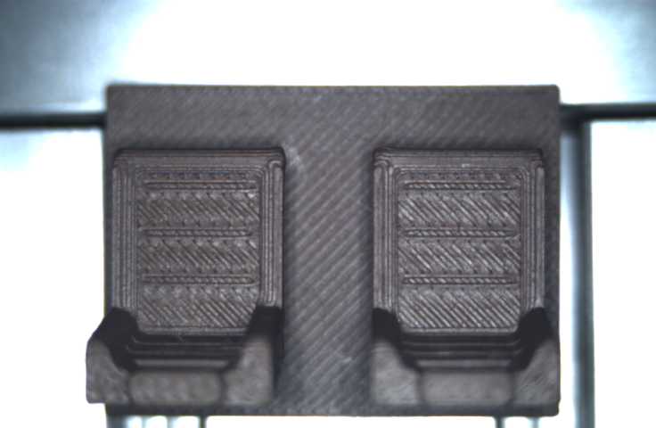
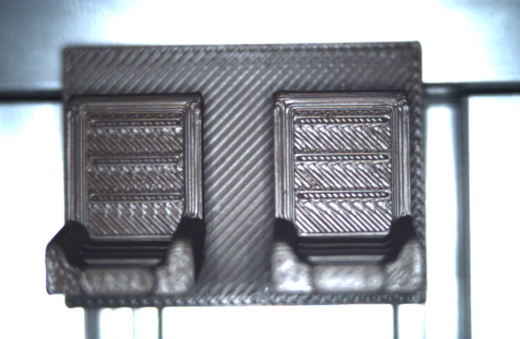
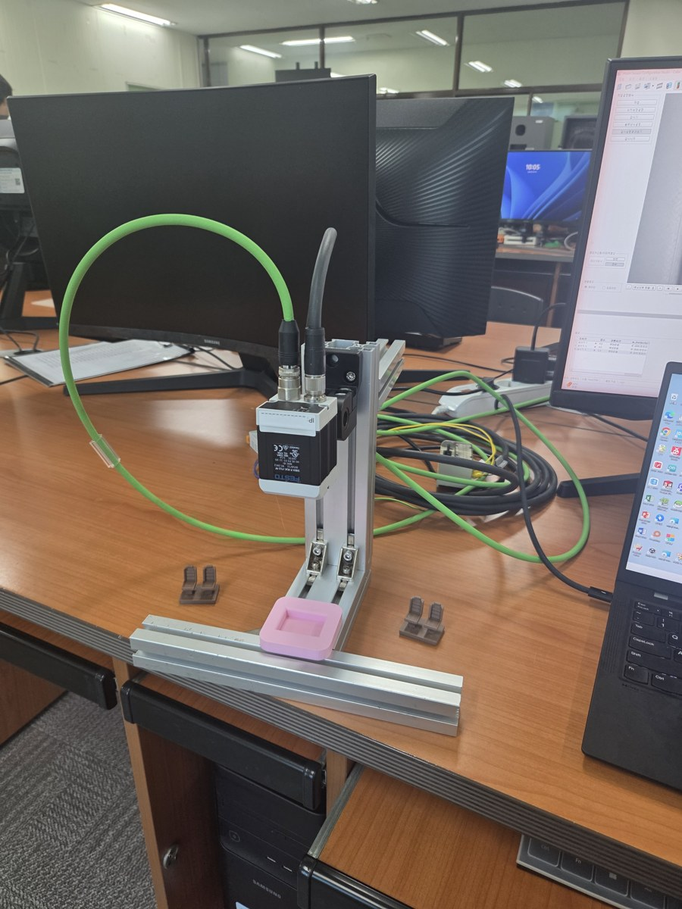
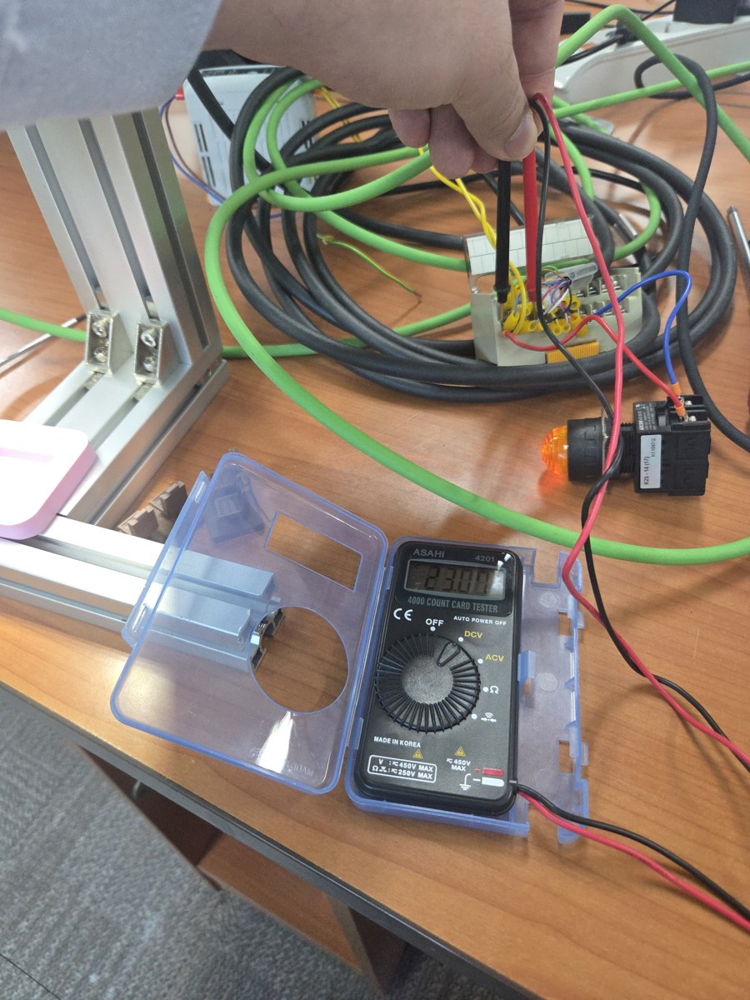

# Module 08 — 최종 프로젝트 v5: 좌석 시료 판별 셀 (분홍 NG / Matte / Basic)

> 📝 **v5 (2026-10-06 10:46, 구현·시험 완료)**: Job1에 실제 적용(판정기준값 10–24 / 24–100, 출력 반전·OR 사용), **LED 2개로 3단 판별 시연 성공, 출력 ON 23.0 V 측정**. 결선 중 안전 사고 2건을 [문제 해결 v2](appendix/troubleshooting_v2.md)에 기록. 이전 판: [`08_capstone_v4.md`](08_capstone_v4.md)
>
> 📝 **v4 (2026-10-06, 현장 실측 반영)**: 시료가 **Bambu Lab PLA Matte Brown**과 **PLA Basic Brown**으로 확정됐다. 두 갈색은 센서에서 **색이 거의 같고 광택만 다르다** → 2단계 검출기를 컬러영역에서 **색 대비(Contrast)** 로 바꿨다. 반복 20회 정분류, 셔터 스윕, 지그 확인까지 끝낸 값으로 다시 썼다.
> 이전 판: [`08_capstone_v3.md`](08_capstone_v3.md)(컬러영역·밝기 설계, 조명 기울기 분석) · [`v2`](08_capstone_v2.md) · [`v1`](08_capstone.md)

## 🎯 목표
1. 분홍 지그 위에 놓인 좌석 시료를 **NG(좌석 없음/분홍) · Matte · Basic** 셋으로 판별한다.
2. 결과를 **검출 시에만 24 V ON**(Module 06)으로 핀에 낸다. PLC 통신은 하지 않는다(규칙 9).
3. 판별이 **손으로 놓는 위치 편차와 반복에 흔들리지 않음**을 수치로 보인다.

## 🏭 왜 필요한가
같은 모양·같은 색 계열인데 **재료(표면 마감)만 다른 부품**은 사람 눈으로도 헷갈린다. 색만 보는 검사로는 못 가르고, **광택이 만드는 명암 질감**을 봐야 한다. "색이 같으면 무엇을 볼 것인가"를 실측으로 찾아낸 과정이 이 프로젝트의 핵심이다.

## 📋 선행 조건 / 준비물
- Module 02(셔터·조명 고정), 04-1(색 대비 검사), 05(출력 논리), 06(24 V 출력), 07(백업)
- 시료: 분홍 지그(Bambu Lab PLA Matte Pink), 좌석 유닛 Matte Brown, 좌석 유닛 Basic Brown
- 측정 기록: [`results/`](../results/) 의 2026-10-06 파일들

---

## 1. 시료

| 시료 | 재료 | 역할 | 센서에서 보이는 모습 (셔터 0.70 ms) |
|---|---|---|---|
| 분홍 지그 | Bambu Lab PLA **Matte Pink** | 시료 받침, **좌석이 없으면 NG** | 거의 흰 회색, 매끈함 |
| 좌석 A | Bambu Lab PLA **Matte Brown** | OK — "Matte" | 푸르스름한 회색, 줄무늬 반사 약함 |
| 좌석 B | Bambu Lab PLA **Basic Brown** | OK — "Basic" | 푸르스름한 회색, **줄무늬마다 반짝임** |

| Matte (live_04) | Basic (live_05) |
|---|---|
|  |  |

## 2. 왜 색 대비(Contrast) 검출기인가 — 실측 근거

같은 위치로 맞춰 비교한 원본 이미지 값(셔터 0.70 ms, [`shutter-sweep_20261006.md`](../results/shutter-sweep_20261006.md)):

| 영역 | 항목 | Matte | Basic |
|---|---|---|---|
| 받침 가운데 | 색상 H / 채도 S | 256° / 6.9 % | 230° / 7.4 % |
| 받침 가운데 | 밝기 V | 45 % | 56 % |
| 받침 가운데 | **질감(줄무늬 명암 편차)** | 7.8 | **23.7 (약 3배)** |
| 오른쪽 등받이 | **질감** | 17.2 | **40.9 (약 2.4배)** |

- 색(H·S)은 거의 같다 → **컬러영역 검출기로는 가르기 어렵다**(v3의 설계를 바꾼 이유).
- 광택 PLA(Basic)는 프린트 줄무늬마다 반사광이 생겨 명암이 크다 → 이 품번의 두 검출기 중 **색 대비 검사**가 정확히 이것을 잰다(Help: "명암은 가장 어두운 픽셀과 가장 밝은 픽셀 사이의 폭과 그 개수에만 달려 있다").

## 3. 셔터 선택 — 차이가 가장 큰 노출

| 셔터 | Matte (검사기 1) | Basic (검사기 1) | 차이 | 비고 |
|---|---|---|---|---|
| 0.35 ms | 8.2 | 17.5 | 9.3 | |
| **0.70 ms** | **16.9** | **35.4** | **18.5** | ← 선택 |
| 1.4 ms | 29.7 | 41.2 | 11.5 | Basic이 먼저 포화 |
| 2.8 ms | 9.6 | — | — | 화면 전체 포화 |

→ **셔터 0.70 ms 고정, 게인 1.00, 내부조명 켜기, 자동 활상 사용 금지.** 점수가 노출에 거의 비례하므로 이 세 값이 판정 기준의 일부다.

## 4. 반복성 — 손으로 다시 놓기 10회씩

([`repeat-10x_20261006.md`](../results/repeat-10x_20261006.md))

| 시료 | 검사기 1 범위 | 평균 | 표준편차 |
|---|---|---|---|
| Matte | 14.7 – 16.0 | 15.3 | 0.49 |
| Basic | 32.6 – 36.4 | 34.9 | 1.04 |

- 두 분포 사이 빈 구간 **16.6점**, 평균 차이는 흔들림(σ 합)의 **12.8배** → 놓는 위치 몇 mm로는 뒤집히지 않는다.
- 검사기 1과 2는 20회 모두 같은 값 → 같은 영역을 보는 중복. 최종 잡에서는 하나로 정리한다.

## 5. 지그 위에서 — 세 경우 판별

([`jig-check_20261006_v2.md`](../results/jig-check_20261006_v2.md))

| 상태 | 검사기 1 | 판정 |
|---|---|---|
| 지그만 (좌석 없음) | **3.3 – 4.4** (5회 다시 놓기 + 추가 판독 2) | **NG** |
| 지그 + Matte | 14.9 | **Matte** |
| 지그 + Basic | 34.4 – 34.9 | **Basic** |

## 6. 검출기 설계 — 실제 적용값 (2026-10-06 10:2x, Job1)

판정기준값 칸은 **정수만** 입력된다(24,3 → 24,00). 그래서 경계값을 반올림했다.

| 검출기 | 종류 | 영역 | 판정기준값 | 합격 = | 측정 범위 대비 여유 |
|---|---|---|---|---|---|
| **검사기 1 (D1) = Matte 구간** | 색 대비 검사 | 기존 검사기 1 영역(좌석 줄무늬 면) | **10 ~ 24** | Matte | 빈 지그 최대 4.4 → 5.6점 / Matte 14.7–16.0 → 4.7·8.0점 |
| **검사기 2 (D2) = Basic 구간** | 색 대비 검사 | 검사기 1과 같은 영역 | **24 ~ 100** | Basic | Matte 최대 16.0 → 8.0점 / Basic 최소 32.6 → 8.6점 |
| (삭제) 검사기 3 | — | — | — | — | 검사기 1과 거의 같은 값이라 삭제 |

| 상태 | 점수 | D1 (10–24) | D2 (24–100) |
|---|---|---|---|
| 빈 지그 | 3.3–4.4 | ✘ | ✘ |
| Matte | 14.7–16.0 | ✔ | ✘ |
| Basic | 32.6–36.4 | ✘ | ✔ |

- 경로: `검사기 › 검사기 n 선택 › 검사실행 › 판정기준값`. 변경 전 잡셋 백업: `backups/jobset_20261006_before-seat-gloss.job`.
- (선택) 분홍을 색으로 이중 확인하는 컬러영역 검출기는 이번 구성에 넣지 않았다(점수 3단 판별로 충분했음).

## 7. 출력 설계 — 실제 적용값 (LED 2개)

디지털출력 탭(일반 모드)에서 확인한 사실: 검출기 칸 선택지는 **켜기 / 반전 / 끄기**, `논리` 칸은 **AND / OR**. 즉 **검출기별 NOT(반전)과 OR를 일반 모드에서 쓸 수 있다**(V-29 해결).

| 출력 줄 | 핀 | 논리 | D1 | D2 | 논리식 | 의미 |
|---|---|---|---|---|---|---|
| 작업검사결과 | — | **OR** | 켜기 | 켜기 | `D1\|D2` | 좌석 있음 = 정상(통계·아카이빙) |
| 12 빨강/파랑(A) → **LED A** | 12 RDBU | AND | 끄기 | **반전** | `!D2` | 빈 지그·Matte에서 ON |
| 07 검정(B) → **LED B** | 07 BK | AND | **반전** | 끄기 | `!D1` | 빈 지그·Basic에서 ON |
| 09 빨강 / 08 회색(C) | — | — | 끄기 | 끄기 | — | 사용 안 함 |

| 상태 | LED A (12) | LED B (07) |
|---|---|---|
| 빈 지그 (NG) | **ON** | **ON** |
| Matte | **ON** | OFF |
| Basic | OFF | **ON** |

결선(PNP): 출력선 → LED(+) , LED(−) → 0 V(2 BU). 12번 최대 100 mA, 07번 최대 50 mA.

## 8. 구현 순서 — 진행 결과

| # | 단계 | 결과 |
|---|---|---|
| CP0 | 잡셋 백업 | ✅ `backups/jobset_20261006_before-seat-gloss.job` (17 KB). 새 잡 대신 Job1을 수정(빈 작업2·3은 이미 없음) |
| CP1 | 셔터 0.70 ms, 게인 1.00, 내부조명 켜기 | ✅ (오늘 설정 그대로) |
| CP2 | 검출기 정리 | ✅ 검사기 3 삭제, 검사기 1 = 10–24, 검사기 2 = 24–100 |
| CP3 | 디지털출력 | ✅ 7절 표대로 (반전·OR 사용) |
| CP4 | 검사시작 | ✅ 운전 모드, 사이클 타임 **44 ms** |
| CP5 | 결선·LED·24 V | ✅ 아래 9절 |
| CP6 | 반복 최종 시험(각 10회)·영상 | ⏳ 다음 시간 |

## 9. 최종 시험 결과 (2026-10-06 10:46, 사용자 현장 확인)

| 상태 | 기대 | 결과 | 판정 |
|---|---|---|---|
| 지그 + Basic | LED B(07 BK)만 ON | **검정선(07)에 24 V** | ✅ |
| 지그 + Matte | LED A(12 RDBU)만 ON | **빨강/파랑선(12)에 24 V** | ✅ |
| 빈 지그 | A·B 둘 다 ON | **빨파·검정선 둘 다 24 V** | ✅ |

| 측정 | 값 | 기준 |
|---|---|---|
| ON 전압 (멀티미터 DCV) | **23.0 V** | ≥ 22 V ✅ |
| OFF 전압 | 0.0 (사진상 0.00 mV 표시) | ≤ 1 V ✅ |
| 사이클 타임 | 44 ms | ≤ 150 ms ✅ |

| 항목 | 기준 | 상태 |
|---|---|---|
| 반복 정분류 (Matte / Basic) | 10/10, 10/10 | ✅ (반복 시험, 검사기 1 점수 기준) |
| 빈 지그 NG | 5/5 | ✅ 3.3–4.4 |
| 분포 간격 | 평균 차 ≥ 10 × (σ₁+σ₂) | ✅ 12.8배 |
| 출력 3단 시연 | 3/3 | ✅ |
| 출력 전압 | ON ≥ 22 V | ✅ 23.0 V |

## 10. 💥 고장 주입

| 주입 | 예상 | 확인 포인트 |
|---|---|---|
| `자동 활상` 한 번 누르기 | 셔터가 바뀌어 점수 이동 → 오분류 가능 | 왜 셔터 고정이 필수인지 |
| Basic 위에 매트 테이프 한 조각 | D2 점수 하락 → Matte로 오판 | 검사 영역 오염 |
| 지그를 빼고 책상 위에서 검사 | 배경 질감에 따라 D1 점수 변화 | 지그의 역할 |
| 핀 07 선 빼기 | 상태표시줄은 ON, 멀티미터 0 V | 결선 고장 |
| **지그를 약 20° 비틀어 놓기** (실제로 일어남) | 지그 안쪽 벽 경계가 검사 영역에 들어가 빈 지그가 14–21점 → **Matte로 오판** | 지그를 바닥 프로파일에 맞대어 고정해야 하는 이유 |

## 11. ⚠️ 함정과 해결

| 증상 | 원인 | 해결 |
|---|---|---|
| Matte/Basic이 색으로 안 갈림 | 두 재료의 색이 센서에서 같음 | 광택(색 대비)으로 판별 — 2절 |
| 셔터를 올렸더니 차이가 줄어듦 | Basic이 먼저 포화 | 0.70 ms 부근 유지 — 3절 |
| 빈 지그가 Matte로 판정 | ① D1 하한이 너무 낮음 ② **지그가 비틀려 벽 경계가 영역에 들어감** | ① D1 하한 10 ② 지그를 맞대어 똑바로 놓기 |
| 판정기준값에 24.3이 안 들어감 | 정수만 입력 가능 | 24로 반올림, 여유 재계산 |
| 결선 중 퍽/스파크 | 전원 켠 채 작업, AC 쪽에 DC 부품 연결 | [문제 해결 v2 — 안전](appendix/troubleshooting_v2.md#안전-2026-10-06-실제-사고) |
| 검사기 두 개가 늘 같은 값 | 같은 영역 중복 | 하나로 정리 |

## 12. 포트폴리오 요약 (문제 – 접근 – 결과 – 수치)

### 컬러 비전 센서로 같은 색·다른 재질(매트/광택) 부품 판별 — Festo SBS R3C 기본형
- **문제**: 같은 갈색 좌석 부품이 PLA Matte / PLA Basic 두 재질로 섞임. 센서에서 두 재료의 색상·채도 차이는 거의 없음(H 230–256°, S 7 %).
- **접근**: 원본 이미지 분석으로 "색이 아니라 광택 질감 차이(약 3배)"를 찾고, 기본형에 있는 색 대비 검출기로 판별. 셔터 스윕으로 차이가 최대인 0.70 ms 선택.
- **결과**: 손으로 다시 놓기 Matte 10/10, Basic 10/10 정분류. LED 2개(24 V, 23.0 V 측정)로 NG=둘 다 / Matte=A / Basic=B 출력, 사이클 44 ms. 점수 Matte 14.7–16.0 ↔ Basic 32.6–36.4, 빈 구간 16.6점(분포 흔들림의 12.8배). 빈 지그(NG) 3.3–4.4로 3단 판별(경계 9.5 / 24.3).
- **배운 점**: 색 검사기가 있는 센서라도 "무엇이 다른가"를 먼저 측정해야 한다 — 이번엔 색이 아니라 표면이었다.

## ✅ 체크리스트
- [x] 셔터 스윕, 반복 20회, 지그 확인 (2026-10-06)
- [x] 빈 지그 반복 5회 (jig-check v2)
- [x] Job1 구성(CP0–CP4)
- [x] 결선·LED 3단 시연·24 V 측정(CP5)
- [ ] 최종 반복 시험 각 10회 + 연속 시연 영상(CP6)

출처 링크: Festo 다운로드·문서 안내 <https://www.festo.com/sp> (8058732 검색)
