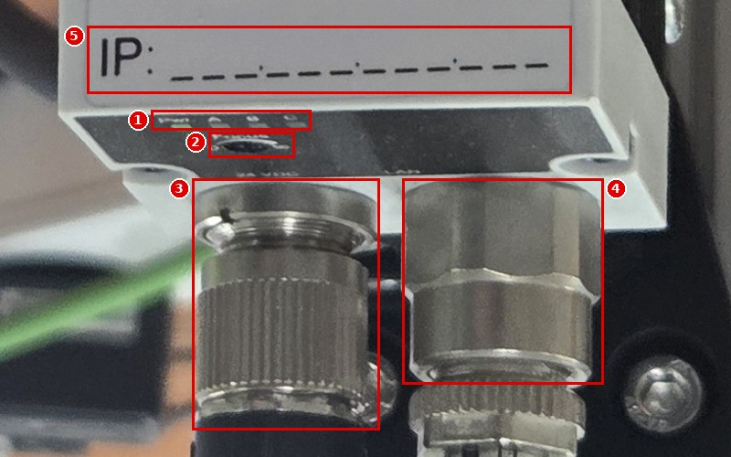
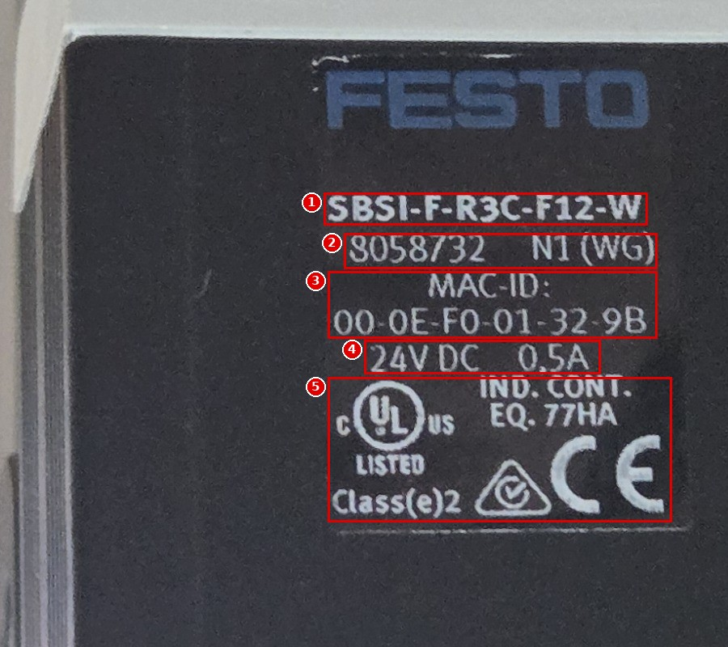
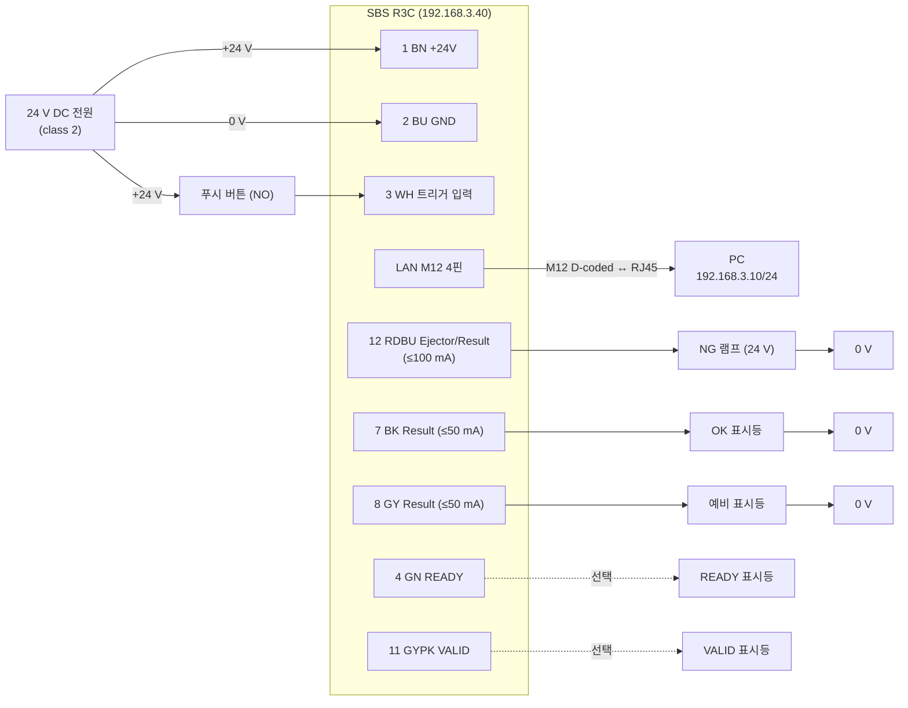

# 🔌 센서 사양과 케이블링 — SBSI-F-R3C-F12-W (8058732)

> 📝 **v2 (2026-10-02)**: 실물 사진(뒷면·라벨) 추가. 뒷면 소켓은 24 VDC·LAN 2개뿐(DATA 없음), MAC 일치 확인. 이전 판: [sensor-spec-and-cabling.md](sensor-spec-and-cabling.md)

> [!WARNING]
> 전기 설치는 자격 있는 사람이 한다. 결선·해체는 **전원을 끈 상태**에서만 한다. (매뉴얼 p.28)
> 이 센서는 안전 부품이 아니다. 사람 보호 용도로 쓰지 않는다. (매뉴얼 p.13), (설치설명서)

## 1. 품번 해독

`SBS` `I` – `F` – ( `AF` ) – `R3` `C` – `F12` – `W`  (매뉴얼 p.409 Type key)

| 자리 | 이 장비 | 의미 |
|---|---|---|
| SBS | SBS | 비전 센서 |
| I / C | **I** | 내장 조명·내장 광학계 (C = C-Mount) |
| Q / B / F / U | **F** | **Color** 센서 (Q Object, B Code reader, U Universal) |
| (AF) | **없음** | AF가 있으면 Extended(Advanced). 없으므로 **Standard** |
| R3 / R2 | **R3** | 736 × 480 픽셀 |
| B / C | **C** | 컬러 촬상 소자 (B = 흑백) |
| F6 / F12 | **F12** | 12 mm 광학계 |
| W / R / NR | **W** | 백색 조명 |
| D | 없음 | Enhanced depth of focus 아님 |

## 2. 사양

> 표기: 자료끼리 값이 다르면 둘 다 적고 ⚠️를 붙인다. 근거는 [상충 보고서](../reports/conflict-report.md) 참조.

### 2.1 광학 · 영상

| 항목 | 값 | 출처 |
|---|---|---|
| 촬상 소자 | CMOS 컬러, 736(H) × 480(V), 1/3", 6.0 µm 정사각 화소 | (매뉴얼 p.395) R3 공통값, (데이터시트) 736×480 WideVGA |
| 해상도 선택 | WVGA 736×480 / VGA 640×480 / QVGA 320×240 (QQVGA ⚠️) | (Help: scjobgeneral), (설정파일) |
| 프레임 속도 | 40 fps | (데이터시트), (매뉴얼 p.19) |
| 렌즈 | 내장 12 mm, 초점 나사로 무한대까지 조절 | (매뉴얼 p.396, p.403) |
| 최소 작업 거리 | 30 mm | (데이터시트), (매뉴얼 p.403) |
| 최소 시야 | 8 × 6 mm | (데이터시트), (매뉴얼 p.403) |
| 피사계 심도 등급 | Normal | (매뉴얼 p.403) |
| 시야–거리 관계 | 그래프 참조 | (매뉴얼 p.398 Fig. 362 "Field of view R3B 12mm lens, internal", WVGA) |
| 내장 조명 | 백색 LED 8개, 쿼드런트별 Off 가능 | (매뉴얼 p.395), (Help: scjobgeneral) |
| 내장 조명 펄스 최대 | 8 ms | (Help: scjobgeneral) |
| 셔터 | 0.017 – 100 ms (기본 0.25 ms) | (설정파일 Configuration_R3C.xml) |
| 게인 | 0.75 – 4 (기본 1) | (설정파일 Configuration_R3C.xml) |
| 화이트 밸런스 기본값 | R 53 / G 62 / B 36, 범위 0.01 – 255 | (설정파일), (스크린샷 cs_job_white-balance) |

> [!NOTE]
> 매뉴얼의 FOV 그래프 제목은 "R3B"(흑백)지만, R3C도 같은 736×480 계열 12 mm 광학계라 같은 그래프를 참고값으로 쓴다. 정확한 값은 Module 00에서 실측한다. ⚠️

### 2.2 기능 한도 (Color Standard)

| 항목 | 값 | 출처 |
|---|---|---|
| 잡(Job) 수 | 최대 8 | (매뉴얼 p.19), (데이터시트) |
| 잡당 검출기 수 | 32 ⚠️ (데이터시트는 2) | (매뉴얼 p.19) ↔ (데이터시트) |
| 정렬 | Contour detection만 | (매뉴얼 p.19) |
| 검출기 | Contrast, Color area | (매뉴얼 p.19), (데이터시트) |
| 대표 처리 시간 | Contrast 2 ms / Color area 30 ms / 위치 추적 30 ms | (데이터시트), (매뉴얼 p.396–397) |

### 2.3 전기

| 항목 | 값 | 출처 |
|---|---|---|
| 정격 전압 | 24 V DC, −25 % / +10 % (18 – 26.4 V) | (데이터시트), (매뉴얼 p.395) |
| 잔류 리플 | < 5 Vss | (매뉴얼 p.395) |
| 전원 | "class 2" 전원으로 공급 | (설치설명서) |
| 소비 전류 | 무부하 200 mA, 최대 550 mA | (데이터시트) |
| 입력 레벨 | PNP/NPN 전환. High ≥ UB − 1 V, Low ≤ 3 V | (데이터시트), (매뉴얼 p.395) |
| 입력 저항 | > 20 kΩ | (매뉴얼 p.395) |
| 입력 최소 신호 길이 | 2 ms | (Help: scoutputiosettings) |
| 출력 | PNP/NPN 전환, 단락 보호, 역극성 보호 | (매뉴얼 p.395) |
| 출력 전류 | 출력당 50 mA, **핀 12(Ejector)만 100 mA** | (매뉴얼 p.395), (설치설명서) ↔ (데이터시트 50 mA) |
| 유도성 부하(참고) | 릴레이 17 kΩ / 2 H, 공압 밸브 1.4 kΩ / 190 mH | (매뉴얼 p.395) |
| 준비 지연 | 전원 투입 후 typ. 13 s | (매뉴얼 p.395) |
| 인터페이스 | Ethernet(LAN) 100 Mbit/s. RS232/422 없음 ⚠️ | (매뉴얼 p.395 "SBS-XX-Standard"), (데이터시트) |
| 케이블 길이 | 30 m 이하 | (매뉴얼 p.28) |

### 2.4 기계 · 환경

| 항목 | 값 | 출처 |
|---|---|---|
| 외형 | 65 × 45 × 45 mm(커넥터 제외) ⚠️ (데이터시트: 45 × 45 × 76.7 mm) | (매뉴얼 p.396) ↔ (데이터시트) |
| 무게 | 약 160 g | (데이터시트), (매뉴얼 p.396) |
| 사용 온도 / 보관 온도 | 0 – 50 °C / −20 – 60 °C (습도 80 %, 결로 없음) | (매뉴얼 p.396) |
| 보호 등급 | IP65/67 ⚠️ (데이터시트: IP67) | (매뉴얼 p.396) ↔ (데이터시트) |
| 하우징 | 양극산화 알루미늄, 커버 ABS 계열 | (데이터시트) |
| 고정 | 도브테일 브래킷 SBAM-C6-CP(기본 포함) | (매뉴얼 p.28), (설치설명서) |

## 3. 커넥터 배치 (센서 뒷면)

### 3.0 이 장비 실물 (2026-10-02 사진)

*브래킷에 거꾸로(렌즈가 아래) 달려 있어 사진을 180° 돌렸다.*

| # | 실물 표기 | 내용 |
|---|---|---|
| 1 | `Pwr` `A` `B` `C` | LED 4개. 촬영 당시 **Pwr 녹색 켜짐**, A·B·C 꺼짐 |
| 2 | `Focus` | 초점 조절 나사 구멍 |
| 3 | `24 VDC` | 전원·I/O 소켓 — **회색 케이블** 연결 |
| 4 | `LAN` | 이더넷 소켓 — **녹색 케이블** 연결 |
| 5 | `IP:` 기입란 | 비어 있음 → **192.168.3.40**을 적어 두면 좋다 |

> [!IMPORTANT]
> 이 장비의 뒷면에는 소켓이 **2개(24 VDC, LAN)뿐**이고 **DATA(RS422/RS232) 소켓 자체가 없다.** 매뉴얼 그림(아래 표의 D)과 다르다 → [상충 C-09](../reports/conflict-report_v5.md#c-09). 따라서 "안 쓰는 DATA 소켓에 보호 캡" 절차(4.3, 7절)는 이 장비에는 해당하지 않는다.

| # | 라벨 표기 | 의미 / 대조 |
|---|---|---|
| 1 | `SBSI-F-R3C-F12-W` | 품번 이름 — 1절과 일치 |
| 2 | `8058732` `N1 (WG)` | 부품 번호 8058732 일치. `N1 (WG)`는 제조 정보로 보이며 의미는 자료에 없음 ⚠️ |
| 3 | `MAC-ID: 00-0E-F0-01-32-9B` | Device Manager에 보이는 MAC과 **일치** ✅ — 여러 대가 있을 때 이 값으로 구분 |
| 4 | `24V DC 0,5A` | 정격 24 V DC, 0.5 A — 2.3절 "최대 550 mA"(데이터시트)와 같은 범위 |
| 5 | cULus LISTED `IND. CONT. EQ. 77HA`, `Class(e)2`, RCM, CE | UL 산업 제어 장비 등록, **Class 2 전원** 사용 표시 — 2.3절 "class 2 전원"과 일치 |

### 3.1 매뉴얼 기준 배치

(매뉴얼 p.29 Fig. 5 기준. 그림은 저작권 때문에 옮기지 않고 배치만 적는다.)

| 기호 | 위치 | 이름 | 이 품번에서 |
|---|---|---|---|
| A | 위쪽 왼편 | LED 표시(Pwr 녹색 / A·B·C 황색) | 사용 |
| B | 위쪽 가운데 | 초점 나사 | 사용 |
| C | 아래 왼편 | **24 V DC, I/O** — M12 12핀 | 사용 |
| D | 위쪽 오른편 | DATA RS422/RS232 — M12 5핀 | **기능 없음**(Color-Standard). **이 장비에는 소켓 자체가 없음**(사진, C-09) |
| E | 아래 오른편 | **LAN** — M12 4핀 | 사용 |

**LED 의미** (매뉴얼 p.29)

| LED | 색 | 의미 | 연결된 핀 |
|---|---|---|---|
| Pwr. | 녹색 | 동작 전압 | — |
| A | 황색 | Result 1 | 핀 12 (매뉴얼 p.31 *4) |
| B | 황색 | Result 2 | 핀 07 |
| C | 황색 | Result 3 | 핀 08 |

> LED는 트리거 지연 같은 타이밍 설정을 반영하지 않는다. (매뉴얼 p.29)

**초점 나사** (매뉴얼 p.30): 시계 방향 = 먼 거리, 반시계 방향 = 가까운 거리.

## 4. 핀 배치

> 모든 핀 배치는 **센서 쪽에서 본 기준**이다. (매뉴얼 p.31)

### 4.1 24 V DC · I/O — M12 12핀 (A-coded)

권장 케이블: `NEBS-M12G12-KS-…-LE12` (설치설명서)

| 핀 | 선 색 | 기능 (매뉴얼 p.31) | 이 품번(Standard) | 현재 설정 (스크린샷 cs_output_io-mapping) |
|---|---|---|---|---|
| 1 | BN 갈색 | +UB 24 V DC | ✅ | — |
| 2 | BU 파랑 | GND | ✅ | — |
| 3 | WH 흰색 | IN 외부 트리거 | ✅ | 입력 · H/W Trigger |
| 4 | GN 녹색 | READY (다음 외부 트리거 받을 준비됨) | ✅ 고정 출력 | (화면 목록에 없음, 고정) |
| 5 | PK 분홍 | IN/OUT (Advanced: encoder B+) | ❌ (*5) | 표시 안 됨 |
| 6 | YE 노랑 | IN/OUT | ❌ (*5) | 표시 안 됨 |
| 7 | BK 검정 | IN/OUT, LED B | ✅ 전환 가능 | 출력 · Result |
| 8 | GY 회색 | IN/OUT, LED C | ✅ 전환 가능 | 출력 · Result |
| 9 | RD 빨강 | OUT 외부 조명 | ✅ | 출력 · Result (전용 기능: External illumination) |
| 10 | VT 보라 | IN (Advanced: encoder A+) | ✅ 입력 | 입력 · no function / undefined (전용 기능: Enable Trigger) |
| 11 | GYPK 회색분홍 | VALID (결과가 유효함) | ✅ 고정 출력 | (화면 목록에 없음, 고정) |
| 12 | RDBU 빨강파랑 | OUT 이젝터, **최대 100 mA**, LED A | ✅ | 출력 · Ejector / Result |

각주 (매뉴얼 p.31): *2 입·출력 전환 가능 / *5 일부 Standard 형식에서는 사용 불가 / 차폐 케이블은 차폐선을 넓게 접지.

> [!WARNING]
> ⚠️ [실기 확인 필요] 실습실 케이블이 위 품번(색 규격)과 같은지 모른다. 케이블 라벨을 확인하고, 다르면 **멀티미터 도통 시험**으로 핀–선 색을 직접 표로 만든다. → [V-06](../appendix/verify-on-device.md)

### 4.2 LAN — M12 4핀 (D-coded)

권장 케이블: `NEBC-D12G4-KS-…-R3G4` (설치설명서)

| 핀 | 신호 (매뉴얼 p.32) |
|---|---|
| 1 | TxD+ |
| 2 | RxD+ |
| 3 | TxD− |
| 4 | RxD− |

### 4.3 DATA — M12 5핀

이 품번에는 기능이 없다("Not with Object-, Color-Standard version", 매뉴얼 p.32). 쓰지 않는 소켓에는 **보호 캡을 끼운다.** (매뉴얼 p.28)

> 이 장비 실물에는 DATA 소켓이 없다(3.0절 사진). 소켓이 있는 다른 SBS를 쓸 때만 보호 캡을 끼운다.

## 5. 실습용 결선 (PLC 없음, PNP 기준)

> 사용자 규칙 9에 따라 PLC는 연결하지 않는다. 트리거는 푸시 버튼, 결과는 표시등으로 확인한다.
> PNP 모드: 입력·출력이 +24 V로 스위칭된다. NPN 모드: 출력이 GND로 스위칭되며 입력에 풀업 저항이 필요할 수 있다. (매뉴얼 p.34)

| 연결 | 내용 | 근거 |
|---|---|---|
| 전원 | 1 BN(+24 V), 2 BU(0 V) | (매뉴얼 p.31) |
| 트리거 | +24 V → 버튼 → 3 WH. Job › Image acquisition › Trigger mode = **Trigger**일 때만 동작 | (Help: scjobgeneral) |
| 결과 출력 | 12 RDBU → 램프 → 0 V. 부하 전류 100 mA 이하 | (매뉴얼 p.395) |
| 보조 출력 | 7 BK, 8 GY → 표시등 → 0 V. 각 50 mA 이하 | (매뉴얼 p.395) |
| 안 쓰는 선 | 5 PK, 6 YE, 10 VT 등은 **한 가닥씩 따로** 절연 | — |
| PNP/NPN 선택 | Output › Interfaces › Internal I/O | (매뉴얼 p.232) |

> [!CAUTION]
> 릴레이 코일이나 밸브를 직접 물릴 때는 **코일 전류를 먼저 계산**한다(24 V ÷ 코일 저항). 50 mA(핀 12는 100 mA)를 넘으면 중간 릴레이나 트랜지스터를 둔다. 단락 보호가 있어도 반복 과부하는 피한다.

> [!TIP]
> 램프가 없으면 Configuration Studio 상태표시줄의 **DOUT 표시**(스크린샷 cs_alignment_status-bar)와 센서 뒷면 LED A/B/C로 출력 상태를 먼저 확인할 수 있다. 실제 전압은 멀티미터로 출력선–0 V 사이를 잰다.

## 6. 네트워크

| 항목 | 값 | 출처 |
|---|---|---|
| 센서 IP / 마스크 / 게이트웨이 | 192.168.3.40 / 255.255.255.0 / 192.168.3.1, DHCP 비활성화 | [0] 입력값 |
| 공장 출하 IP | 192.168.100.100 / 255.255.255.0 | (매뉴얼 p.28, p.35) |
| PC IP (현재) | 192.168.3.10 / 255.255.255.0 | (스크린샷 dm_main 상태표시줄) |
| PC IP 규칙 | 같은 서브넷, 센서와 다른 주소, .0과 .255 사용 금지 | (매뉴얼 p.35) |
| 권장 연결 | PC와 **직결** | (매뉴얼 p.30) |
| 속도 | 100 Mbit/s. VGA 이상 + Visualisation Studio 사용 시 100 Mbit full-duplex 필수 | (데이터시트), (매뉴얼 p.36) |
| 사용 포트 | TCP 2005 = 결과 데이터 출력, TCP 2006 = 명령 수신. 포트당 클라이언트 1개 | (매뉴얼 p.247) |
| 웹 뷰어 | `http://192.168.3.40` (Output › Interfaces › SBSxWebViewer 활성 + Start sensor 후) | (매뉴얼 p.233–234) |
| RAM disk FTP | 사용자 `user` / 비밀번호 `user`, 경로 `/tmp/results/` | (매뉴얼 p.248) |
| DHCP 주의 | DHCP 서버가 없으면 IP가 0.0.0.0이 된다 | (매뉴얼 p.38) |

> [!NOTE]
> 이 PC에는 이더넷 어댑터가 둘 이상 있다는 경고가 떠 있다(스크린샷 dm_main 상태표시줄 "본 PC에는 둘 이상의 Ethernet 어댑터가 있습니다"). 센서가 검색되지 않으면 **센서에 연결된 어댑터**의 IP부터 확인한다. (매뉴얼 p.36 "some PC's have more than one Ethernet connection")

## 7. 설치 시 확인 순서 (요약)

1. 전원 OFF 상태에서 12핀 케이블 결선 → 안 쓰는 선 절연
2. LAN 케이블 연결 (이 장비는 DATA 소켓 없음 — 다른 SBS라면 안 쓰는 DATA 소켓에 보호 캡)
3. 전원 ON → Pwr LED 녹색 확인(사진 3.0절 1번 위치) → **약 13 s 대기** (매뉴얼 p.395)
4. Device Manager에서 센서 검색 → 자세한 절차는 Module 01
