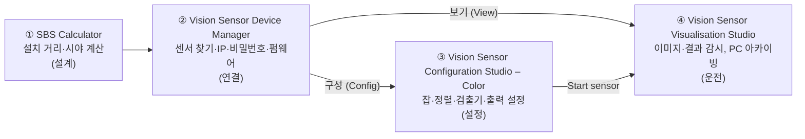
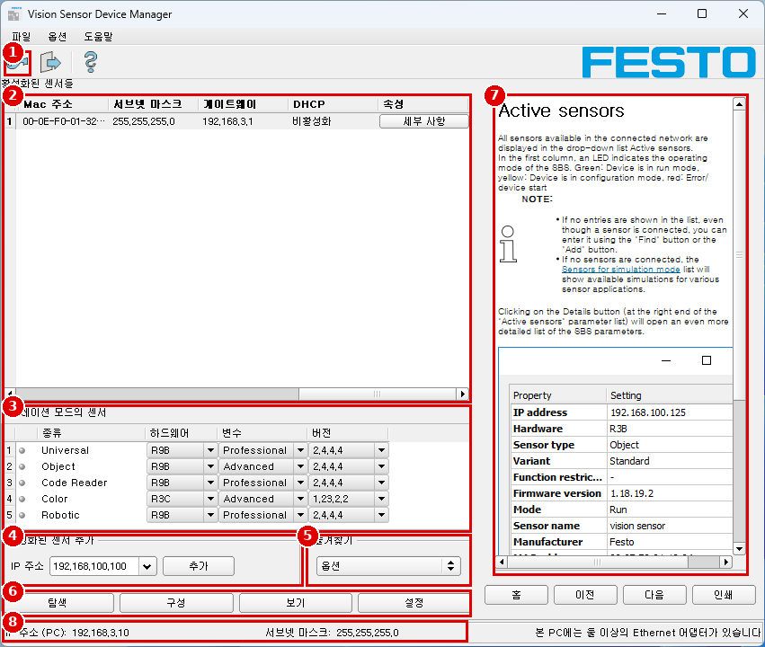
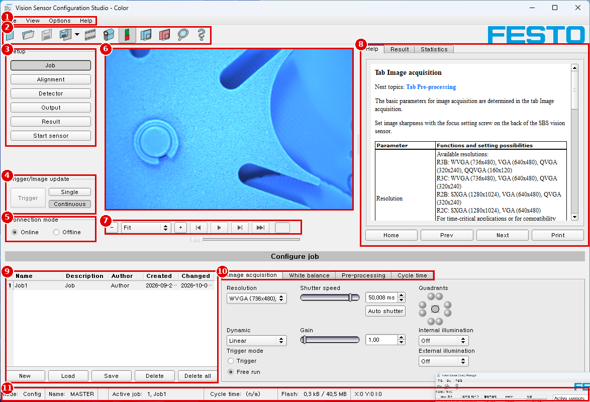

# 🎯 Festo SBS 컬러 비전 센서 실습 튜토리얼 — SBSI-F-R3C-F12-W

> 📝 **README v7 (2026-10-03)** — 이 파일이 최신이다. 이전 README는 [`old/`]()에 보관한다.
>
> v7: **센서 원본 이미지로 시료 색을 실측** → [측정 기록](../results/live-color_20261003_1134.md), [Module 08 v3](../docs/08_capstone_v3.md). 1단계(분홍↔갈색)는 색상만으로 충분, 2단계(갈색↔연한 갈색)는 밝기 차 4–9 %p뿐이고 조명이 화면 가로로 15–20 %p 기울어 **작은 검사 영역을 같은 자리에 고정**해야 한다. 이전 판: [old/README_v6.md](README_v6.md)
>
> v6: **최종 프로젝트 계획 변경** → [Module 08 v2 — 좌석 시료 2단계 색 판별](../docs/08_capstone_v2.md): 1단계 분홍(NG)/갈색, 2단계 갈색/연한 갈색(좌석 방석 위치). 시료·거리·단자대 사진 7장 반영, [사양서 v3](../docs/hardware/sensor-spec-and-cabling_v3.md)에 단자대 결선표. 이전 판: [old/README_v5.md](README_v5.md)
>
> v5: 실물 사진 4장 반영 → [Module 00 v3](../docs/00_device-map_v3.md)(실습 장치 구성), [사양서 v2](../docs/hardware/sensor-spec-and-cabling_v3.md)(뒷면·라벨). 뒷면에 DATA 소켓 없음(상충 C-09). 이전 판: [old/README_v4.md](README_v4.md)

> 📝 **v4 (2026-10-02)**: PC를 직접 제어해 Configuration Studio 화면 17장을 추가 캡처(설정값은 바꾸지 않음) → 레슨 01·02·04·05·06·07을 `_v3`으로 갱신. V-01·02·03·07·09·11·18·19 확정, 상충 B-23·C-07·C-08 추가. 이전 판: [old/README_v3.md](README_v3.md)

> 📝 **README v3 (2026-10-02)**: 2차 스크린샷 반영. 레슨 00–07은 `_v2` 파일이 최신이다(1차 판은 그대로 보관). Configuration Studio를 한국어로 쓰는 경우 → [**화면 표기 대응표 (English ↔ 한국어)**](../docs/appendix/ui-label-map_v2.md)

실제 장비 **Festo SBS Color Standard (8058732)** 로 이 품번이 지원하는 기능을 **모두 직접 조작하고 수치로 검증**하는 실습 리포지토리.
화면 따라 하기가 아니라 **3D 프린터 출력물(OK/NG 시료)** 로 실험하고, 결과를 표와 수치로 남긴다.

> [!IMPORTANT]
> **이 장비는 Standard(기본형)다.** 검출기는 **Contrast**, **Color area** 2종, 정렬은 **Contour detection**뿐이다.
> 패턴 매칭·캘리퍼·BLOB·캘리브레이션은 쓸 수 없다. → [기능 매트릭스 v2](../docs/reports/feature-matrix_v2.md)
>
> **PLC 통신은 다루지 않는다.** 외부 신호는 **검출 시에만 출력 핀 24 V ON**으로 마무리한다. → [상충 보고서 A-07](../docs/reports/conflict-report_v6.md#a-07)

---

## 1. 대상 장비

| 항목 | 값 |
|---|---|
| 형식 / 품번 | SBSI-F-R3C-F12-W / 8058732 — Color, **Standard**, 12 mm, 백색 LED (매뉴얼 p.403) |
| 해상도 / 속도 | 736 × 480 (WVGA), 40 fps (데이터시트) |
| 펌웨어 | 1.23.2.2 |
| 센서 이름 / IP | MASTER / 192.168.3.40 /24, GW 192.168.3.1, DHCP 비활성화 |
| PC IP | 192.168.3.10 /24 |
| 잡 / 검출기 | 최대 8잡 / 잡당 32개 ⚠️ (데이터시트는 2) |
| 사용 I/O | 입력 03·10, 출력 12·09, 전환 07·08, 고정 출력 Ready 04·Valid 11 |
| 단종 | 2024년 공급 종료 품번 (데이터시트) → 백업 필수 |

➡️ 전체 사양·핀 배치·실습 결선: [**센서 사양과 케이블링**](../docs/hardware/sensor-spec-and-cabling_v2.md)

## 2. 학습자 전제

- PLC 기초, 컴퓨터 비전 개념(OpenCV, PyTorch, CNN/RNN)을 안다 → **개념 설명은 최소화**하고 장비 조작과 검증에 집중한다.
- SBS 프로그램은 처음 쓴다 → 모든 메뉴 위치를 **번호 박스가 표시된 스크린샷**으로 보여 준다.
- Configuration Studio의 **Help 탭 영문은 레슨마다 한국어 번역**으로 함께 싣는다. → [Help 번역 색인 v2](../docs/help-ko/README_v2.md)

---

## 3. 소프트웨어 4종 — 역할과 사용 순서



| # | 소프트웨어 | 언제 쓰나 | 이 품번 메모 | 출처 |
|---|---|---|---|---|
| ① | SBS Calculator v2.0.10 | 설치 전: 작업 거리 ↔ 시야(FOV) ↔ mm/px | ✅ 기기 목록에 R3C(736×480)가 없음을 화면으로 확인 → 계산식 + 실측으로 대체 | (SBS Calculator 리소스), [A-02](../docs/reports/conflict-report_v6.md#a-02) |
| ② | Vision Sensor Device Manager | 매번 시작점. 센서 검색, IP 변경, 설정/보기 프로그램 실행 | 이 PC에서는 **한국어 UI** | (매뉴얼 p.39–40, p.54–66) |
| ③ | Vision Sensor Configuration Studio – Color | 검사 설정 6단계: Job → Alignment → Detector → Output → Result → Start sensor | 영문 UI | (매뉴얼 p.41, p.47) |
| ④ | Vision Sensor Visualisation Studio | 운전 중 감시, 이미지 저장, 잡 선택·업로드 | 설정 기능은 제한적 | (매뉴얼 p.39, p.42–43, p.277–286) |

### 3.1 Device Manager 화면 지도



| # | 화면 표기 (매뉴얼 영문명) | 하는 일 | 출처 |
|---|---|---|---|
| 1 | 🔑 열쇠 아이콘 (Password button) | 로그인·비밀번호 관리 | (매뉴얼 p.44–45) |
| 2 | `활성화된 센서들` (Active sensors) | 네트워크에서 찾은 센서 목록. 첫 칸 LED: 녹색 = Run, 노랑 = Config, 빨강 = 오류/시작 중 | (매뉴얼 p.40), Help 패널 문구 |
| 3 | `시뮬레이션 모드의 센서` (Sensors for simulation mode) | 장비 없이 오프라인 설정 | (매뉴얼 p.40) |
| 4 | `활성화된 센서 추가` › `추가` (Add sensors via IP address) | 검색이 안 될 때 IP로 직접 추가 | (매뉴얼 p.40) |
| 5 | `즐겨찾기` (Favorites) | 자주 쓰는 센서 저장 | (매뉴얼 p.41) |
| 6 | `탐색` (Find) / `구성` (Config) / `보기` (View) / `설정` (Settings) | 다시 검색 / Configuration Studio 실행 / Visualisation Studio 실행 / IP 등 네트워크 설정 | (매뉴얼 p.40–41) |
| 7 | 도움말 패널 (Context help) | 선택한 기능의 설명 (영문) | (매뉴얼 p.41) |
| 8 | 상태표시줄 `IP 주소 (PC)` | 이 PC의 IP. 어댑터가 여러 개면 경고 표시 | (매뉴얼 p.36) |

### 3.2 Configuration Studio 화면 지도

> 한국어 화면 지도: [Module 01 v2](../docs/01_connection-first-image_v3.md#14-configuration-studio-열기--online--offline) · 이름 대응: [ui-label-map v2](../docs/appendix/ui-label-map_v2.md)



| # | 화면 표기 | 하는 일 | 출처 |
|---|---|---|---|
| 1 | `File` `View` `Options` `Help` | 메뉴 (잡/잡셋 저장·불러오기는 File) | (매뉴얼 p.41, p.262) |
| 2 | 툴바 | 자주 쓰는 명령 아이콘 ⚠️ 아이콘별 이름은 툴팁 캡처 후 확정 | (매뉴얼 p.41) |
| 3 | **Setup**: `Job` `Alignment` `Detector` `Output` `Result` `Start sensor` | 설정 6단계. 위에서 아래 순서로 진행 | (매뉴얼 p.47) |
| 4 | **Trigger/Image update**: `Trigger` `Single` `Continuous` | 연속 촬영 ↔ 1장 촬영, 화면 트리거 | (매뉴얼 p.42, p.259) |
| 5 | **Connection mode**: `Online` `Offline` | 센서 연결 ↔ 시뮬레이션 | (매뉴얼 p.42, p.260) |
| 6 | 이미지 창 | 영상 + 검색/파라미터 영역(ROI) 그래픽 | (매뉴얼 p.41) |
| 7 | 확대(`−` `Fit` `+`), 필름스트립 이동 | 확대, 저장된 이미지 넘기기 | (매뉴얼 p.41, p.261) |
| 8 | `Help` `Result` `Statistics` 탭, `Home` `Prev` `Next` `Print` | 상황별 도움말(영문) / 검출 결과 / 통계 | (매뉴얼 p.42) |
| 9 | 잡 목록 + `New` `Load` `Save` `Delete` `Delete all` | 잡 만들기·관리 | (스크린샷), (Help: scjobedit) |
| 10 | 설정 탭 (Setup 단계에 따라 바뀜) | 예: Job → `Image acquisition` `White balance` `Pre-processing` `Cycle time` | (스크린샷) |
| 11 | 상태표시줄 | Mode, Name, Active job, Cycle time, Flash 사용량, 커서 X/Y/밝기, DOUT 표시 | (매뉴얼 p.42) |

> 각 Setup 단계의 상세 화면은 해당 모듈에서 다룬다: [`images/annotated/`](../images/annotated/)

---

## 4. 커리큘럼 — 현장 문제 해결 순서

**잘 보이게 → 위치 찾기 → 판별 → 출력 → (PC 연동) → 운영**

| 모듈 | 현장 질문 | 다루는 기능 | 실물 실험 (예) | 정량 기준 (예) | 상태 |
|---|---|---|---|---|---|
| [00 장비와 도구 지도](../docs/00_device-map_v3.md) | 무엇을, 얼마나 떨어져서 볼까? | 품번 해독, 기능 범위, SW 4종, FOV 계산 | 계산 거리에서 모눈종이로 실제 FOV 측정 | 계산 ↔ 실측 오차, 결함 ≥ 3 px | ✅ |
| [01 연결과 첫 이미지](../docs/01_connection-first-image_v3.md) | 센서와 말이 통하나? | 전원·준비 시간, PC IP, 찾기·추가·세부 사항, Online/Offline, 트리거 모드, 초점 | 거리별 초점, 준비 시간 측정 | 검색 5/5, 준비 시간 평균 | ✅ |
| [02 좋은 이미지 만들기](../docs/02_image-quality_v3.md) | 판단할 만큼 잘 보이나? | 해상도, 셔터, 게인, Dynamic, 조명·쿼드런트, 외부 조명 출력, WB, 전처리, 필름스트립 | 조건 A/B ΔI 비교, 노이즈 σ | ΔI ≥ 50, 반복 ±5 | ✅ |
| [03 어디에 있나](../docs/03_alignment-contour_v2.md) | 움직여도 따라가나? | Contour detection 5개 탭, 검색/파라미터 영역 | ±mm 이동, ±° 회전 | 허용 범위 안 10/10 | ✅ |
| [04 무엇을 판별하나](../docs/04_inspection-detectors_v3.md) | 있나? 색? 크기? | 04-1 Contrast · 04-2 Color area(RGB/HSV/LAB) · 04-3 크기 Go/No-Go | 캡 유무, 색, 크기 시료 | OK/NG 10/10, 마진 ≥ 15 %p | ✅ |
| [05 판정과 출력 로직](../docs/05_judgement-and-output_v3.md) | 결과를 어떻게 묶고 언제 내보내나? | Result, Start sensor, 논리식, 트리거, Timing, Cycle time | 처리 시간, Result duration, 타임아웃 | 판정 일치, max 처리 시간 | ✅ |
| [06 검출 시 24 V ON](../docs/06_output-24v_v3.md) | 검출되면 선에 24 V가 나오나? | I/O mapping, Internal I/O(PNP), 출력 결선 | 멀티미터 OK/NG 전압 | OK ≥ 22 V, NG ≤ 1 V, 20/20 | ✅ |
| [07 운영과 유지보수](../docs/07_operation-maintenance_v3.md) | 바꾸고, 남기고, 되살릴 수 있나? | 잡셋 백업·보호, 잡 전환, 레코더·RAM disk·아카이빙, Visualisation Studio, 웹 뷰어, 즐겨찾기·비밀번호·펌웨어 절차·Auto Start Up | 백업→삭제→복원, NG만 저장 | 복원 일치, 저장 수 = NG 수 | ✅ |
| [08 최종 프로젝트 v3](../docs/08_capstone_v3.md) | 검사 셀을 혼자 만들 수 있나? | 위 전부 | **좌석 시료 2단계 색 판별**: 분홍 = NG, 갈색 / 연한 갈색 분류 (출력 12 / 07 / 08) | 분홍 10/10 NG, 오분류 0, 마진 ≥ 15 %p, ≤ 150 ms | ✅ |

> [!NOTE]
> Module 06은 원래 PLC 연동이었다. 사용자 규칙 9와 결정(2026-10-02)에 따라 "검출 시에만 출력 24 V ON"으로 마무리했다. 1차 계획의 `06_pc-data-link.md`는 만들지 않았다.

> [!TIP]
> 모든 레슨의 Help 번역은 `📖 Help 번역` 접기 블록 안에 있다. ⚠️ [스크린샷 필요: 파일명] 표시가 있는 곳은 [촬영 목록 v5](../images/CAPTURE-LIST_v5.md)대로 찍어 채운다.

## 5. 모든 레슨의 형식

| 블록 | 내용 |
|---|---|
| 🎯 목표 | 끝나면 할 수 있는 것 (동사, 1–3개) |
| 🏭 왜 필요한가 | 이 기능이 없을 때 현장에서 생기는 문제 1개 |
| 📋 선행 조건 / 준비물 | 이전 레슨, 시료, 결선 상태 |
| ⚙️ 메뉴 경로 | `소프트웨어 › 메뉴 › …` + **번호 박스 스크린샷** + (출처) 또는 ⚠️ [실기 확인 필요] |
| 📖 Help 번역 | 해당 화면 Help 탭 영문의 한국어 번역 |
| 📝 단계별 조작 | 번호 순서. 파라미터 표: \| 파라미터 \| 시작값 \| 의미 \| 올리면 \| 내리면 \| |
| 🧪 실험 | 변수 하나만 바꿔 결과를 기록 (양식 제공) |
| 🔍 검증 | 정량 합격 기준 (예: OK 10/10, NG 10/10, 마진 = \|합격 기준값 − 실측값\| ≥ 15 %) |
| 💥 고장 주입 | 일부러 틀리게 설정하고 증상 관찰 |
| ⚠️ 함정과 해결 | 증상 → 원인 → 조치 |
| ✅ 체크리스트 | |
| 📁 포트폴리오 기록 | 남길 스크린샷·수치·한 줄 요약 |

## 6. 출처 표기

| 표기 | 문서 |
|---|---|
| (매뉴얼 p.xx) | SBS Vision Sensor Manual V1.23.2 (8097682 2018-07c) — 펌웨어와 같은 버전 |
| (데이터시트) | colour sensor SBSI-F-R3C-F12-W, 8058732 |
| (설치설명서) | SBS Mounting Instruction V1.23.2 (8090327) |
| (Help: 토픽파일) | Configuration Studio Help 원본 `SBS_ContextHelp_en_V1_22_14.chm` |
| (설정파일) | 설치 SW `SBSConfig/1.23.2.2/Data/*.xml` |
| (스크린샷 파일명) | `images/raw/` 직접 캡처 |
| ⚠️ [실기 확인 필요] | 자료로 확정 못 함 → [장비 앞에서 확인할 목록 v6](../docs/appendix/verify-on-device_v6.md) |

원본 PDF·CHM은 PC의 `C:\Program Files (x86)\Festo\SBS Vision Sensor\Documentation\`, `…\Help\`에 있다. **저작권 때문에 이 저장소에는 넣지 않는다.**

## 7. 저장소 구조

```text
festo-sbs-r3c-tutorial/
├── README.md                       ✅ 최신판 (v7) — GitHub 첫 화면
├── old/                          이전 README (README_v1 = 최초 README.md, README_v2–v6)
├── .gitignore                        ✅ 매뉴얼·Help 원본 제외
├── docs/
│   ├── 00_device-map(_v2,_v3).md             ✅ 장비와 도구 지도
│   ├── 01_connection-first-image(_v2).md  ✅ 연결과 첫 이미지
│   ├── 02_image-quality(_v2,_v3).md          ✅ 좋은 이미지 만들기
│   ├── 03_alignment-contour(_v2).md       ✅ 위치 추적
│   ├── 04_inspection-detectors(_v2,_v3).md   ✅ 04-1 Contrast / 04-2 Color area / 04-3 크기 Go/No-Go
│   ├── 05_judgement-and-output(_v2,_v3).md   ✅ 판정과 출력 로직
│   ├── 06_output-24v(_v2,_v3).md             ✅ 검출 시 24 V ON
│   ├── 07_operation-maintenance(_v2,_v3).md  ✅ 운영과 유지보수
│   ├── 08_capstone(_v2,_v3).md       ✅ 최종 프로젝트 (v2 = 좌석 2단계 색 판별, v3 = 센서 실측 반영)
│   ├── hardware/
│   │   └── sensor-spec-and-cabling(_v2,_v3).md ✅ 사양·핀 배치·실습 결선·네트워크
│   ├── reports/
│   │   ├── feature-matrix(_v2).md    ✅ 기능 매트릭스 + 최종 커버리지
│   │   └── conflict-report(_v2–_v6).md ✅ 상충 보고서
│   ├── help-ko/
│   │   └── README(_v2).md            ✅ Help 토픽 → 레슨 번역 색인
│   └── appendix/
│       ├── verify-on-device(_v2–_v6).md ✅ 장비 앞에서 확인할 목록 (V-01~V-30)
│       ├── ui-label-map(_v2).md      ✅ 화면 표기 대응표 (English ↔ 한국어)
│       ├── advanced-only.md          ✅ 상위 모델 전용 기능
│       ├── glossary.md               ✅ 용어집
│       └── troubleshooting.md        ✅ 문제 해결
├── images/
│   ├── raw/                          ✅ 원본 캡처 (수정 금지)
│   ├── annotated/                    ✅ 번호 박스 주석본
│   ├── CAPTURE-LIST.md               1차 촬영 목록
│   ├── CAPTURE-LIST_v2.md            2차 촬영 목록
│   ├── CAPTURE-LIST_v3.md            3차 촬영 목록
│   ├── CAPTURE-LIST_v4.md            4차 촬영 목록
│   └── CAPTURE-LIST_v5.md            ✅ 남은 촬영 요청 (최신)
├── templates/
│   └── experiment-log.md             ✅ 실험 기록 양식
├── results/                          실험 결과 (live-color_*.md = 센서 색 측정, live_*.bmp = 센서 원본)
├── tools/
│   ├── annotate.py / annotations.json       ✅ 번호 박스 도구(1차)
│   ├── annotate_v2.py / annotations_v2.json ✅ 배율·잘라내기 지원(2차)
│   ├── annotate_v3.py / annotations_v3.json ✅ 번호를 박스 바깥에(3차)
│   └── annotate_v4.py / annotations_v4–v6.json ✅ 사진용 크기 자동 비례(4–6차)
└── backups/                          잡셋 백업, 필름스트립
```

### 스크린샷 주석 만들기

```bash
pip install pillow
python tools/annotate.py tools/annotations.json
```

새 캡처를 `images/raw/`에 넣고 `annotations.json`에 박스 좌표 `[왼쪽, 위, 오른쪽, 아래]`를 추가하면 `images/annotated/`에 새 파일이 생긴다. 원본은 건드리지 않는다.

## 8. 시작 전 체크

- [ ] [사양서 4.1](../docs/hardware/sensor-spec-and-cabling_v2.md) 핀 표와 실습실 케이블 대조 (V-06)
- [ ] 시료 준비: 갈색 좌석 유닛, 연한 갈색 좌석 유닛, 분홍 트레이(NG) (3D 프린터 출력물, [08 v3](../docs/08_capstone_v3.md) 1절)
- [ ] 현재 잡셋 백업: Configuration Studio `File › Save job set (Backup) ...` → `backups/`
- [ ] [장비 앞에서 확인할 목록 v5](../docs/appendix/verify-on-device_v6.md) 중 남은 ⏳ 항목(V-05, V-06, V-12, V-22, V-25) 먼저 확인

## 9. 출처와 저작권

연구·학습용 저장소다. Festo 매뉴얼·Help의 저작권은 Festo SE & Co. KG에 있으며, 번역은 아래 원문을 출처로 한다.

| 자료 | 링크 / 위치 |
|---|---|
| Festo 다운로드·문서 안내 (부품번호 **8058732**로 검색) | <https://www.festo.com/sp> |
| 데이터시트 colour sensor SBSI-F-R3C-F12-W | 같은 포털, 부품번호 8058732 |
| SBS Vision Sensor Manual V1.23.2 (8097682) | 로컬 `C:\Program Files (x86)\Festo\SBS Vision Sensor\Documentation\SBS_user_manual_en_V_1_23_2.pdf` |
| SBS Mounting Instruction V1.23.2 (8090327) | 로컬 `…\Documentation\SBS_MountingInstruction_en_V_1_23_2.pdf` |
| Configuration Studio Help V1.22.14 | 로컬 `…\Help\en\1.22.14.1\SBS_ContextHelp_en_V1_22_14.chm` |

스크린샷은 작성자가 직접 찍은 소프트웨어 화면이다.
